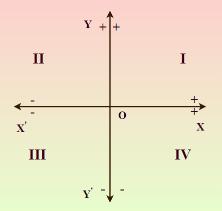
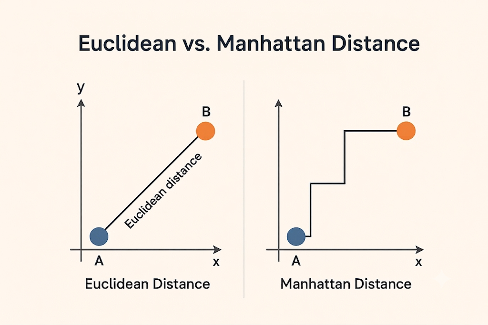
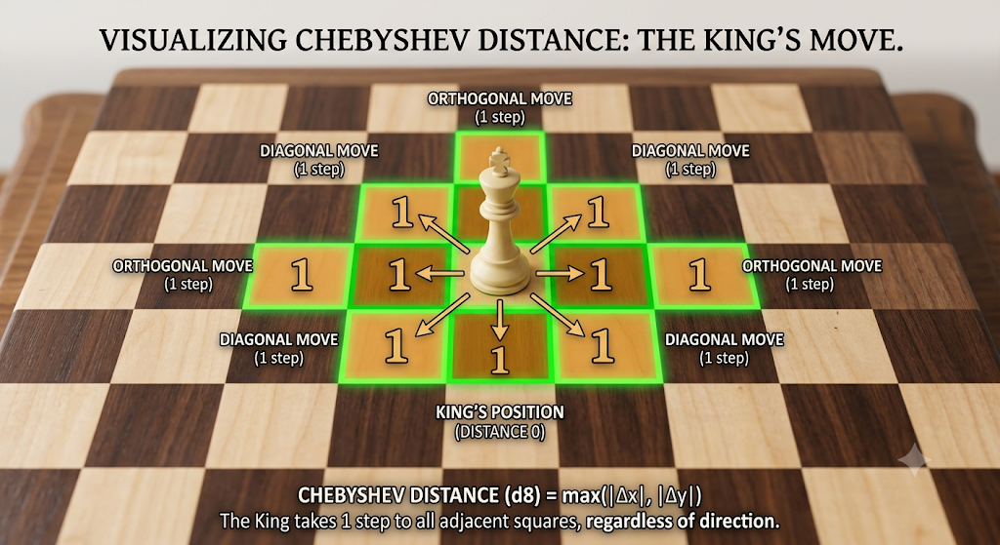

# Basic Geometry in CP

Computational Geometry can be one of the most frustrating topics in competitive programming. A logically perfect algorithm will frequently fail on edge cases due to division by zero or floating-point precision errors. 

In this module, we will learn the fundamental geometry rules and the "CP Way" of handling geometry using integers to achieve 100% accuracy.

---

## 1. The 2D Coordinate System

The Cartesian plane is a two-dimensional grid defined by a horizontal axis ($x$-axis) and a vertical axis ($y$-axis). They intersect at the **origin** $(0, 0)$.

- **Points:** Represented as $(x, y)$.
- **Quadrants:** The axes divide the plane into four infinite regions.
  - **Quadrant I:** $(+, +)$ (Top-Right)
  - **Quadrant II:** $(-, +)$ (Top-Left)
  - **Quadrant III:** $(-, -)$ (Bottom-Left)
  - **Quadrant IV:** $(+, -)$ (Bottom-Right)

Many CP problems map directly to this grid, placing entities at distinct $(x, y)$ coordinates.

---

## 2. Distances on a Grid

When navigating between two points $P_1(x_1, y_1)$ and $P_2(x_2, y_2)$, the shortest path depends on the rules of movement.

### Euclidean Distance
If you can move freely in any diagonal direction, the shortest distance is a straight line. By drawing a right-angled triangle between the two points, we use the **Pythagorean theorem** ($a^2 + b^2 = c^2$) to derive the distance:
$$d = \sqrt{(x_2 - x_1)^2 + (y_2 - y_1)^2}$$

> 💡 **CP Insight:** Computing the square root results in a floating-point number (`double`). When comparing distances (e.g., "Is Point A closer than Point B?"), **never use `sqrt()`!** Instead, simply compare the squared distances $(d^2)$ to keep all math in pure integers.

> 🚨 **The C++ Overflow Trap:** While squared distances remove the `double` precision issue, they create an overflow risk! If coordinates can be up to $10^9$, the squared distance $(10^9)^2$ reaches $10^{18}$. This exceeds the 32-bit `int` limit. **Always cast to 64-bit integers** when calculating squared Euclidean distance: 
> `long long d_sq = 1LL * (x2 - x1) * (x2 - x1) + 1LL * (y2 - y1) * (y2 - y1);`

### Manhattan Distance
If you are restricted to moving only horizontally and vertically (like a car navigating city blocks or a robot on a grid), you cannot travel diagonally. The distance is simply the absolute difference of their $x$ and $y$ coordinates:
$$d_{manhattan} = |x_1 - x_2| + |y_1 - y_2|$$

### Chebyshev Distance (Chess King Distance)
What if you are allowed to move horizontally, vertically, *and* diagonally, and a diagonal move costs exactly the same as a straight move? This is exactly how a **King** moves in chess!

Since a diagonal move mathematically covers 1 unit of $X$ and 1 unit of $Y$ simultaneously for the cost of just 1 step, the total distance is bounded entirely by whichever axis requires the most steps. The formula simply takes the maximum of the two coordinate differences:
$$d_{chebyshev} = \max(|x_1 - x_2|, |y_1 - y_2|)$$

---

## Let's Practice!

Put your new grid distance skills to the test with these fundamental coordinate problems:

- **[Minimum Time Visiting All Points](https://leetcode.com/problems/minimum-time-visiting-all-points/)**
- **[Escape The Ghosts](https://leetcode.com/problems/escape-the-ghosts/)**
- **[K Closest Points to Origin](https://leetcode.com/problems/k-closest-points-to-origin/)**

---

## Video Explanation

