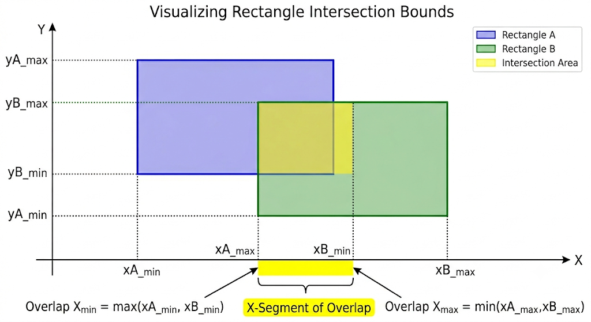

# 2D Shapes and Properties

In competitive programming, you won't be tested on your ability to memorize high-school geometry proofs. Instead, CP geometry problems usually involve placing shapes on a 2D coordinate grid and calculating their intersections, areas, or boundaries.

Let's break down the most common 2D shapes that appear in CP and the specific "integer-safe" formulas you need to conquer them.

---

## 1. Axis-Aligned Rectangles

The most common shape in CP is the **Axis-Aligned Rectangle**. "Axis-aligned" simply means the rectangle's sides are perfectly parallel to the X and Y axes (it is not rotated).

Because it is not rotated, an axis-aligned rectangle can be entirely defined by just two points:
- Its **bottom-left** corner $(x_1, y_1)$
- Its **top-right** corner $(x_2, y_2)$

### Area and Perimeter
The width is $(x_2 - x_1)$ and the height is $(y_2 - y_1)$.
- **Area:** $\text{width} \times \text{height}$
- **Perimeter:** $2 \times (\text{width} + \text{height})$

### The Overlapping Rectangles Trick
A classic interview problem asks you to find the overlapping area of two axis-aligned rectangles. Do not write a massive `if-else` chain to check which corner is inside which rectangle!

Instead, use the **Min-Max Boundary Trick**. The intersection of two axis-aligned rectangles is *always* another axis-aligned rectangle. You can find its corners perfectly:
- **Left boundary of overlap:** $\max(x_{1\text{left}}, x_{2\text{left}})$
- **Right boundary of overlap:** $\min(x_{1\text{right}}, x_{2\text{right}})$
- **Bottom boundary of overlap:** $\max(y_{1\text{bottom}}, y_{2\text{bottom}})$
- **Top boundary of overlap:** $\min(y_{1\text{top}}, y_{2\text{top}})$

If $\text{Left} < \text{Right}$ and $\text{Bottom} < \text{Top}$, they overlap! The overlapping area is simply $(\text{Right} - \text{Left}) \times (\text{Top} - \text{Bottom})$.

> 💡 **CP Trick: The Zero-Clamping Area**
> If the rectangles do NOT overlap, `(Right - Left)` or `(Top - Bottom)` will be negative. If you multiply two negative bounds together, it mathematically creates a positive fake area! 
> **The Fix:** Clamp the differences to zero using `max()`. If they don't overlap, the difference becomes 0, and the resulting area is safely 0.
> ```cpp
> long long overlap_width = max(0LL, right_bound - left_bound);
> long long overlap_height = max(0LL, top_bound - bottom_bound);
> long long overlap_area = overlap_width * overlap_height;
> ```



---

## 2. Circles

Circles are defined by a **center point** $(h, k)$ and a **radius** $r$. 
- **Area:** $\pi r^2$
- **Circumference:** $2\pi r$

> 💡 **CP Insight:** The value of $\pi$ cannot be represented perfectly as a floating-point number. In C++, you can get a highly precise value of $\pi$ using the math function `acos(-1.0)`.

### Point Inside a Circle (The Anti-WA Rule)
To check if a point $(x, y)$ is inside a circle, you check if its Euclidean distance to the center is less than or equal to $r$:
$$ \sqrt{(x - h)^2 + (y - k)^2} \le r $$

**WARNING!** Do not use the `sqrt()` function. It introduces floating-point inaccuracies. Instead, square both sides to keep the equation in pure, flawless integers!
$$ (x - h)^2 + (y - k)^2 \le r^2 $$

---

## 3. Triangles

Triangles are defined by three vertices: $A(x_1, y_1)$, $B(x_2, y_2)$, and $C(x_3, y_3)$.

### Point Inside a Triangle
How do you check if a point $P$ is inside a triangle $ABC$? 
The most reliable CP method is the **Area Sum Method**. 
If $P$ is inside the triangle, then splitting the triangle into three smaller triangles using $P$ ($PAB$, $PBC$, and $PCA$) should yield an area that perfectly equals the area of the large triangle $ABC$.
$$ \text{Area}(ABC) == \text{Area}(PAB) + \text{Area}(PBC) + \text{Area}(PCA) $$

But wait, how do we calculate the area of a triangle given just its coordinates?

### The Shoelace Formula (Area of Any Polygon)
In high school, you learn Area = $\frac{1}{2} \times \text{base} \times \text{height}$. In CP, finding the exact height is a nightmare.

Instead, we use the **Shoelace Formula**, which calculates the exact area of *any* simple polygon (including triangles) just by crossing its coordinates!

For a triangle with vertices $(x_1, y_1), (x_2, y_2), (x_3, y_3)$:
$$ 2 \times \text{Area} = | (x_1y_2 - y_1x_2) + (x_2y_3 - y_2x_3) + (x_3y_1 - y_3x_1) | $$

> 💡 **CP Insight:** Notice that we multiply the Area by 2 on the left side of the equation! Why? Because the right side is purely integer multiplication. If we divide by 2 to get the exact area, we might get a decimal (like `12.5`). By comparing `2 * Area` everywhere in our code, we avoid using `double` and prevent precision errors! This means when checking if a point is inside a triangle, you should directly compare the integer outputs: `2*Area(ABC) == 2*Area(PAB) + 2*Area(PBC) + 2*Area(PCA)` to stay 100% safe!


---

## 4. Pick's Theorem (Grid Polygons)

Pick's Theorem is a "secret weapon" formula in CP. It specifically applies to polygons where **all vertices are perfectly on grid coordinates** (integers).

Pick's theorem relates the Area of a polygon to the number of grid points that lie perfectly on its boundary ($B$) and the number of grid points strictly inside it ($I$):
$$ \text{Area} = I + \frac{B}{2} - 1 $$

If a problem asks you to count how many integer grid points fall inside a massive polygon, you can use the Shoelace formula to find the `Area`, find `B` by calculating the GCD (Greatest Common Divisor) of the coordinate differences along the edges, and then rearrange Pick's Theorem to solve for `I`:
$$ I = \text{Area} - \frac{B}{2} + 1 $$

> 💡 **CP Must-Know: Counting Boundary Points on a Line**
> To find the exact number of integer grid points lying strictly on a line segment between $(x_1, y_1)$ and $(x_2, y_2)$, use the Greatest Common Divisor (GCD):
> $$B_{\text{edge}} = \gcd(|x_1 - x_2|, |y_1 - y_2|)$$
> Calculate this for all edges of the polygon and sum them up to get the total $B$ for Pick's Theorem!

---

## Let's Practice!

Put your integer geometry skills to the test with these foundational problems:


- **[Rectangle Overlap](https://leetcode.com/problems/rectangle-overlap/description/)**
- **[Rectangle Area](https://leetcode.com/problems/rectangle-area/)**
- **[Queries on Number of Points Inside a Circle](https://leetcode.com/problems/queries-on-number-of-points-inside-a-circle/description/)**
- **[Largest Triangle Area](https://leetcode.com/problems/largest-triangle-area/)**

---

## Video Explanation

[]()
