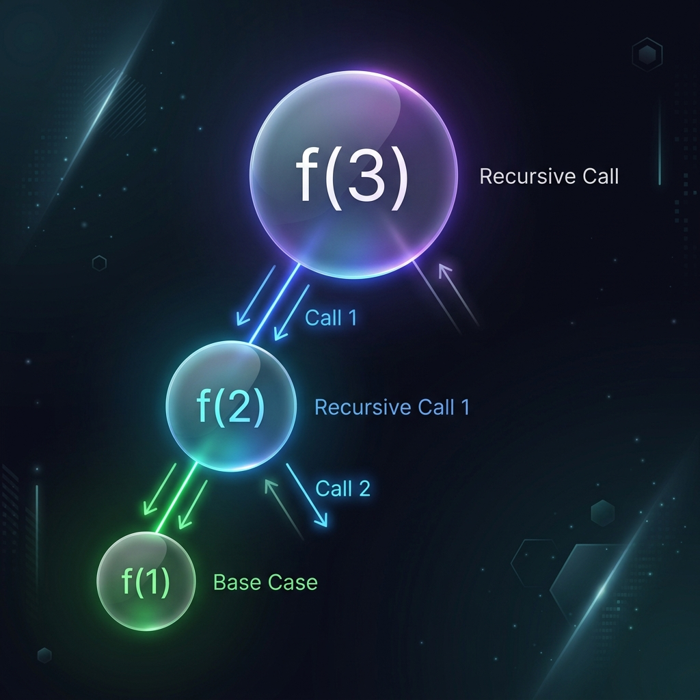
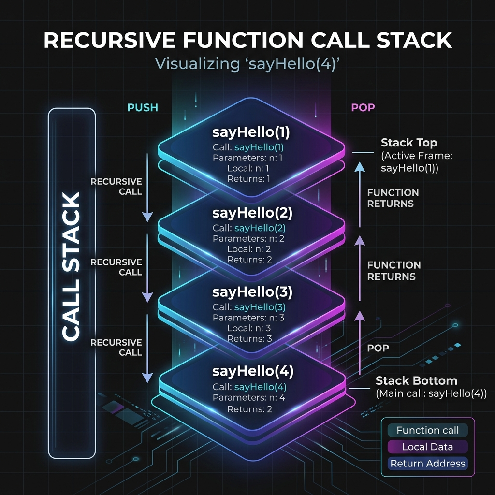

# Basic Recursion

Hey there! Have you ever looked at two mirrors facing each other and seen an infinite tunnel of reflections? That's recursion in real life! In programming, recursion is one of the most powerful and elegant techniques you can learn. If you can master recursion, you're halfway to mastering Data Structures and Algorithms.

Let's demystify recursion step by step so you can start thinking recursively!

## What is Recursion?

At its core, **recursion is simply a function that calls itself** to solve smaller instances of the same problem. 

Think of a large task, like eating a giant pizza. You don't eat it all at once; you take a bite, and then what's left is a slightly smaller pizza. You repeat the process (take a bite, get a smaller pizza) until the pizza is gone. Recursion works exactly the same way.

> 💡 **Interview Insight:** Many advanced topics like Trees, Graphs, and Dynamic Programming rely heavily on recursion. If you can't confidently trace a recursive function, you'll struggle in DSA interviews. Spend extra time building your intuition here!



---

## Function Calling Itself

Let's look at a simple example of a function calling itself in C++:

```cpp
void sayHello() {
    cout << "Hello!\n";
    sayHello(); // The function calls itself!
}
```

If you run this code, it will print "Hello!" over and over again until your program crashes. Why? Because we didn't tell it when to stop! This is called **infinite recursion**, and it's the recursive equivalent of an infinite loop.

To prevent this, every recursive function needs two crucial parts: the **Base Case** and the **Recursive Case**.

---

## The Base Case and Recursive Case

### The Base Case (How recursive calls stop)
The base case is the condition under which the function **stops** calling itself. It prevents the infinite loop and tells the recursion when the task is small enough to be solved directly.

### The Recursive Case
The recursive case is the part of the function where it actually calls itself, breaking the main problem into a smaller, simpler sub-problem.

Let's write a function to print "Hello" exactly 3 times using these concepts:

```cpp
void sayHello(int times) {
    // 1. Base Case: Stop when there are no more times left
    if (times == 0) {
        return; // **RETURN to stop the recursion!**
    }
    
    // 2. Do the work for the current step
    cout << "Hello!\n";
    
    // 3. Recursive Case: Call the function with a smaller problem
    sayHello(times - 1); 
}
```

When we call `sayHello(3)`, it works perfectly. But how exactly does the computer keep track of this?

---

## Call Stack Intuition

To understand recursion, you must understand the **Call Stack**. The call stack is like a stack of plates. When you call a function, the computer puts a new "plate" (a memory frame) on top of the stack. When the function finishes, the computer takes that "plate" off.



Let's trace `sayHello(3)`:

1. `sayHello(3)` is called. A frame is added to the stack. `times = 3`. It prints "Hello!" and calls `sayHello(2)`.
2. `sayHello(2)` is called. A new frame is placed **on top**. `times = 2`. It prints "Hello!" and calls `sayHello(1)`.
3. `sayHello(1)` is called. Another frame is placed on top. `times = 1`. It prints "Hello!" and calls `sayHello(0)`.
4. `sayHello(0)` is called. The base case `times == 0` is true! The function hits `return`. The frame for `sayHello(0)` is popped off the stack.
5. Control goes back to `sayHello(1)`, which has no more code to run, so it pops off.
6. Control goes back to `sayHello(2)`, which pops off.
7. Control goes back to `sayHello(3)`, which pops off. The stack is empty, and the program ends.

> 💡 **Interview Insight: Auxiliary Space & Constraints** 
> Understanding the call stack is critical because **every frame added to the stack takes up physical memory**. 
> - **Space Complexity:** If `sayHello(N)` calls itself $N$ times, the maximum depth of the tree is $N$. This means the **Auxiliary Space Complexity is $O(N)$**. Beginners often mistake recursion for $O(1)$ space because they didn't explicitly allocate an array, but the call stack *is* an array!
> - **System Constraints:** A typical C++ program allocates a limited amount of stack memory (often around 8MB). If a recursive function goes deeper than roughly $10^5$ calls, it triggers a `Segmentation Fault` or `Stack Overflow`. When you see $N \le 10^5$ in a problem description, know that an $O(N)$ depth recursive approach is pushing the physical limits of the stack!

---

## Dry Run of Recursive Functions

"Dry running" means tracing the code on paper step by step. Let's practice with a slightly different printing example.

### Printing Using Recursion

What happens if we swap the order of the recursive call and the print statement?

```cpp
void printNumbers(int n) {
    if (n == 0) {
        return; // Base Case
    }
    
    printNumbers(n - 1); // Recursive Call FIRST
    cout << n << " ";    // Print LATER
}
```

If we call `printNumbers(3)`, what is the output? Let's dry run:

1. `printNumbers(3)`: calls `printNumbers(2)`. (It *waits* to print).
2. `printNumbers(2)`: calls `printNumbers(1)`. (It *waits* to print).
3. `printNumbers(1)`: calls `printNumbers(0)`. (It *waits* to print).
4. `printNumbers(0)`: Base case hit! Returns.
5. Back in `printNumbers(1)`: It finishes waiting, executes `cout << 1 << " "`. Returns.
6. Back in `printNumbers(2)`: It finishes waiting, executes `cout << 2 << " "`. Returns.
7. Back in `printNumbers(3)`: It finishes waiting, executes `cout << 3 << " "`. Returns.

**Output:** `1 2 3`

This is the magic of recursion! By changing where we put the recursive call, we reversed the order of printing without using any loops.

---

## Returning Values from Recursion

Often, recursive functions don't just print things; they calculate and return values. Let's look at simple recursion with numbers.

### Simple Recursion with Numbers (Factorial)

The factorial of a number $N$ (written as $N!$) is the product of all positive integers less than or equal to $N$.
Example: $4! = 4 \times 3 \times 2 \times 1 = 24$.

Notice that $4! = 4 \times (3 \times 2 \times 1) = 4 \times 3!$. 
This gives us a perfect recursive relationship: `factorial(N) = N * factorial(N - 1)`.

```cpp
int factorial(int n) {
    // Base case: 0! is 1 (and 1! is 1)
    if (n == 0 || n == 1) {
        return 1; // **RETURN base case**
    }
    
    // Recursive case
    int smallerAnswer = factorial(n - 1);
    return n * smallerAnswer;
}
```

Let's trace `factorial(3)`:
- `factorial(3)` needs `factorial(2)`.
- `factorial(2)` needs `factorial(1)`.
- `factorial(1)` returns `1` (Base case).
- `factorial(2)` receives `1`, returns `2 * 1 = 2`.
- `factorial(3)` receives `2`, returns `3 * 2 = 6`.

**Visualizing the Return (Bubbling Up):**
```text
f(3) -> waits for f(2)
      f(2) -> waits for f(1)
            f(1) -> returns 1
      f(2) <- receives 1, returns 2 * 1 = 2
f(3) <- receives 2, returns 3 * 2 = 6
```

> 💡 **Interview Insight:** When writing recursive functions that compute and return values, a very common mistake is omitting the `return` keyword before the recursive call. Always ensure that the computed value is explicitly returned up the call chain!

### The Recurrence Relation

Once you understand how the recursion builds up, you can express its time complexity mathematically. For `factorial(N)`, the time to solve for $N$ is the time to solve for $N-1$ plus the $O(1)$ multiplication step.
This gives us a **Recurrence Relation**: 
$$T(N) = T(N-1) + O(1)$$
Because we do an $O(1)$ operation $N$ times, this relation simplifies to a final Time Complexity of $O(N)$.

---

## Simple Recursion with Arrays/Strings

Recursion isn't just for math; it's great for data structures too! Let's say we want to find the sum of all elements in an array.

We can think of the sum of an array as:
`Sum = (First Element) + Sum of the (Rest of the Array)`

```cpp
// BEST PRACTICE: Passing vector by reference!
int getArraySum(vector<int>& arr, int index) {
    // Base Case: If index reaches the size of the array, return 0
    if (index == arr.size()) {
        return 0; // **RETURN base case**
    }
    
    // Recursive Case: Current element + Sum of the remaining elements
    return arr[index] + getArraySum(arr, index + 1);
}
```

> 🚨 **CRITICAL C++ TRAP: Forgetting the `&` (Pass-by-Value)**
> In the code above, we correctly passed the vector **by reference** using `vector<int>& arr`. What happens if you forget the `&` and pass it **by value** (`vector<int> arr`)? 
> 
> *Every single time* the function calls itself, it will create a brand new deep copy of the entire vector! 
> - **Time Complexity:** Silently degrades from $O(N)$ to $O(N^2)$ (copying $N$ elements, $N$ times).
> - **Space Complexity:** Becomes an $O(N^2)$ Memory Limit Exceeded (MLE) disaster!
> 
> **The Takeaway:** Always pass large data structures like `std::vector` or `std::string` by reference to keep the space complexity at $O(N)$ for the call stack with no extra copying overhead!

To call this function, we would use `getArraySum(arr, 0)` starting at index 0. 

You can apply the exact same logic to strings. For example, to reverse a string or check if it's a palindrome, you compare the outer characters and recursively check the inner substring.

---

## Let's Practice!

Recursion is best learned by doing. Test your recursion logic skills with these fundamental problems!

Try solving the following problems:
- **[Print from 1 to N](https://codeforces.com/group/MWSDmqGsZm/contest/223339/problem/B)**
- **[Print Digits using Recursion](https://codeforces.com/group/MWSDmqGsZm/contest/223339/problem/D)**
- **[Fibonacci](https://codeforces.com/group/MWSDmqGsZm/contest/223339/problem/O)**
- **[Palindrome Array](https://codeforces.com/group/MWSDmqGsZm/contest/223339/problem/R)**
- **[Combination](https://codeforces.com/group/MWSDmqGsZm/contest/223339/problem/T)**
- **[Reach Value](https://codeforces.com/group/MWSDmqGsZm/contest/223339/problem/W)**
- **[The maximum path-sum](https://codeforces.com/group/MWSDmqGsZm/contest/223339/problem/X)**
- **[Number of Ways](https://codeforces.com/group/MWSDmqGsZm/contest/223339/problem/Y)**
- **[Knapsack](https://maang.in/problems/Knapsack-1169)**
- **[Josephus Problem](https://maang.in/problems/Josephus-Problem-586)**

---

## Video Explanation

[]()
