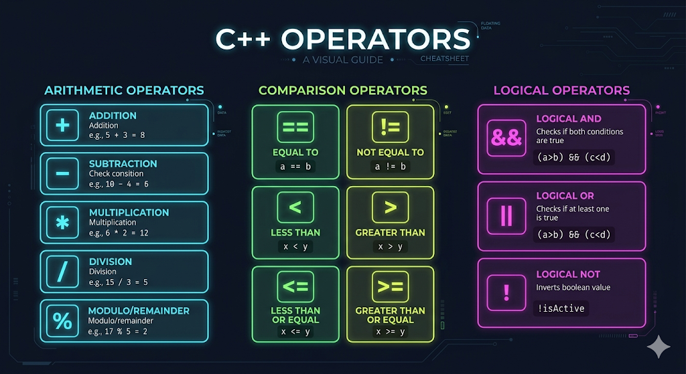

# Variables, Data Types, and Operators

Programming is all about taking data, manipulating it, and giving it back. But where does the data live while the program is running? That's where **Variables** come in!

---

## 1. Variables: The Containers of Code

Think of a variable as a labeled box where you can store a piece of information. 

In C++, before you can use a box, you have to do two things:
1. Decide what **type** of data goes inside the box.
2. Give the box a unique **name**.

```cpp
int age;      // 1. Declaration: "I need a box named 'age' that holds an integer."
age = 20;     // 2. Initialization: "Put the number 20 inside the 'age' box."

// You can also do both in one line!
int score = 100;
```


---

## 2. Essential Data Types

C++ provides different types of boxes depending on what you want to store. Choosing the right data type is crucial in competitive programming to avoid unexpected bugs.

### `int` (Integer)
Used to store whole numbers without decimals.
- **Exact Range:** $-2^{31}$ to $2^{31}-1$
- **CP Perspective:** Roughly $-10^9$ to $10^9$
- **Example:** `int apples = 5;`

> 💡 **Math Trick:** How do we know $-2^{31}$ is roughly $-2 \times 10^9$? In computer science, a handy approximation is $2^{10} \approx 10^3$ ($1024 \approx 1000$). Therefore, $2^{30} = (2^{10})^3 \approx (10^3)^3 = 10^9$. Since it's $2^{31}$, we multiply by 2, getting approximately $2 \times 10^9$!

### `long long` (Large Integer)
When your numbers get too big for an `int`, you use `long long`. This is incredibly common in CP!
- **Exact Range:** $-2^{63}$ to $2^{63}-1$
- **CP Perspective:** Roughly $-10^{18}$ to $10^{18}$
- **Example:** `long long population = 8000000000;`

> 💡 **Pro Tip:** A classic beginner mistake is multiplying two large `int` values and getting a wrong, negative answer (Integer Overflow). If your problem constraints mention $10^5$ and you need to multiply them, the result is $10^{10}$, which exceeds `int`. **Always use `long long` when in doubt!**

### `char` (Character)
Stores a single character, enclosed in single quotes.
- **Example:** `char grade = 'A';`

### `bool` (Boolean)
Stores true or false values (represented as 1 or 0 in memory). Very useful for flags or checking conditions!
- **Example:** `bool isWinner = true;`

### `double` (Decimal)
Stores floating-point numbers (numbers with decimals).
- **Example:** `double pi = 3.14159;`

### `string` (Text)
Stores a sequence of characters, enclosed in double quotes. (Requires the `<string>` library, or simply `<bits/stdc++.h>`).
- **Example:** `string greeting = "Hello AlgoZenith";`

---

## 3. The `const` Keyword

Sometimes, you have a variable whose value should **never** change. You can lock it by using the `const` keyword. If you accidentally try to change it later, the compiler will save you by throwing an error!

```cpp
const int MOD = 1000000007;
// MOD = 5;  // This would cause a Compilation Error!
```

---

## 4. Operators: Manipulating Data

Operators are special symbols that perform operations on variables and values. 

### Arithmetic Operators
Used to perform standard mathematical operations.

| Operator | Name | Example (`a = 10`, `b = 3`) | Result |
| :---: | :--- | :--- | :--- |
| `+` | Addition | `a + b` | 13 |
| `-` | Subtraction | `a - b` | 7 |
| `*` | Multiplication | `a * b` | 30 |
| `/` | Division | `a / b` | 3 *(Notice the decimal is dropped!)* |
| `%` | Modulo (Remainder) | `a % b` | 1 |

> ⚠️ **Warning:** In C++, dividing two integers gives an integer. `10 / 3` is `3`, not `3.333`. If you need the exact decimal value, at least one of the numbers must be a `double` (e.g., `10.0 / 3`).

### Comparison Operators
Used to compare two values. They always return a `bool` (`true` or `false`).

- `==` : Equal to (`10 == 10` is true)
- `!=` : Not equal to (`10 != 5` is true)
- `<` : Less than
- `>` : Greater than
- `<=` : Less than or equal to
- `>=` : Greater than or equal to

### Logical Operators
Used to combine multiple conditions together.

- `&&` (Logical AND): True only if **both** sides are true. (`true && false` is false)
- `||` (Logical OR): True if **at least one** side is true. (`true || false` is true)
- `!` (Logical NOT): Reverses the result. (`!true` is false)

### Assignment Operators
Used to assign values to variables efficiently.

- `=` : Simple assignment (`x = 5`)
- `+=` : Add and assign (`x += 3` is the same as `x = x + 3`)
- `-=` : Subtract and assign (`x -= 3`)
- `*=` : Multiply and assign (`x *= 3`)

### Increment and Decrement
A very fast way to add or subtract 1 from a variable. You'll see these everywhere in loops!

- `++` : Increment by 1 (`x++` is the same as `x += 1`)
- `--` : Decrement by 1 (`x--` is the same as `x -= 1`)



---

## Let's Practice!

Now that you know how to create variables and do math, try solving these fundamental problems. These will test your ability to read different data types and use operators effectively!

Try solving the following problems:
- **[Basic Data Types](https://maang.in/problems/Basic-Data-Types-1167)**
- **[Simple Calculator](https://maang.in/problems/Simple-Calculator-1174)**
- **[Difference](https://codeforces.com/group/MWSDmqGsZm/contest/219158/problem/D)**
- **[Area of a Circle](https://codeforces.com/group/MWSDmqGsZm/contest/219158/problem/E)**
- **[Summation from 1 to N](https://codeforces.com/group/MWSDmqGsZm/contest/219158/problem/G)**
- **[Digits Summation](https://codeforces.com/group/MWSDmqGsZm/contest/219158/problem/F)**
- **[Two numbers](https://codeforces.com/group/MWSDmqGsZm/contest/219158/problem/H)**
- **[The last 2 digits](https://codeforces.com/group/MWSDmqGsZm/contest/219158/problem/Y)**

---

## Video Explanation

[]()
