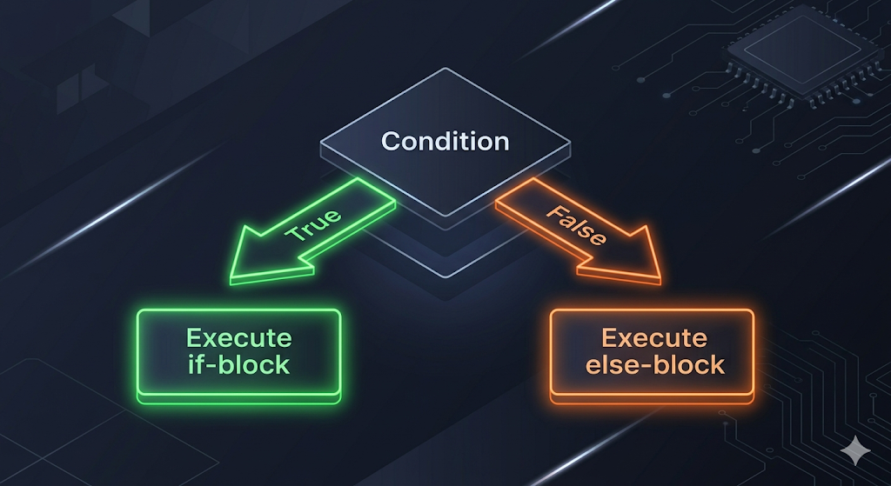
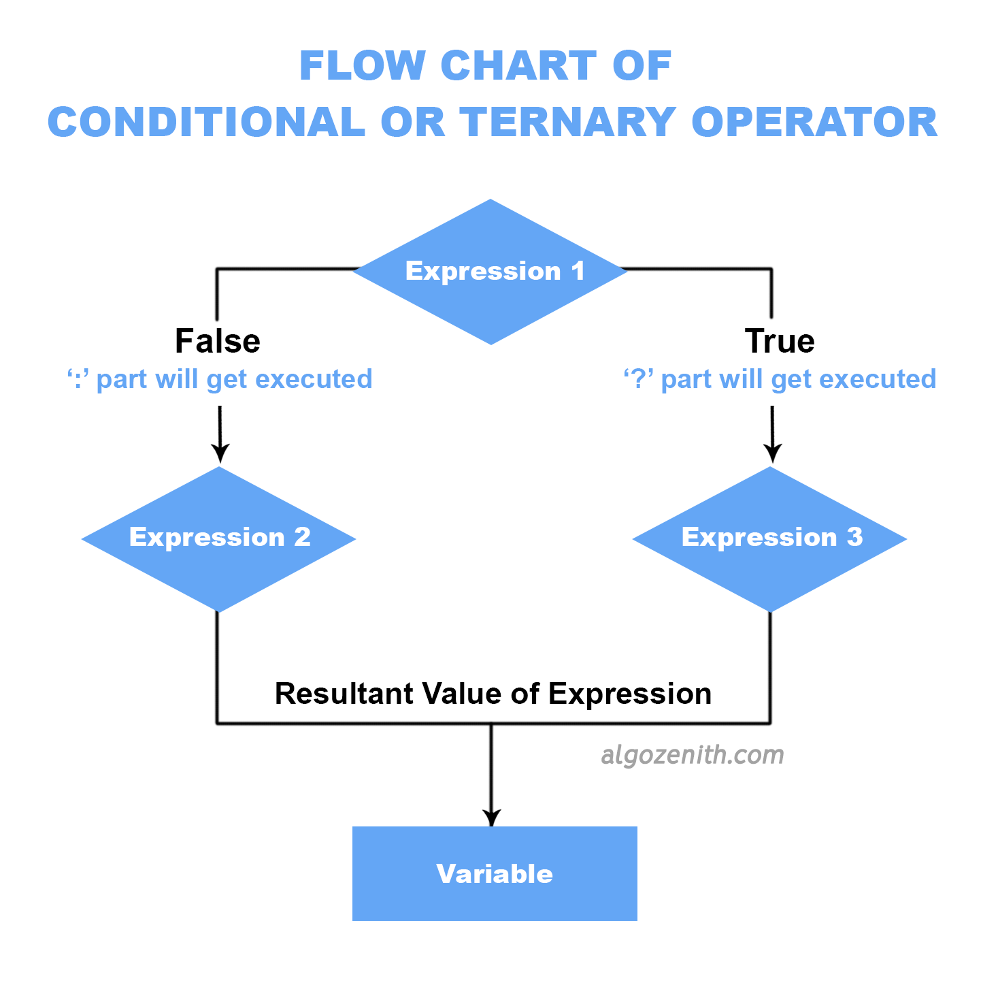

# Conditional Statements

Up until now, your code has run sequentially: line 1, then line 2, then line 3. But real-world problems require **decisions**. 
What if you only want to print "Even" if a number is divisible by 2? What if you want to give a discount only if the user is a VIP? 

This is where **Conditional Statements** come into play!

---

## 1. The `if` Statement

The `if` statement evaluates a condition. If the condition is `true`, the code inside the curly braces `{}` executes. If it's `false`, the program simply skips that block of code.

```cpp
int score = 85;

// The condition goes inside parentheses ()
if (score >= 80) {
    cout << "You passed the test!\n";
}
```

## 2. The `else` Statement

What if you want to do something when the condition is *not* met? You use the `else` statement. It acts as a fallback or a default action.

```cpp
int age = 16;

if (age >= 18) {
    cout << "You are eligible to vote.\n";
} else {
    cout << "You are too young to vote.\n";
}
```



## 3. The `else if` Ladder

When you have multiple, mutually exclusive conditions to check, you can chain them together using `else if`. The program will evaluate them from top to bottom and execute **only the first one** that is true.

```cpp
int marks = 75;

if (marks >= 90) {
    cout << "Grade: A\n";
} else if (marks >= 80) {
    cout << "Grade: B\n";
} else if (marks >= 70) {
    cout << "Grade: C\n";
} else {
    // If none of the above are true
    cout << "Grade: F\n";
}
```

> 💡 **Pro Tip:** The order of conditions matters! If we put `marks >= 70` at the very top, a student with 95 marks would get a 'C' because that first condition evaluates to `true` and the rest of the ladder is completely skipped!

## 4. Nested Conditions

You can place `if` statements *inside* other `if` statements. This is called nesting, and it's used when a decision depends on a previous decision.

```cpp
int number = 10;

if (number > 0) {
    cout << "The number is positive.\n";
    
    // Nested check
    if (number % 2 == 0) {
        cout << "It is also an even number.\n";
    } else {
        cout << "It is an odd number.\n";
    }
} else {
    cout << "The number is zero or negative.\n";
}
```

## 5. The Ternary Operator (Shortcut)

For very simple `if-else` assignments, C++ provides a sleek one-liner called the **Ternary Operator**.

**Syntax:** `condition ? value_if_true : value_if_false;`

```cpp
int a = 15;
int b = 20;

// Without Ternary
int max_val;
if (a > b) {
    max_val = a;
} else {
    max_val = b;
}

// With Ternary
int max_val_ternary = (a > b) ? a : b;
```

It reads like English: "Is `a` greater than `b`? If yes, give me `a`. Otherwise, give me `b`."



---

## Let's Practice!

Decision-making is the heart of logic. Test your conditional logic skills with these fundamental problems!

Try solving the following problems:
- **[Welcome Conditions](https://maang.in/problems/Welcome-Conditions-1165)**
- **[Max and Min](https://maang.in/problems/Max-and-Min-1178)**
- **[Power Of Two](https://maang.in/problems/Power-Of-Two-1228)**
- **[Char](https://codeforces.com/group/MWSDmqGsZm/contest/219158/problem/N)**
- **[Capital or Small or Digit](https://maang.in/problems/Capital-or-Small-or-Digit-1176)**
- **[Age in Days](https://maang.in/problems/Age-in-Days-1162)**
- **[Mathematical Expression](https://maang.in/problems/Mathematical-Expression-1180)**
- **[Multiples](https://codeforces.com/group/MWSDmqGsZm/contest/219158/problem/J)**
- **[Float or int](https://codeforces.com/group/MWSDmqGsZm/contest/219158/problem/U)**
- **[Sort Numbers](https://codeforces.com/group/MWSDmqGsZm/contest/219158/problem/T)**
- **[The Brothers](https://maang.in/problems/The-Brothers-1179)**
- **[Two Intervals](https://maang.in/problems/Two-Intervals-1183)**
- **[Coordinates of a Point](https://maang.in/problems/Coordinates-of-a-Point-1163)**
- **[Memo and Momo](https://codeforces.com/group/MWSDmqGsZm/contest/326175/problem/B)**
- **[Ali Baba and Puzzles](https://codeforces.com/group/MWSDmqGsZm/contest/326175/problem/D)**
- **[Lucky Numbers](https://codeforces.com/group/MWSDmqGsZm/contest/326175/problem/I)**

---

## Video Explanation

[]()
