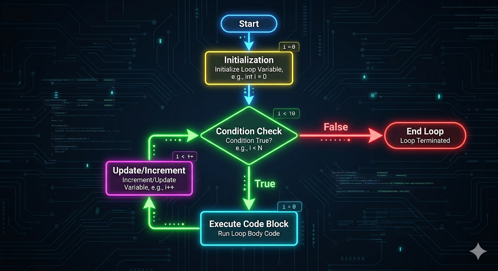
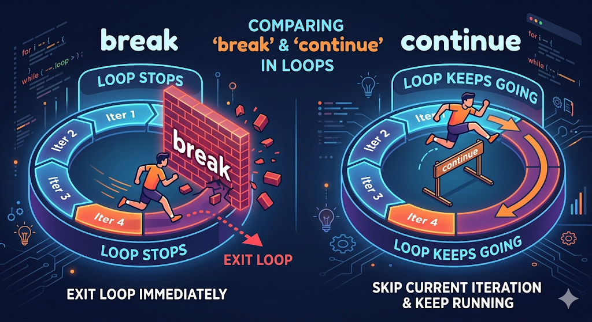

# Loops and Pattern of Iteration

Imagine you are punished in class and asked to write "I will not talk in class" 100 times. You *could* write 100 `cout` statements. But what if the teacher asks for 100,000 times? 

Programming is all about efficiency. Whenever you need to do something repeatedly, you use **Loops**.

---

## 1. The `for` Loop

The `for` loop is your best friend when you know **exactly how many times** you want to repeat a block of code.

It has three main parts:
1. **Initialization:** Where does the loop start? (e.g., `int i = 1`)
2. **Condition:** When should the loop stop? (e.g., `i <= 10`)
3. **Update:** How should we move forward? (e.g., `i++`)

### Forward Iteration (Counting Up)
Printing numbers from 1 to 5:

```cpp
for (int i = 1; i <= 5; i++) {
    cout << i << " ";
}
// Output: 1 2 3 4 5
```

### Reverse Iteration (Counting Down)
Printing numbers from 5 down to 1:

```cpp
for (int i = 5; i >= 1; i--) {
    cout << i << " ";
}
// Output: 5 4 3 2 1
```

> 💡 **Pro Tip:** You can increment or decrement by any number! For example, `i += 2` will skip numbers and count by twos (e.g., 2, 4, 6, 8).



---

## 2. The `while` Loop

Use the `while` loop when you **don't know exactly how many times** the loop needs to run, but you know the *condition* that must be true for it to keep running.

```cpp
int password;
cout << "Enter the 4-digit PIN: ";
cin >> password;

// The loop keeps running AS LONG AS the password is wrong
while (password != 1234) {
    cout << "Wrong PIN. Try again: ";
    cin >> password;
}

cout << "Access Granted!";
```

---

## 3. The `do while` Loop

The `do while` loop is almost identical to the `while` loop, with one massive difference: **It checks the condition at the END.**
This guarantees that the code inside the loop will execute **at least once**, regardless of whether the condition is true or false.

```cpp
int apples = 0;

do {
    cout << "You ate an apple.\n";
    apples--;
} while (apples > 0);

// Output: "You ate an apple."
// Even though apples wasn't > 0 to begin with, it ran once!
```

---

## 4. Controlling the Flow: `break` and `continue`

Sometimes you need to interrupt a loop's normal flow based on a sudden event.

### `break`
The `break` statement instantly **kills** the loop. It immediately jumps out of the loop and moves on to the rest of the code.

```cpp
for (int i = 1; i <= 10; i++) {
    if (i == 4) {
        break; // Stops the loop entirely when i reaches 4
    }
    cout << i << " ";
}
// Output: 1 2 3
```

### `continue`
The `continue` statement skips the **current iteration** and immediately jumps to the next iteration.

```cpp
for (int i = 1; i <= 5; i++) {
    if (i == 3) {
        continue; // Skips printing '3' and moves directly to '4'
    }
    cout << i << " ";
}
// Output: 1 2 4 5
```



---

## 5. Nested Loops

Just like nested `if` statements, you can put a loop inside another loop! 
- The **outer loop** runs once.
- The **inner loop** runs completely from start to finish.
- The **outer loop** runs its second iteration, and the **inner loop** runs completely again.

This is extremely common for printing 2D grids or patterns.

```cpp
for (int row = 1; row <= 3; row++) {
    for (int col = 1; col <= 3; col++) {
        cout << "* ";
    }
    cout << "\n"; // Move to the next line after finishing a row
}
/*
Output:
* * * 
* * * 
* * * 
*/
```

---

## Let's Practice!

Loops are where programming starts to feel powerful!

Try solving the following problems:
- **[1 to N](https://codeforces.com/group/MWSDmqGsZm/contest/219432/problem/A)**
- **[Even Numbers](https://maang.in/problems/Even-Numbers-1220)**
- **[Even, Odd, Positive and Negative](https://maang.in/problems/Even-Odd-Positive-and-Negative-1221)**
- **[Fixed Password](https://codeforces.com/group/MWSDmqGsZm/contest/219432/problem/D)**
- **[Max](https://maang.in/problems/Max-1215)**
- **[Factorial](https://maang.in/problems/Factorial-1138)**
- **[Divisors](https://maang.in/problems/Divisors-1205)**
- **[Gcd](https://maang.in/problems/Gcd-1206)**
- **[Lucky Numbers](https://maang.in/problems/Lucky-Numbers-1209)**
- **[Multiplication Table](https://codeforces.com/group/MWSDmqGsZm/contest/219432/problem/F)**
- **[One Prime](https://codeforces.com/group/MWSDmqGsZm/contest/219432/problem/H)**
- **[Palindrome](https://codeforces.com/group/MWSDmqGsZm/contest/219432/problem/I)**
- **[Digits](https://codeforces.com/group/MWSDmqGsZm/contest/219432/problem/Q)**
- **[Sum of Consecutive Odd Numbers](https://codeforces.com/group/MWSDmqGsZm/contest/219432/problem/S)**
- **[Some Sums](https://codeforces.com/group/MWSDmqGsZm/contest/219432/problem/U)**
- **[Sequence of Numbers and Sum](https://codeforces.com/group/MWSDmqGsZm/contest/219432/problem/R)**
- **[Easy Fibonacci](https://codeforces.com/group/MWSDmqGsZm/contest/219432/problem/Y)**
- **[Finding Minimums](https://codeforces.com/group/MWSDmqGsZm/contest/326907/problem/C)**
- **[Range Sum](https://codeforces.com/group/MWSDmqGsZm/contest/326907/problem/D)**
- **[Break Number](https://codeforces.com/group/MWSDmqGsZm/contest/326907/problem/F)**

---

## Video Explanation

[]()
