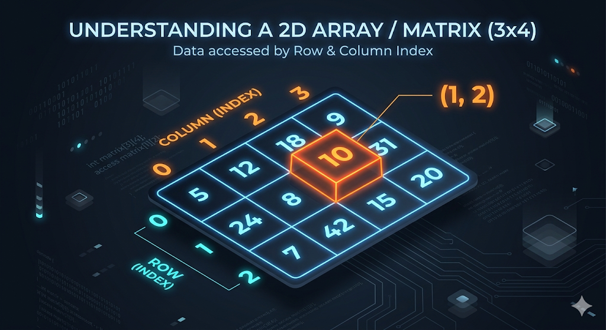

# 2D Arrays and Matrices

We've learned how to store a list of numbers in a 1D Array. But what if your data isn't a single list? What if you are building a Chess board, a Sudoku puzzle, a pixel art image, or a map for a video game?

For data that exists in a **grid**, you need a **2D Array** (also known as a Matrix).

---

## 1. What is a 2D Array? (Rows and Columns)

A 2D array is essentially an "array of arrays." It organizes data into a table format with **Rows** (horizontal) and **Columns** (vertical).

- **Rows** go from top to bottom.
- **Columns** go from left to right.
- Every single "cell" in the grid has a unique coordinate `(i, j)`, where `i` is the row index and `j` is the column index.



---

## 2. Declaring and Accessing Elements

Just like 1D arrays, you must declare the data type and the sizes. However, now you need **two** sizes: `[rows][columns]`.

```cpp
#include <iostream>
using namespace std;

int main() {
    // Declares a grid with 3 rows and 4 columns
    int arr[3][4]; 

    // Assigning a value to the cell at Row 1, Column 2
    arr[1][2] = 99;

    // Accessing that value
    cout << "Value at (1, 2) is: " << arr[1][2] << "\n";
    
    return 0;
}
```

> ⚠️ **Warning:** Just like 1D arrays, 2D arrays are **0-indexed**. A 3x4 matrix has rows `0, 1, 2` and columns `0, 1, 2, 3`. There is no row `3` or column `4`!

---

## 3. Taking Input and Printing Output

To interact with every cell in a 2D array, we use **Nested Loops**. The outer loop iterates through the rows, and the inner loop iterates through the columns.

### Taking Input
```cpp
int n, m;
cin >> n >> m; // Taking input of number of rows and number of cols

int arr[n][m]; // Creating a matrix of size n x m

for (int i = 0; i < n; i++) {
    for (int j = 0; j < m; j++) {
        cin >> arr[i][j];
    }
}
```

### Printing Output (Row-wise Traversal)
Printing row-by-row is the most common way to display a matrix. Notice the `cout << "\n"` after the inner loop finishes to ensure each row prints on a new line!

```cpp
for (int i = 0; i < n; i++) {
    for (int j = 0; j < m; j++) {
        cout << arr[i][j] << " ";
    }
    cout << "\n"; // Move to the next line after a row is done
}
```

---

## 4. Column-wise Traversal

What if you want to process the matrix top-to-bottom, column by column? Simply swap the order of your loops! Make the outer loop control the columns (`j`), and the inner loop control the rows (`i`).

```cpp
for (int j = 0; j < m; j++) { // Outer loop is Columns!
    for (int i = 0; i < n; i++) {
        cout << arr[i][j] << " ";
    }
    cout << "\n"; // Moves to the next line after a column is done
}
```

> 💡 **Computer Science Trivia (Row-Major Order):** Under the hood, C++ stores 2D arrays in contiguous memory row-by-row. This means `arr[0][0]` is right next to `arr[0][1]` in RAM. Because of this, iterating **row-wise** is significantly faster and more "cache-friendly" than iterating column-wise!

---

## 5. Finding the Sum, Minimum, and Maximum

Because a matrix is just a collection of numbers, you can easily find properties like the sum or the extremes by traversing it.

### Sum of All Elements & Finding Extremes
```cpp
int totalSum = 0;
int maxVal = -1e9; // Start with a very small number
int minVal = 1e9;  // Start with a very large number

for (int i = 0; i < n; i++) {
    for (int j = 0; j < m; j++) {
        totalSum += arr[i][j];
        
        if (arr[i][j] > maxVal) maxVal = arr[i][j];
        if (arr[i][j] < minVal) minVal = arr[i][j];
    }
}
```

### Row-wise and Column-wise Sum
Sometimes you need the sum of *each individual row* or *column*.

```cpp
// Row-wise Sum
for (int i = 0; i < n; i++) {
    int rowSum = 0;
    for (int j = 0; j < m; j++) {
        rowSum += arr[i][j];
    }
    cout << "Sum of Row " << i << " is: " << rowSum << "\n";
}
```

---

## 6. Basic Diagonal Traversal

In a **square matrix** (where `n == m`), diagonals are incredibly important.

- **Main Diagonal:** Goes from top-left to bottom-right. The row index always equals the column index (`i == j`).
- **Secondary Diagonal:** Goes from top-right to bottom-left. The row and column indices always add up to `n - 1` (`i + j == n - 1`).

```cpp
int n = 3;
int arr[3][3] = {
    {1, 2, 3},
    {4, 5, 6},
    {7, 8, 9}
};

cout << "Main Diagonal: ";
for (int i = 0; i < n; i++) {
    cout << arr[i][i] << " "; // Since i == j, we just use i for both!
}
// Output: 1 5 9

cout << "\nSecondary Diagonal: ";
for (int i = 0; i < n; i++) {
    int j = n - 1 - i; // Deriving j from the formula i + j == n - 1
    cout << arr[i][j] << " "; 
}
// Output: 3 5 7
```

---

## 7. Boundary Checks in a Matrix

In many grid problems (like mazes or BFS algorithms), you will need to check the "neighbors" of a cell (up, down, left, right). Before you check a neighbor, you **must** ensure you don't step off the edge of the board!

If you try to access `arr[-1][0]` or `arr[n][0]`, your program will crash or read garbage data.

```cpp
int r = 0; // Current row
int c = 2; // Current column

// Is the cell to our "Right" safe to visit?
int next_c = c + 1;

if (next_c >= 0 && next_c < m) {
    cout << "Safe to move right! The value is: " << arr[r][next_c] << "\n";
} else {
    cout << "Danger! That is out of bounds!\n";
}

// A standard reusable boundary check function for a grid of size n x m:
bool isValid(int i, int j, int n, int m) {
    return (i >= 0 && i < n && j >= 0 && j < m);
}
```

---

## 8. Passing 2D Arrays to Functions

Passing a 2D static array to a function is a massive pain point for beginners. If you write `void printMatrix(int arr[][])`, your code **will not compile**. 

C++ needs to know how to calculate the memory offsets to find the next row. Therefore, you **must specify the column size** in the function parameters!

```cpp
// The number of columns (3) MUST be hardcoded!
void printMatrix(int arr[][3], int rows) {
    for(int i = 0; i < rows; i++) {
        for(int j = 0; j < 3; j++) {
            cout << arr[i][j] << " ";
        }
        cout << "\n";
    }
}
```

---

## Let's Practice!

2D Array problems are excellent for practicing logic and nested loops. 

Try the following problems:

- **[Search in Matrix](https://maang.in/problems/Search-in-Matrix-1145)**
- **[Matrix](https://maang.in/problems/Matrix-1144)**
- **[8 Neighbors](https://maang.in/problems/8-Neighbors-1141)**
- **[Mirror Array](https://maang.in/problems/Mirror-Array-1142)**

---

## Video Explanation

[]()
