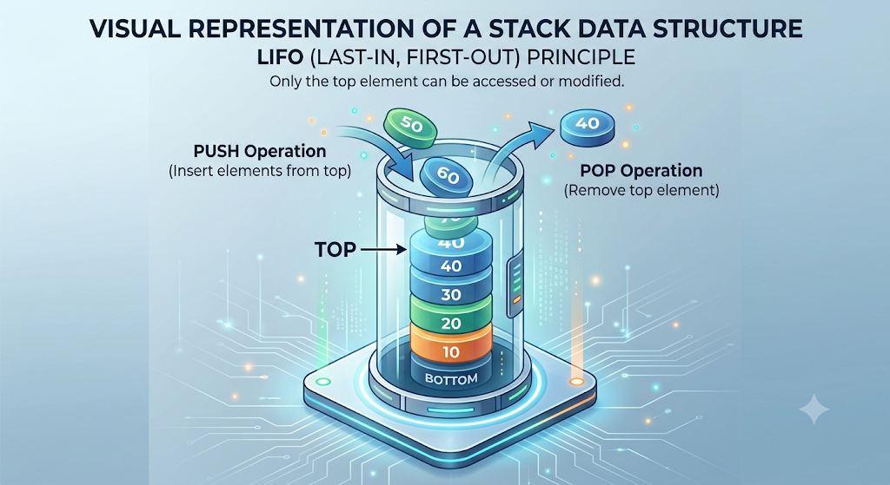
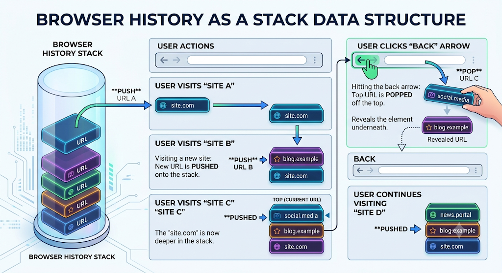

# The Stack Data Structure

Imagine you are at a buffet and you see a massive stack of clean plates. If you want a plate, you take the one resting precisely on the very top. When the dishwasher brings out freshly cleaned plates, they don't shove them into the bottom or middle of the pile—they place them directly on top. 

This simple real-world mechanism perfectly describes one of the most powerful structures in Computer Science: **The Stack**.

---

## 1. The LIFO Principle

A Stack is a linear data structure that strictly follows the **LIFO** principle:
**Last In, First Out**

The last element that you insert into the stack will always be the very first element that you pull out of it. You are strictly forbidden from accessing, inserting, or deleting elements from the middle or the bottom of the stack. All interactions happen at one single point: the **Top**.



---

## 2. Core Operations

Because a Stack restricts access to a single point (the top), its operations are blazingly fast. Every core operation on a Stack operates in exactly **$O(1)$ Time Complexity**.

Here are the fundamental operations:

1. **Push (`push(x)`):** Adds element `x` to the absolute top of the stack.
2. **Pop (`pop()`):** Removes the element currently sitting at the top of the stack.
3. **Top / Peek (`top()`):** Returns the value of the top element *without* removing it.
4. **Size (`size()`):** Returns the total number of elements currently in the stack.
5. **IsEmpty (`empty()`):** Checks if the stack has zero elements.

> 🚨 **The CP Trap: Popping an Empty Stack** 
> If you call `.pop()` or `.top()` on an empty stack, your C++ program will instantly crash with a **Segmentation Fault**! Always securely wrap your pops with an `if (!st.empty())` check.

```cpp
#include <iostream>
#include <stack>
using namespace std;

int main() {
    stack<int> st;

    st.push(10); // Stack: [10]
    st.push(20); // Stack: [10, 20]
    st.push(30); // Stack: [10, 20, 30] (Top is 30)

    cout << "Size of Stack is: " << st.size() << "\n"; // Prints 3

    cout << "Top element is: " << st.top() << "\n"; // Prints 30

    st.pop(); // Removes 30. Stack: [10, 20]

    // Secure pop
    if (!st.empty()) {
        cout << "New Top element is: " << st.top() << "\n"; // Prints 20
    }

    return 0;
}
```

---

## 3. How is a Stack Built? (The Underlying Reality)

A Stack is technically an **Abstract Data Type (ADT)**. This means "Stack" is just a set of rules (LIFO). It doesn't magically exist in memory on its own. 

Under the hood, a Stack is actually just an **Array** or a **Linked List** wearing a disguise! 
- If you use an Array to build a stack, `push()` just means `arr[size] = x`, and `pop()` just means `size--`.

---

## 4. Why Do We Need Stacks?

If a stack is just a restricted Array, why not just use an Array for everything? 
Because **restrictions breed safety and specialized algorithms**. 

By forcing data into a LIFO pattern, Stacks naturally solve problems that involve "undoing" actions or matching pairs from the inside out.

> 💡 **CP Insight:** If a problem requires you to process the most recently seen items first, or requires you to "backtrack" to an earlier state, a Stack is almost always the required Data Structure.

### Famous Stack Applications:
1. **The Undo Button:** Every time you type a word in your text editor, it gets pushed to a stack. When you hit `Ctrl + Z` (Undo), it pops the last word off the top!
2. **Web Browser History:** Clicking a link pushes your current page onto a stack. Hitting the "Back" button pops it to take you to the previous page.
3. **Function Call Stack:** When a function calls another function, your computer's OS uses a stack to remember where to return to when the inner function finishes!
4. **Valid Parentheses:** Matching opening brackets `({[` with closing brackets `]})` is the ultimate classic Stack interview question.



---

## 5. Solving "Valid Parentheses"

Let's look at the absolute quintessential Stack problem: **Valid Parentheses**.

**The Problem:** Given a string `s` containing just the characters `(`, `)`, `{`, `}`, `[` and `]`, determine if the input string is valid.
An input string is valid if:
1. Open brackets must be closed by the same type of brackets.
2. Open brackets must be closed in the correct order.
3. Every close bracket has a corresponding open bracket of the same type.

**Examples:**
- `s = "()"` $\rightarrow$ `true`
- `s = "()[]{}"` $\rightarrow$ `true`
- `s = "(]"` $\rightarrow$ `false`
- `s = "([])"` $\rightarrow$ `true`
- `s = "([)]"` $\rightarrow$ `false`

### The Intuition

Why is a Stack the perfect data structure here? Because of the **"Inside-Out"** matching rule.
If you have a string like `([])`, the most recently opened bracket `[` must be the very first one to be closed `]`. 
"Most recently opened must be closed first" is the exact definition of **Last-In-First-Out (LIFO)**!

### The Algorithm
1. Iterate through every character in the string.
2. If it is an **opening bracket** `(`, `{`, or `[`, push it onto the stack.
3. If it is a **closing bracket** `)`, `}`, or `]`:
   - First, check if the stack is empty. If it is, there is no matching opening bracket, so return `false`.
   - Next, check the `top()` of the stack. If it perfectly matches the type of the closing bracket, `pop()` it from the stack.
   - If it doesn't match (e.g., you found a `}` but the top of the stack is a `[`), return `false`.
4. At the very end of the string, the stack should be completely empty (all brackets were matched). If the stack is not empty, return `false`.

### The Code (C++)

```cpp
bool isValid(string s) {
    stack<char> st;
    
    for (char c : s) {
        // If it's an opening bracket, push to stack
        if (c == '(' || c == '{' || c == '[') {
            st.push(c);
        } 
        // If it's a closing bracket
        else {
            // Guard against Segmentation Fault!
            if (st.empty()) return false;
            
            char top = st.top();
            
            // Check for perfect match
            if ((c == ')' && top == '(') || 
                (c == '}' && top == '{') || 
                (c == ']' && top == '[')) {
                st.pop(); // Match found, remove it
            } else {
                return false; // Mismatch!
            }
        }
    }
    
    // If the stack is empty, all brackets were matched!
    return st.empty();
}
```

---

## Let's Practice!

Put your new LIFO skills to the test with these foundational Stack problems:

- **[Stack AZ101](https://maang.in/problems/Stack-AZ101-347)**
- **[Valid Parentheses](https://leetcode.com/problems/valid-parentheses/)**
- **[Valid Parentheses AZ101](https://maang.in/problems/Valid-Parentheses-AZ101-348)**
- **[Reverse each word in a given string](https://www.geeksforgeeks.org/problems/reverse-each-word-in-a-given-string1001/1)**
- **[Maximum Nesting Depth of the Parentheses](https://leetcode.com/problems/maximum-nesting-depth-of-the-parentheses/description/)**
- **[Final Prices With a Special Discount in a Shop](https://leetcode.com/problems/final-prices-with-a-special-discount-in-a-shop/description/)**
- **[Implement stack using array](https://www.geeksforgeeks.org/problems/implement-stack-using-array/1)**
- **[Postfix to Prefix Conversion](https://www.geeksforgeeks.org/problems/postfix-to-prefix-conversion/1)**
- **[Infix-Postfix](https://maang.in/problems/InfixPostfix-393)**
- **[Strong Elements](https://maang.in/problems/Strong-Elements-1059)**

---

## Video Explanation

[]()
