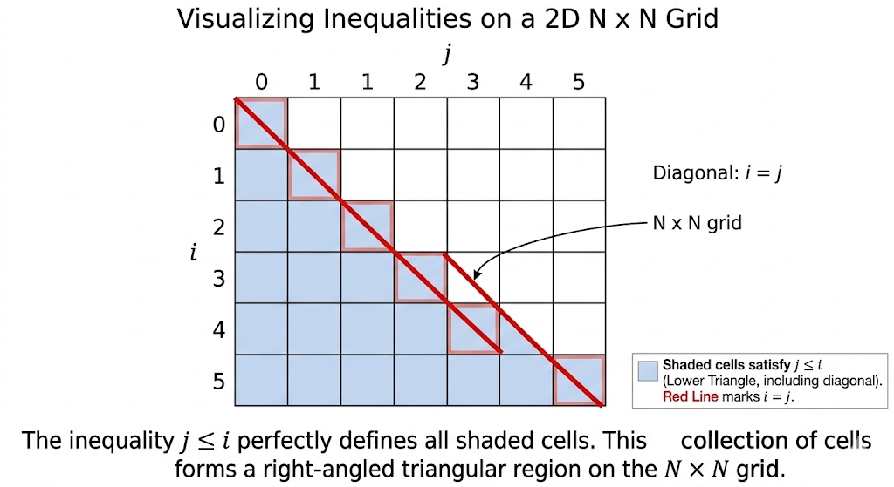

# The Art of Pattern Printing: The Canvas Approach

*Stop memorizing fragile nested loops. Learn the mathematical paradigm shift that turns complex pattern printing into an elegant game of coordinate geometry.*

## Why the Traditional Way is Broken

Let's talk about the elephant in the room: top-tier tech companies rarely ask direct pattern printing questions. Because of this, many students skip them. But this is a massive mistake. Pattern printing is actually a disguised training ground for 2D Matrix Traversal and Coordinate Geometry. 

The traditional approach of manually managing the changing boundaries of inner loops is highly prone to off-by-one errors and is incredibly hard to debug. In real-world software engineering—such as building a graphics rendering engine, writing GPU shaders, or rendering UI elements—we don't loop through "empty spaces" and then "filled spaces". 

Instead, we define a **Canvas**, iterate over every pixel `(i, j)`, and ask an **Oracle function**: *"Based on your coordinates, what should you print?"*

Welcome to **The Canvas Approach**. 

### The Paradigm Shift
Instead of writing complex nested loops with shifting bounds, we will:
1. **Define the Canvas:** Determine the exact grid dimensions (e.g., $N \times M$). Write two simple, fixed loops to iterate through every coordinate $(i, j)$ on this canvas.
2. **The Oracle Function:** For every coordinate, call a separate logic function (e.g., `oracle(i, j)`) that uses mathematical inequalities (half-planes) or modulo logic to decide what character to return at that exact pixel.

Let's see how this drastically simplifies our thought process, starting with the basics and building up to a complex grid.

---

## Level 1: The Hollow Rectangle (Outer Boundaries)

**The Problem:** Print a hollow rectangle of length $N$ and width $M$ using `*`. The borders are filled with `*` and the interior is empty.

For $N = 4, M = 5$:
```text
*****
*   *
*   *
*****
```

### 1. Defining the Canvas
The dimensions are explicitly given: $N$ rows and $M$ columns. 
Our fixed outer loops will simply be:
```cpp
for (int i = 0; i < n; i++) {
    for (int j = 0; j < m; j++) {
        cout << oracle(i, j, n, m);
    }
    cout << "\n";
}
```

### 2. The Oracle Function
How do we mathematically define a "border"?
On an $(i, j)$ coordinate system (where $i$ goes from $0$ to $N-1$ and $j$ from $0$ to $M-1$), the borders are simply the extreme minimum and maximum coordinates.
- **Top Border:** $i = 0$
- **Bottom Border:** $i = N - 1$
- **Left Border:** $j = 0$
- **Right Border:** $j = M - 1$

If we are on any of these coordinates, we print a `*`. Otherwise, we print a space.

```cpp
char oracle(int i, int j, int n, int m) {
    if (i == 0 || i == n - 1 || j == 0 || j == m - 1) {
        return '*';
    }
    return ' ';
}
```


---

## Level 2: Right Angled Triangle (Single Boundary)

**The Problem:** Print a right-angled triangle pattern for a given $N$. 
For $N = 4$:
```text
*
**
***
****
```

### 1. Defining the Canvas
The triangle has $N$ rows. The maximum width at the bottom is also $N$. So, our canvas is an $N \times N$ grid.
```cpp
for (int i = 0; i < n; i++) {
    for (int j = 0; j < n; j++) {
        cout << oracle(i, j);
    }
    cout << "\n";
}
```

### 2. The Oracle Function (Coordinate Geometry)
How do we mathematically bound this triangle?
If we look at the row index $i$ and column index $j$:
- Row $i=0$: prints 1 star (at $j=0$)
- Row $i=1$: prints 2 stars (at $j=0, 1$)
- Row $i=2$: prints 3 stars (at $j=0, 1, 2$)

Notice the pattern? We print a star as long as the column index $j$ is less than or equal to the row index $i$. Mathematically, $j \le i$.

```cpp
char oracle(int i, int j) {
    if (j <= i) {
        return '*';
    } 
    return ' '; 
}
```



---

## Level 3: The Pyramid (Intersecting Boundaries)

**The Problem:** Print a pyramid pattern for a given $N$. The stars are separated by spaces.
For $N = 4$:
```text
   *
  * *
 * * *
* * * *
```

### 1. Defining the Canvas
For a pyramid of height $N$, the maximum width at the bottom is $2N - 1$. So our canvas is exactly $N$ rows and $2N - 1$ columns. 
```cpp
for (int i = 0; i < n; i++) {
    for (int j = 0; j < 2 * n - 1; j++) {
        cout << oracle(i, j);
    }
    cout << "\n";
}
```

### 2. The Oracle Function (Absolute Value and Parity)
Notice how traditional loops struggle with the spaces between the stars (e.g., `* * *`)? This is a notorious Online Judge trap. The Canvas approach solves this effortlessly by layering two conditions.

First, let's look at the overall shape. The pyramid is a triangle centered in the middle of our canvas. The center column is exactly at $j = N - 1$.
If we treat $j$ as the X-axis, $i$ as the Y-axis, and the center $(N-1)$ as our origin shift, the boundaries of the pyramid can be written in one beautiful line of math:

$$|j - (N - 1)| \le i$$

This absolute value inequality states that a star is printed if the horizontal distance from the center is less than or equal to the current row $i$.

But what about the spaces between the stars? We simply add a parity check! The parity of the stars depends entirely on the tip of the pyramid, located at `(0, center)`. We just need to check if our current coordinate sum `(i + j)` matches the parity of the tip!

```cpp
char oracle(int i, int j, int n) {
    int center = n - 1;
    // Condition 1: Inside the triangle bounds
    bool insidePyramid = abs(j - center) <= i;
    
    // Condition 2: Coordinate parity for spaces between stars
    // The parity must match the tip of the pyramid at (0, center)
    bool isCorrectParity = (i + j) % 2 == center % 2;
    
    if (insidePyramid && isCorrectParity) {
        return '*';
    }
    return ' ';
}
```
This is a massive "Aha!" moment. We just replaced complicated nested bounds and flag variables with simple coordinate geometry.


---

## Level 4: The Masterpiece (Periodic Grids)

Now, let's look at a problem where the traditional approach of nested loops completely falls apart and becomes a nightmare to code.

**The Problem:** Print a grid-like pattern of blocks for a given $N$ (vertical blocks) and $M$ (horizontal blocks). Every block is bounded by `*` and filled with `.`.
For $N = 3, M = 4$:
```text
*************
*..*..*..*..*
*..*..*..*..*
*************
*..*..*..*..*
*..*..*..*..*
*************
*..*..*..*..*
*..*..*..*..*
*************
```

### 1. Defining the Canvas
If you try to write nested loops per block, how do you handle the shared borders? It's a disaster of edge cases. 

Instead, let's step back and look at the entire canvas.
How many total rows are there?
Each of the $N$ blocks takes 3 vertical pixels (1 top border, 2 dots). Then there is 1 final bottom border for the entire grid. So, $\text{total rows} = 3N + 1$.
Similarly, each of the $M$ blocks takes 3 horizontal pixels, plus 1 final right border. $\text{total columns} = 3M + 1$.

To avoid "magic numbers" (a red flag in interviews), we introduce a `stride` variable to represent the block size.

```cpp
int stride = 3;
int total_rows = stride * n + 1;
int total_cols = stride * m + 1;

for (int i = 0; i < total_rows; i++) {
    for (int j = 0; j < total_cols; j++) {
        cout << oracle(i, j, stride);
    }
    cout << "\n";
}
```

### 2. The Oracle Function (Modulo Magic)
When exactly do the `*` borders appear?
Look at the row indices for the horizontal lines: $i = 0$, $i = 3$, $i = 6$, $i = 9$...
Look at the column indices for the vertical lines: $j = 0$, $j = 3$, $j = 6$, $j = 9$, $j = 12$...

They appear exactly when the index is a multiple of the stride!
Mathematically: `i % stride == 0` OR `j % stride == 0`.
If either is true, it's a border (`*`). Otherwise, it's the inside of a block (`.`).

```cpp
char oracle(int i, int j, int stride) {
    if (i % stride == 0 || j % stride == 0) {
        return '*';
    }
    return '.';
}
```

That's it. What could have been 100 lines of spaghetti code with overlapping loops is solved in 6 lines of elegant, pure logic.


---

## Edge Cases & "Gotchas"

Even though the Canvas Approach eliminates loop boundary bugs, there are still a few traps you need to watch out for:

1. **🚨 CRITICAL: Zero-Indexing vs One-Indexing 🚨** 
   We mapped our canvas from $0$ to $Total-1$. If you accidentally start your loops at $1$, equations like `i % 3 == 0` will break completely (they would become `(i-1) % 3 == 0`). **Stick religiously to 0-indexed canvases.** The math is infinitely easier when the origin is $(0,0)$.

2. **Trailing Spaces and Strict Online Judges (OJs):** Some OJs are extremely strict about trailing spaces. If the OJ expects exactly $i$ characters per row and then a newline, printing spaces for the rest of the canvas might give a Presentation Error. In such cases, you can optimize the inner loop to only iterate up to $i$, effectively terminating the row early. The geometric logic remains exactly the same!

3. **Time Complexity Checks:** The canvas approach guarantees we visit every coordinate exactly once. The time complexity is exactly $O(\text{rows} \times \text{cols})$.

4. **The $O(1)$ Space Complexity Flex:**
   Because the Canvas Approach evaluates coordinates dynamically on the fly (the Oracle) and prints directly to the output stream, the **Auxiliary Space Complexity is strictly $O(1)$**. We *simulate* a 2D array without ever allocating one in memory. Mentioning this optimization in an interview is a huge flex!

## The Verdict

By switching from **Loop Boundary Management** to **Coordinate Geometry**, you decouple the traversal of the grid from the logic of what to print. The next time you see a complicated repeating pattern, don't ask "How do I loop over this?" Ask: *"What are the mathematical equations of its boundaries?"*

---

## Let's Practice!

Pattern printing is best learned by doing. Test your newfound coordinate geometry skills with these problems!

Try solving the following problems:

- **[Hollow Pattern](https://maang.in/problems/Hollow-Pattern-1089)**
- **[Right Angled Triangle Pattern](https://maang.in/problems/Right-Angled-Triangle-Pattern-1096)**
- **[Inverted Right Angled Triangle Pattern](https://maang.in/problems/Inverted-Right-Angled-Triangle-Pattern-1095)**
- **[Pyramid Pattern](https://maang.in/problems/Pyramid-Pattern-1091)**
- **[Another Pyramid Pattern](https://maang.in/problems/Another-Pyramid-Pattern-1094)**
- **[Alphabetical Pattern](https://maang.in/problems/Alphabetical-Pattern-1090)**
- **[Zig-zag Snake](https://maang.in/problems/Zigzag-Snake-772)**
- **[Pattern Problem 1 AZ101](https://maang.in/problems/Pattern-Problem-1-AZ101-317)**
- **[Pattern Problem 2 AZ101](https://maang.in/problems/Pattern-Problem-2-AZ101-318)**
- **[Butterfly Pattern](https://maang.in/problems/Butterfly-Pattern-1093)**
- **[Hollow Diamond](https://maang.in/problems/Hollow-Diamond-121)**

---

## Video Explanation

[](https://maang.in/playlists/The-Art-of-printing-patterns-3156?resourceUrl=cs203-cp849-pl3156-rs8107&returnUrl=%5B%22%2Fcourses%2FAZ101-Master-C-For-Data-Structures-and-Algorithms-203%3Ftab%3Dchapters%22%5D)
