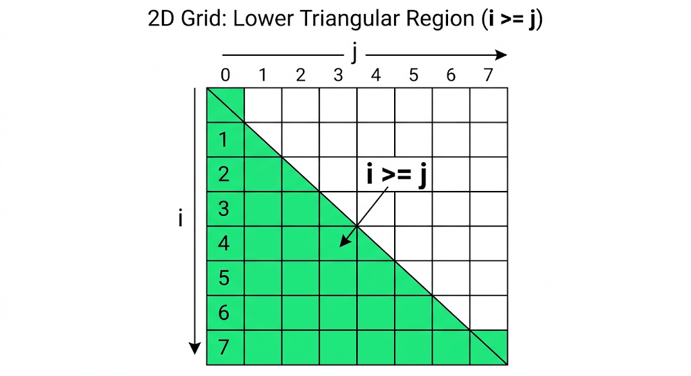

# The Art of Pattern Printing: Level 3 - Regions and Inequalities

In Level 2, we learned how to draw perfectly straight diagonal lines using equations like `i == j`. But what if we don't just want a line? What if we want to fill an entire *region* of the canvas?

In mathematics, a line splits a 2D plane into two halves. To color in one of those halves, we simply change our equation (`==`) into an inequality (`>=` or `<=`). Let's see how this creates solid shapes!

---

## Pattern 1: The Right-Angled Triangle (Lower Half)

**The Problem:** Print a right-angled triangle pattern for a given $N$. 

For $N = 5$:
```text
*
**
***
****
*****
```

### 1. Defining the Canvas
The triangle has $N$ rows, and the maximum width at the bottom is $N$. So, our canvas is a standard $N \times N$ grid.
```cpp
for (int i = 0; i < n; i++) {
    for (int j = 0; j < n; j++) {
        print_pixel(i, j, n);
    }
    cout << "\n";
}
```

### 2. The Print Function (Inequalities)
Think back to Level 2. The diagonal line running from top-left to bottom-right is `i == j`. 

Notice that our triangle is essentially that diagonal line **plus everything below it**. 
If you pick any star below the diagonal—for example, the star at row 4, column 1 `(4, 1)`—you will see that the row index is always strictly greater than the column index ($4 > 1$). 

So, to print the diagonal AND everything below it, we just combine them into a single inequality: `i >= j`.

```cpp
void print_pixel(int i, int j, int n) {
    if (i >= j) {
        cout << "*";
    } else {
        cout << " "; 
    }
}
```



---

## Pattern 2: The Inverted Right-Angled Triangle (Upper Half)

**The Problem:** Print an inverted right-angled triangle, pushed to the right side of the canvas.

For $N = 5$:
```text
*****
 ****
  ***
   **
    *
```

### 1. Defining the Canvas
We still have an $N \times N$ canvas. Our standard loops remain completely unchanged.

### 2. The Print Function (The Other Half)
Let's look at the shape. This is the exact opposite of our first pattern. We have the primary diagonal (`i == j`), but this time, all the stars are **above** the diagonal!

If you pick any star above the diagonal—for example, the star at row 0, column 4 `(0, 4)`—you will see that the row index is always strictly less than the column index ($0 < 4$).

To print the diagonal and everything above it, we flip the inequality: `i <= j`.

```cpp
void print_pixel(int i, int j, int n) {
    if (i <= j) {
        cout << "*";
    } else {
        cout << " "; 
    }
}
```


---

## Pattern 3: Dynamic Characters (The Alphabetical Pattern)

**The Problem:** Print a right-angled triangle, but instead of stars, print the first $j+1$ characters of the alphabet.

For $N = 4$:
```text
A
AB
ABC
ABCD
```

### 1. Defining the Canvas
The bounds are exactly the same as the right-angled triangle (`i >= j`).

### 2. The Print Function (Dynamic Characters)
Up until now, our print function returned binary shapes: `*` or ` `. But we have the full power of C++ at our disposal! Because we have the $j$ coordinate, we can dynamically calculate the exact character to print using ASCII math: `char('A' + j)`.

```cpp
void print_pixel(int i, int j, int n) {
    if (i >= j) {
        cout << char('A' + j);
    } else {
        cout << " "; 
    }
}
```
This proves that the Canvas Approach isn't just for stars. You can inject any complex logic inside the `if` block, and the geometric layout will perfectly handle the rest.

---

## Edge Cases & "Gotchas"

1. **Strict OJ Traps (Trailing Spaces):** 
   While the canvas approach works perfectly, some Online Judges (OJs) are incredibly strict and will throw a *Presentation Error* if you print trailing spaces at the end of a line. In Pattern 1, we print spaces when `i < j`. To optimize for strict OJs, you can break the inner loop early: `if (j > i) break;`. This prevents trailing spaces without changing your geometric logic!

2. **Flipping the Diagonal:** 
   What if the triangle is mirrored along the *secondary* diagonal (`i + j == N - 1`)? You apply the exact same inequality logic! 
   - `i + j >= N - 1` shades the bottom-right half.
   - `i + j <= N - 1` shades the top-left half.
   Mastering these four half-planes is the ultimate cheat code for pattern printing.

## The Verdict

By simply swapping `==` for `>=` or `<=`, we upgraded our ability to draw 1D lines into the power to shade entire 2D regions. In the next level, we will learn how to intersect these regions using logical operators to draw incredibly complex shapes!

---

## Let's Practice!

Test your inequality logic with these foundational problems!

- **[Right Angled Triangle Pattern](https://maang.in/problems/Right-Angled-Triangle-Pattern-1096)**
- **[Inverted Right Angled Triangle Pattern](https://maang.in/problems/Inverted-Right-Angled-Triangle-Pattern-1095)**
- **[Alphabetical Pattern](https://maang.in/problems/Alphabetical-Pattern-1090)**

---

## Video Explanation

[]()
