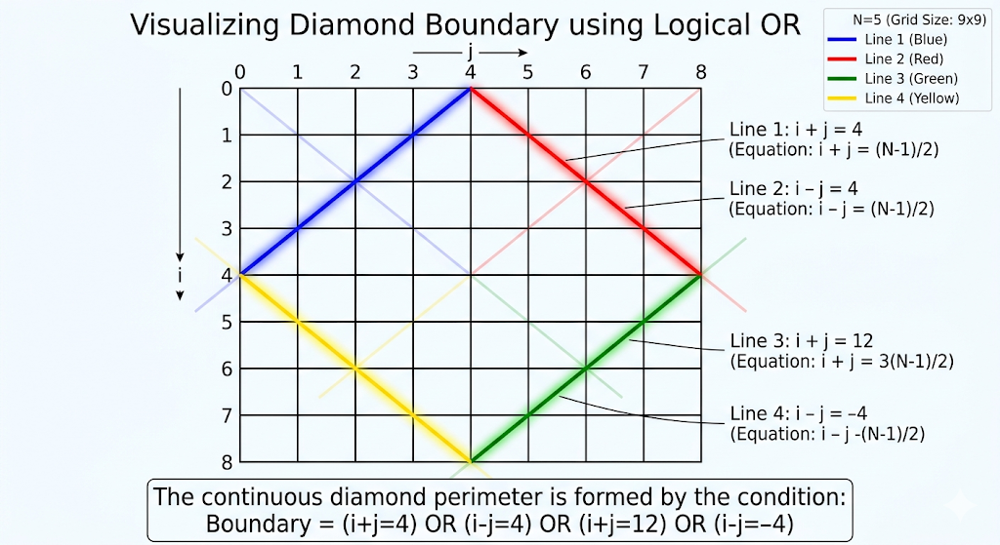

# The Art of Pattern Printing: Level 4 - Composition of Lines

In previous levels, we learned how to draw single lines and single regions. But most interview patterns aren't just one line—they are complex shapes made of multiple intersecting lines. 

How do we draw two things at once? We simply use Logical Operators (`||` and `&&`)! 

---

## Pattern 1: The Plus Sign

**The Problem:** Print a plus sign `+` inside an $N \times N$ canvas. (Assume $N$ is odd).

For $N = 5$:
```text
  *  
  *  
*****
  *  
  *  
```

### 1. Defining the Canvas
Our canvas is $N \times N$. 
```cpp
for (int i = 0; i < n; i++) {
    for (int j = 0; j < n; j++) {
        print_pixel(i, j, n);
    }
    cout << "\n";
}
```

### 2. The Print Function (Logical OR)
What is a plus sign? It is simply a vertical line intersecting with a horizontal line exactly at the center of the canvas.
We know the center is at `mid = n / 2`.
- The horizontal line equation: `i == mid`
- The vertical line equation: `j == mid`

To print the plus sign, a star should be drawn if we are on the horizontal line **OR** if we are on the vertical line.

```cpp
void print_pixel(int i, int j, int n) {
    int mid = n / 2;
    if (i == mid || j == mid) {
        cout << "*";
    } else {
        cout << " "; 
    }
}
```

---

## Pattern 2: The "X" Sign

**The Problem:** Print an "X" pattern inside an $N \times N$ canvas.

For $N = 5$:
```text
*   * 
 * *  
  *   
 * *  
*   * 
```

### 1. Defining the Canvas
The canvas is $N \times N$.
```cpp
for (int i = 0; i < n; i++) {
    for (int j = 0; j < n; j++) {
        print_pixel(i, j, n);
    }
    cout << "\n";
}
```

### 2. The Print Function
What is an "X"? It is the intersection of the **Primary Diagonal** and the **Secondary Diagonal**.
We learned these equations in Level 2!
- Primary Diagonal: `i == j`
- Secondary Diagonal: `i + j == n - 1`

Again, we simply combine them with a logical OR.

```cpp
void print_pixel(int i, int j, int n) {
    if (i == j || i + j == n - 1) {
        cout << "*";
    } else {
        cout << " "; 
    }
}
```


---

## Pattern 3: Composition of Regions (The Hourglass)

We just composed lines using `||`. But what if we want to draw solid, filled shapes like a Butterfly or an Hourglass? 
We simply compose **regions** using inequalities (`>=`, `<=`) and combine them with logical AND (`&&`) or logical OR (`||`)!

**The Problem:** Print a solid Hourglass shape.
For $N = 5$:
```text
*****
 *** 
  *  
 *** 
*****
```

### 1. Defining the Canvas
The canvas is simply $N \times N$.
```cpp
for (int i = 0; i < n; i++) {
    for (int j = 0; j < n; j++) {
        print_pixel(i, j, n);
    }
    cout << "\n";
}
```

### 2. The Print Function (Intersecting Regions)
An hourglass is made of two filled triangles:
1. **The Top Triangle:** It must be *above* the primary diagonal (`i <= j`) AND *above* the secondary diagonal (`i + j <= n - 1`).
2. **The Bottom Triangle:** It must be *below* the primary diagonal (`i >= j`) AND *below* the secondary diagonal (`i + j >= n - 1`).

To print the full hourglass, we just ask: Are we in the top triangle OR are we in the bottom triangle?

```cpp
void print_pixel(int i, int j, int n) {
    bool top_triangle = (i <= j && i + j <= n - 1);
    bool bottom_triangle = (i >= j && i + j >= n - 1);
    
    if (top_triangle || bottom_triangle) {
        cout << "*";
    } else {
        cout << " "; 
    }
}
```

If you change the `||` to an `&&` (or swap the region equations), you can instantly flip this logic into a solid **Butterfly Pattern**! 

---

## The Masterpiece: The Hollow Diamond

Now, let's look at a problem where the traditional approach of nested loops completely falls apart and becomes a nightmare to code.

**The Problem:** Print a hollow diamond.
For $N = 5$:
```text
    *
   * *
  *   *
 *     *
*       *
 *     *
  *   *
   * *
    *
```

### 1. Defining the Canvas
Notice the size of the diamond. The top half takes $N$ rows, and the bottom half takes $N - 1$ rows.
Total rows = $2N - 1$.
Total columns = $2N - 1$.

```cpp
int canvas_size = 2 * n - 1;
for (int i = 0; i < canvas_size; i++) {
    for (int j = 0; j < canvas_size; j++) {
        print_pixel(i, j, n);
    }
    cout << "\n";
}
```

### 2. The Print Function (Four Intersecting Lines)
If you try to write nested loops for the top half, and then another set of nested loops for the bottom half, you will be swimming in off-by-one errors. 

Instead, let's look at the diamond for what it really is geometrically. A hollow diamond is simply the intersection of four shifted diagonal lines! 
Think back to the "Shifted Diagonals" concept we learned in Level 2. The diamond is composed of:
1. **Top-Left Edge:** A secondary diagonal shifted left (`i + j == n - 1`)
2. **Top-Right Edge:** A primary diagonal shifted up (`i == j - n + 1`)
3. **Bottom-Left Edge:** A primary diagonal shifted down (`i == j + n - 1`)
4. **Bottom-Right Edge:** A secondary diagonal shifted right (`i + j == 3*n - 3`)

By combining these four line equations with the logical OR operator (`||`), the diamond forms naturally without a single confusing inner loop:

```cpp
void print_pixel(int i, int j, int n) {
    if (i + j == n - 1 || i == j - n + 1 || i == j + n - 1 || i + j == 3*n - 3) {
        cout << '*';
    } else {
        cout << ' ';
    }
}
```
That's it. What could have been 40 lines of spaghetti code with overlapping loops is solved elegantly by composing four simple lines.



---

## The Verdict

By composing lines with `||` and shifting them across the canvas, we've unlocked the ability to draw highly complex intersecting shapes without adding a single extra `for` loop.

In the final level, we will learn how to take these shapes and repeat them infinitely across the canvas using Modulo Math!

---

## Let's Practice!

Pattern printing is best learned by doing. Test your newfound coordinate geometry skills with these problems!

- **[Hollow Diamond](https://maang.in/problems/Hollow-Diamond-121)**
- **[Butterfly Pattern](https://maang.in/problems/Butterfly-Pattern-1093)**
- **[Another Pyramid Pattern](https://maang.in/problems/Another-Pyramid-Pattern-1094)**
- **[Pyramid Pattern](https://maang.in/problems/Pyramid-Pattern-1091)**

---

## Video Explanation

[]()
