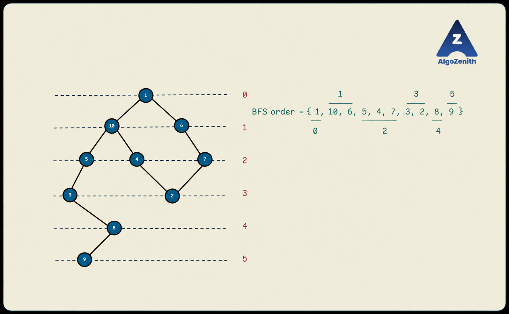

<VIDEO_WIDGET>

<VIDEO_ID></VIDEO_ID>

</VIDEO_WIDGET>

<READING_WIDGET>

# Introduction to Breadth-First Search

Depth-First Search explores one branch deeply before returning. **Breadth-First Search (BFS)** explores a graph **level by level** from a chosen starting vertex, called the **source**.

It first reaches the source's immediate neighbours, then vertices two edges away, then vertices three edges away, and so on.

This order gives BFS an important property:

> **In an unweighted graph, BFS finds the minimum number of edges needed to reach each vertex from the source.**

We will use an adjacency list and a **queue** to implement BFS. The main example is an undirected graph with vertices numbered from 1 to \(n\); the same traversal also works for directed graphs when edges are stored in their given direction.

## 1. Understanding BFS Levels

The **level**, or distance, of a reachable vertex is the minimum number of edges on a path from the source to that vertex.

- **Level 0:** the source itself.
- **Level 1:** vertices reachable using one edge, but not zero edges.
- **Level 2:** vertices whose shortest path uses two edges.
- Subsequent levels follow the same pattern.



For the illustrated graph, using source 1:

| Distance from 1 | Vertices at that level |
| --- | --- |
| 0 | 1 |
| 1 | 10, 6 |
| 2 | 5, 4, 7 |
| 3 | 3, 2 |
| 4 | 8 |
| 5 | 9 |

The numbers inside the circles are **vertex labels**. The numbers beside the dashed horizontal guides are **distances from the source**.

For example, vertex 2 has distance 3. Both \(1-10-4-2\) and \(1-6-7-2\) reach it using three edges. A shortest path need not be unique, but its length is well-defined.

## 2. Why Does BFS Use a Queue?

A queue follows **FIFO: First In, First Out**. Vertices added earlier are processed before vertices added later.

When processing a vertex at distance \(d\), BFS adds its newly discovered neighbours to the **back** of the queue with distance \(d+1\). Vertices already waiting at the current level remain ahead of them.

This is how BFS completes one level before processing the next. Unlike DFS, it does not immediately follow a newly discovered neighbour as deeply as possible.

In C++:

- `q.push(v)` adds `v` to the back.
- `q.front()` reads the vertex at the front.
- `q.pop()` removes the front vertex. It does not return that vertex, so read `q.front()` first.

## 3. The BFS Procedure

We maintain:

- `g[u]`: the neighbours of vertex `u`.
- `vis[u]`: whether `u` has already been discovered.
- `dis[u]`: its shortest distance from the source; initially `-1` for an unreached vertex.
- A queue of discovered vertices waiting to be processed.

### Initialize the Source

1. Mark the source as visited.
2. Set its distance to 0.
3. Add it to the queue.

### Process the Queue

While the queue is not empty:

1. Read and remove its front vertex, `node`.
2. Inspect every neighbour `v` in `g[node]`.
3. If `v` is unvisited, mark it visited, assign `dis[v] = dis[node] + 1`, and add it to the back of the queue.

When the queue becomes empty, every vertex reachable from the source has been processed.

### Discovered vs. Processed

A vertex is **discovered** when it is first marked and added to the queue. It is **processed** later, when it is removed from the queue and its neighbours are inspected.

In this implementation, `vis[v] = 1` means that `v` has been discovered. It does not necessarily mean that its neighbours have already been processed.

## 4. Mark Vertices When Adding Them to the Queue

**Do not wait until a vertex is removed from the queue to mark it.** Otherwise, several vertices may add the same unmarked neighbour before its first queue entry is processed.

In the illustrated graph, both 4 and 7 have an edge to vertex 2:

- Processing vertex 4 discovers vertex 2, marks it, and adds it to the queue.
- Processing vertex 7 later sees that 2 is already marked and does not add it again.

Thus, each reachable vertex enters the queue exactly once. A marked vertex may still be waiting in the queue; it does not need to be fully processed before other vertices skip it.

## 5. The BFS Function

Before calling this function for a new single-source search, initialize `vis` to 0 and `dis` to -1, and clear `order`.

```cpp
void bfs(int source) {
    queue<int> q;

    vis[source] = 1;
    dis[source] = 0;
    q.push(source);

    while (!q.empty()) {
        int node = q.front();
        q.pop();
        order.push_back(node);

        for (int v : g[node]) {
            if (!vis[v]) {
                vis[v] = 1;
                dis[v] = dis[node] + 1;
                q.push(v);
            }
        }
    }
}
```

The optional `order` vector records the order in which vertices are removed from the queue. It is not required if the task only needs distances.

Unlike recursive DFS, BFS uses a loop and an explicit queue rather than recursive calls.

## 6. Dry Run on the Illustrated Graph

The graph has ten vertices and these ten undirected edges:

```text
1 10
1 6
10 5
10 4
6 7
5 3
4 2
7 2
3 8
8 9
```

Use source 1 and append neighbours in the input order above. Initially, all vertices are unvisited and all distances are -1. Mark vertex 1, set `dis[1] = 0`, and enqueue it.

In the following table, the queue is written **front to back, from left to right**. Each row shows the queue after the removed vertex's neighbours have been inspected.

| Vertex removed | Newly discovered vertices and their distances | Queue after processing |
| --- | --- | --- |
| Initialization | \(1:0\) | `[1]` |
| 1 | \(10:1,\ 6:1\) | `[10, 6]` |
| 10 | \(5:2,\ 4:2\) | `[6, 5, 4]` |
| 6 | \(7:2\) | `[5, 4, 7]` |
| 5 | \(3:3\) | `[4, 7, 3]` |
| 4 | \(2:3\) | `[7, 3, 2]` |
| 7 | None; vertex 2 is already discovered. | `[3, 2]` |
| 3 | \(8:4\) | `[2, 8]` |
| 2 | None. | `[8]` |
| 8 | \(9:5\) | `[9]` |
| 9 | None. | `[]` |

The processing order is:

```text
1, 10, 6, 5, 4, 7, 3, 2, 8, 9
```

The final distances, listed by vertex label rather than traversal order, are:

```text
Vertex:    1  2  3  4  5  6  7  8  9 10
Distance:  0  3  3  2  2  1  2  4  5  1
```

Notice that vertices from different levels may temporarily coexist in the queue. For example, after processing 10, vertex 6 at level 1 is ahead of vertices 5 and 4 at level 2. FIFO preserves the order needed to finish level 1 first.

## 7. Why Does BFS Find Shortest Distances?

**Single-Source Shortest Path (SSSP)** asks for the shortest distance from one source to every vertex. In an unweighted graph, distance means the number of edges used.

BFS processes vertices in nondecreasing order of distance:

1. The source has distance 0.
2. Its newly discovered neighbours have distance 1.
3. Only after vertices at distance 1 are processed do vertices at distance 2 reach the front, and so on.

Suppose BFS first discovers `v` while processing `u`, with `dis[u] = d`. Following the edge from `u` to `v` gives a path of length \(d+1\), so BFS assigns that distance.

If a shorter path to `v` existed, the vertex immediately before `v` on that path would have distance less than \(d\). BFS would have processed that earlier level and discovered `v` already. This contradicts `v` being unvisited now.

Therefore, the distance assigned on first discovery is already shortest. We do not need to update it when another route reaches the same vertex later.

> **Scope check:** This guarantee is for unweighted graphs, where each edge counts as one step. If edges have different costs, the route with the fewest edges need not have the lowest total cost. Ordinary BFS does not solve that general weighted problem.

The code computes distances and a traversal order. It does not construct and print the individual shortest-path vertex sequences.

## 8. Complete C++ Implementation

This program reads an **undirected, unweighted graph** and one source vertex. It prints the BFS processing order, followed by distances in vertex-label order.

### Input

- First line: `n m`.
- Next `m` lines: undirected edges `u v`.
- Last line: the source vertex, with a label from 1 to \(n\).

### Output

- First line: the reachable vertices in BFS processing order.
- Second line: `dis[1]` through `dis[n]`. A value of `-1` means unreachable from the source.

```cpp
#include <iostream>
#include <queue>
#include <vector>
using namespace std;

vector<vector<int>> g;
vector<int> vis, dis, order;

void bfs(int source) {
    queue<int> q;

    vis[source] = 1;
    dis[source] = 0;
    q.push(source);

    while (!q.empty()) {
        int node = q.front();
        q.pop();
        order.push_back(node);

        for (int v : g[node]) {
            if (!vis[v]) {
                vis[v] = 1;
                dis[v] = dis[node] + 1;
                q.push(v);
            }
        }
    }
}

void solve() {
    int n, m;
    cin >> n >> m;

    g.assign(n + 1, vector<int>());
    vis.assign(n + 1, 0);
    dis.assign(n + 1, -1);
    order.clear();

    for (int i = 0; i < m; ++i) {
        int u, v;
        cin >> u >> v;
        g[u].push_back(v);
        g[v].push_back(u);  // Both directions for an undirected edge.
    }

    int source;
    cin >> source;
    bfs(source);

    for (int i = 0; i < static_cast<int>(order.size()); ++i) {
        if (i > 0) cout << ' ';
        cout << order[i];
    }
    cout << '\n';

    for (int node = 1; node <= n; ++node) {
        if (node > 1) cout << ' ';
        cout << dis[node];
    }
    cout << '\n';
}

int main() {
    ios::sync_with_stdio(false);
    cin.tie(nullptr);

    solve();
    return 0;
}
```

For a **directed graph**, remove `g[v].push_back(u)` from the input loop. BFS will then follow only outgoing edges, and the same shortest-distance argument still applies.

### Sample 1: The Illustrated Graph

Input:

```text
10 10
1 10
1 6
10 5
10 4
6 7
5 3
4 2
7 2
3 8
8 9
1
```

Output:

```text
1 10 6 5 4 7 3 2 8 9
0 3 3 2 2 1 2 4 5 1
```

### Sample 2: Unreachable Vertices

Input:

```text
5 3
1 2
2 3
4 5
4
```

Output:

```text
4 5
-1 -1 -1 0 1
```

The source is 4, not 1. Only vertices 4 and 5 are reachable from it. The other component exists, but there is no path from the source to any of its vertices.

## 9. Reachability, Traversal Order, and Distances

### One Source Does Not Necessarily Reach the Whole Graph

In an undirected graph, one BFS visits the source's connected component. In a directed graph, it visits the vertices reachable by following outgoing edges from the source.

An isolated source is still visited and has distance 0. Every other vertex remains at distance -1.

For a traversal of the entire graph, we could start BFS again from other unvisited vertices, as we did with DFS. However, **those new searches would measure distances from their own starting vertices**, not from the original source. For this single-source shortest-path task, leave unreachable distances as -1.

### The Order Within a Level Can Vary

Changing adjacency-list order may change which vertex within a level is processed first. For example, if `g[1]` lists 6 before 10, BFS processes 6 before 10.

This does not change the shortest distances from the same source. The dry run and sample output use the stated input order to make the processing order reproducible.

The complete BFS processing order is also **not necessarily a path**: two consecutive removed vertices need not share an edge. For example, vertices 10 and 6 are consecutive in the sample order but are not adjacent.

## 10. Time and Space Complexity

With an adjacency list:

- Each reachable vertex is enqueued and removed once.
- Its adjacency list is scanned once.
- In an undirected graph, each edge in the explored component appears in two adjacency lists; scanning both directions does not change the asymptotic bound.

The worst-case traversal time is \(O(n+m)\). If only part of the graph is reachable, the loop explores only that part. Building the graph, initializing arrays, and printing all \(n\) distances keep the complete program within \(O(n+m)\) time.

Space usage is:

- Adjacency list: \(O(n+m)\).
- Visited and distance arrays: \(O(n)\).
- Queue: \(O(n)\) in the worst case.
- Optional processing-order vector: \(O(n)\).

Thus, BFS uses \(O(n)\) auxiliary space beyond the graph. It has no recursive call-stack depth, but its queue can still hold many vertices at once.

With an adjacency matrix instead, finding neighbours requires scanning an entire row for each processed vertex, giving \(O(n^2)\) worst-case traversal time.

## 11. Common Mistakes and Quick Checks

- **Marking only when removing a vertex:** mark on discovery so that the same vertex is not enqueued repeatedly.
- **Using a stack instead of a queue:** LIFO does not preserve BFS's level-order processing.
- **Setting the source distance to 1:** it takes zero edges to reach the source from itself.
- **Initializing every distance to 0:** that makes unreachable vertices indistinguishable from the source; use -1 here.
- **Changing a discovered vertex's distance on every encounter:** first discovery already gives its shortest unweighted distance.
- **Assuming source 1:** read and use the source specified by the input.
- **Applying the shortest-cost claim to arbitrary edge weights:** BFS minimizes the number of edges, not general weighted cost.

For repeated independent searches, reset the visited array, distances, and recorded order. Do not reuse discovery marks from an earlier source when computing a fresh set of distances.

## Quick Recap

- BFS explores reachable vertices level by level using a FIFO queue.
- Mark a vertex when adding it to the queue, not when removing it.
- Set `dis[source] = 0`; assign `dis[v] = dis[node] + 1` on first discovery.
- These distances are shortest-path lengths in an unweighted graph.
- Leave unreachable vertices at -1, and distinguish the queue's current contents from the complete traversal order.
- Adjacency-list BFS takes \(O(n+m)\) worst-case time and \(O(n)\) auxiliary space.

</READING_WIDGET>
