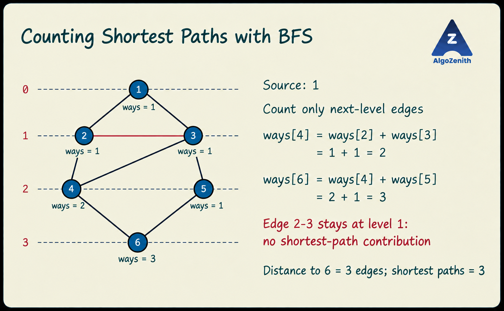

<VIDEO_WIDGET>

<VIDEO_ID></VIDEO_ID>

</VIDEO_WIDGET>

<READING_WIDGET>

# Number of Shortest Paths

BFS tells us the minimum number of edges needed to reach a vertex. But there may be **more than one path with that minimum length**.

In this lesson, we extend ordinary BFS to count all shortest paths from one source to every vertex, without explicitly listing those paths.

## 1. Problem Statement

Given an **undirected, unweighted graph** and a source vertex `source`, find, for every vertex `v`:

- `dis[v]`: the shortest distance from `source` to `v`.
- `path_count[v]`: the number of distinct shortest paths from `source` to `v`.

For this lesson, assume a **simple graph**: no parallel edges or self-loops. Two paths are distinct if their sequences of vertices differ. Vertices are numbered from 1 to \(n\).

For an unreachable vertex, report distance -1 and count 0. For the source itself, report distance 0 and count 1: there is one zero-edge path, consisting only of the source.

We count **shortest paths**, not all possible paths. A longer route does not contribute, even if it reaches the same destination.

## 2. A Graph with Multiple Shortest Paths

Consider source 1 and these undirected edges:

```text
1-2, 1-3, 2-3, 2-4, 3-4, 3-5, 4-6, 5-6
```



There are two shortest paths to vertex 4:

```text
1 -> 2 -> 4
1 -> 3 -> 4
```

There are three shortest paths to vertex 6, each containing three edges:

```text
1 -> 2 -> 4 -> 6
1 -> 3 -> 4 -> 6
1 -> 3 -> 5 -> 6
```

The route `1 -> 2 -> 3 -> 5 -> 6` does **not** count: it uses four edges, whereas the minimum is three.

The final results are:

| Vertex | Shortest distance | Number of shortest paths |
| --- | --- | --- |
| 1 | 0 | 1 |
| 2 | 1 | 1 |
| 3 | 1 | 1 |
| 4 | 2 | 2 |
| 5 | 2 | 1 |
| 6 | 3 | 3 |

## 3. The Key Idea: Count Contributions from the Previous Level

Suppose BFS is processing vertex `node` and examines its neighbour `v`.

If a shortest path to `v` ends with the edge `node -> v`, then:

$$
\text{dis}[v] = \text{dis}[\text{node}] + 1
$$

Every shortest path to `node` can then be extended by that edge to produce a shortest path to `v`. So `node` contributes **`path_count[node]` paths**, not just one.

For a reachable vertex other than the source:

$$
\text{path\_count}[v]
= \sum_{\substack{u\text{ adjacent to }v\\
\text{dis}[u]+1=\text{dis}[v]}}
\text{path\_count}[u]
$$

In the example:

- Vertex 4 receives one path from 2 and one from 3: \(1+1=2\).
- Vertex 6 receives two paths from 4 and one from 5: \(2+1=3\).

### Why Does the Edge Between 2 and 3 Not Contribute?

Both vertices have distance 1. Reaching 3 through 2 would take `dis[2] + 1 = 2` edges, but 3 already has distance 1.

An edge contributes only when it moves **from distance \(d\) to distance \(d+1\)**. Same-level edges and edges back toward the source do not contribute.

## 4. The Two BFS Update Cases

Initialize every distance to -1 and every count to 0. Then initialize the source:

```cpp
dis[source] = 0;
path_count[source] = 1;
q.push(source);
```

While processing an edge from `node` to `v`, use the following rules.

### Case 1: First Discovery — Copy the Count

If `dis[v] == -1`, BFS has found the first shortest route to `v`:

```cpp
dis[v] = dis[node] + 1;
path_count[v] = path_count[node];
q.push(v);
```

The distance changes from -1 immediately, so other vertices will not enqueue `v` again.

### Case 2: Another Shortest Route — Add the Count

If `v` has already been discovered, check whether this edge also reaches it with the minimum length:

```cpp
if (dis[v] == dis[node] + 1) {
    path_count[v] += path_count[node];
}
```

Do **not** enqueue `v` again. Its distance has not changed; we have only found more ways to achieve that distance.

If the equality fails, ignore this edge for counting.

> **A discovered vertex can still receive more shortest-path contributions. Being visited prevents another queue insertion; it does not prevent a count update.**

The implementation combines these cases using `if ... else if`. If we copied the count on first discovery and then immediately added it again for the same edge, we would double-count that contribution.

## 5. Dry Run

Use source 1 and visit neighbours in the order produced by the sample input below. The queue is shown **front to back**, after processing all neighbours of the indicated vertex.

Initially:

```text
Queue: [1]
dis[1] = 0
path_count[1] = 1
All other distances = -1; all other counts = 0
```

| Vertex processed | Changes | Queue afterward |
| --- | --- | --- |
| 1 | Discover 2 and 3 at distance 1; set each count to 1. | `[2, 3]` |
| 2 | Ignore edges to 1 and 3 for counting. Discover 4 at distance 2 with count 1. | `[3, 4]` |
| 3 | Ignore edges to 1 and 2. Add 1 to the count of 4, making it 2. Discover 5 at distance 2 with count 1. | `[4, 5]` |
| 4 | Its count is now 2. Discover 6 at distance 3 and copy that count: `path_count[6] = 2`. | `[5, 6]` |
| 5 | The route through 5 also reaches 6 at distance 3. Add 1, making `path_count[6] = 3`. | `[6]` |
| 6 | Both neighbours are in the previous level; no count changes. | `[]` |

Notice that vertex 4's count increases **while it is waiting in the queue**. By the time it is processed, both shortest paths to it have been counted. It then passes that complete count of 2 to vertex 6.

## 6. Why Is One Queue Insertion per Vertex Enough?

BFS processes every vertex at distance \(d-1\) before processing any vertex at distance \(d\).

All shortest paths to a vertex `v` at distance \(d\) must arrive through neighbours at distance \(d-1\). Therefore, all their contributions have been added **before `v` is removed from the queue for processing**.

This gives the counting invariant:

> When a vertex is processed, its shortest-path count is complete, so it can safely pass that count to the next level.

There is no double-counting between different contributing neighbours: paths arriving through different last-but-one vertices have different vertex sequences. Conversely, every shortest path has exactly one last-but-one vertex, so it appears in exactly one contribution.

The source's count stays 1. Returning to it through an edge cannot produce a path of length 0, so such a route never satisfies the distance condition.

## 7. Complete C++17 Implementation

This version uses `dis[v] == -1` as the unvisited check, so a separate `vis` array is unnecessary. The queue stores only vertex labels; distances are already stored in `dis`.

**Numeric assumption:** the exact answer for every vertex fits in a signed 64-bit integer (`long long`). If a problem gives a modulus instead, use the adjustment in the next section.

### Input

- First line: `n m source` — the number of vertices, the number of edges, and the source.
- Next `m` lines: endpoints `u v` of an undirected edge.
- Assume `n >= 1`, valid vertex labels, and no repeated edges or self-loops.

### Output

For vertices 1 through `n`, print `vertex distance shortest_path_count`.

```cpp
#include <iostream>
#include <queue>
#include <vector>
using namespace std;

vector<vector<int>> g;
vector<int> dis;
vector<long long> path_count;

void bfs(int source) {
    dis.assign(g.size(), -1);
    path_count.assign(g.size(), 0);

    queue<int> q;
    dis[source] = 0;
    path_count[source] = 1;
    q.push(source);

    while (!q.empty()) {
        int node = q.front();
        q.pop();

        for (int v : g[node]) {
            if (dis[v] == -1) {
                // First shortest route to v: copy all ways to node.
                dis[v] = dis[node] + 1;
                path_count[v] = path_count[node];
                q.push(v);
            } else if (dis[v] == dis[node] + 1) {
                // Another route of the same minimum length.
                path_count[v] += path_count[node];
            }
        }
    }
}

void solve() {
    int n, m, source;
    cin >> n >> m >> source;
    g.assign(n + 1, {});

    for (int i = 0; i < m; ++i) {
        int u, v;
        cin >> u >> v;
        g[u].push_back(v);
        g[v].push_back(u);
    }

    bfs(source);

    for (int v = 1; v <= n; ++v) {
        cout << v << ' ' << dis[v] << ' ' << path_count[v] << '\n';
    }
}

int main() {
    ios::sync_with_stdio(false);
    cin.tie(nullptr);

    solve();
    return 0;
}
```

### Sample 1: The Illustrated Graph

Input:

```text
6 8 1
1 2
1 3
2 3
2 4
3 4
3 5
4 6
5 6
```

Output:

```text
1 0 1
2 1 1
3 1 1
4 2 2
5 2 1
6 3 3
```

### Sample 2: Unreachable Vertices

Input:

```text
4 1 2
1 2
```

Output:

```text
1 1 1
2 0 1
3 -1 0
4 -1 0
```

Vertices 3 and 4 are unreachable, so their counts remain 0. We do **not** start another BFS from them: the question asks for paths from the specified source, not from each connected component separately.

## 8. Large Counts and Modulo Arithmetic

The number of shortest paths can grow very quickly, even though BFS visits each vertex only once. For example, repeated layers with two choices per layer can produce exponentially many shortest paths.

Use `long long` rather than `int` when the exact answer fits in 64 bits. Even `long long` is not sufficient for arbitrarily large exact counts.

If the problem asks for answers modulo \(10^9+7\), declare:

```cpp
const long long MOD = 1'000'000'007;
```

and replace the addition with:

```cpp
path_count[v] = (path_count[v] + path_count[node]) % MOD;
```

First-discovery copying remains unchanged because the copied count is already reduced modulo `MOD`. Only counts are reduced; distances remain ordinary integers.

Do not introduce a modulus when the problem requires exact counts. In that case, follow the numeric bounds or use an arbitrary-precision integer type if necessary.

## 9. Complexity

Each vertex is enqueued at most once. Every adjacency-list entry is examined once; an undirected edge appears in two lists.

- **Time:** \(O(n+m)\), assuming constant-time integer arithmetic.
- **Auxiliary space:** \(O(n)\) for distances, counts, and the queue.
- **Total space including the graph:** \(O(n+m)\).

The algorithm counts paths without storing them individually. A large answer therefore does not require a separate traversal for every path.

## 10. Common Mistakes

- **Initializing the source count to 0:** all later counts would also remain 0. The source has one zero-edge path.
- **Skipping every visited neighbour:** this loses additional shortest paths. Check the distance equality even when the neighbour was already discovered.
- **Adding 1 instead of `path_count[node]`:** one neighbour can contribute many shortest paths, as vertex 4 contributes two paths to vertex 6.
- **Adding along every edge:** only `dis[v] == dis[node] + 1` contributes. Same-level and backward edges must be ignored.
- **Enqueuing a vertex again when its count increases:** unnecessary; BFS finishes all contributions from the previous level before processing it.
- **Stopping when a target is first discovered:** its count may still increase. Vertex 6 is first discovered with count 2 but finishes with count 3. For this problem, run BFS to completion to answer for every vertex.
- **Using 0 ways as the unvisited check:** this also fails in a modular version, where a reachable vertex can have a count congruent to 0. Use the distance instead.
- **Ignoring the definition of distinct paths:** repeated input edges would be counted as separate edge choices by this code. Our simple-graph assumption avoids that ambiguity.

## Quick Recap

- BFS determines the shortest distance to each vertex.
- Initialize the source with distance 0 and count 1.
- On first discovery, **copy** the current vertex's count.
- On another route of equal shortest length, **add** the current vertex's count.
- Ignore longer routes and enqueue each vertex only once.
- Unreachable vertices have distance -1 and count 0.

</READING_WIDGET>
