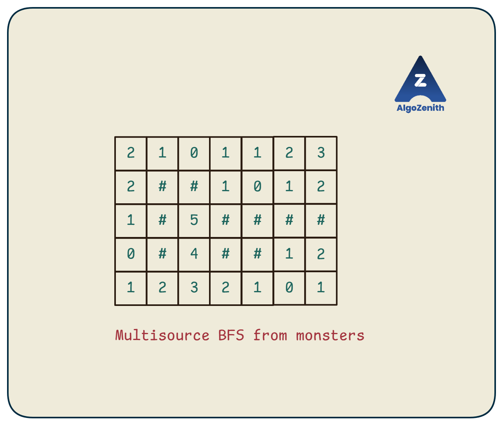

<VIDEO_WIDGET>

<VIDEO_ID></VIDEO_ID>

</VIDEO_WIDGET>

<READING_WIDGET>

# Multisource Breadth-First Search (BFS)

Ordinary BFS starts from one source and finds the shortest distance from it to every reachable vertex. **Multisource BFS starts from several sources at distance 0** and finds the distance to the **nearest source**.

The traversal does not change. The main change is how we initialize the queue.

We will apply this idea to two grid problems:

1. Escape before any monster can intercept us.
2. Find the distance from every starting cell to its nearest end cell.

## 1. One Queue, Several Starting Points

Suppose the source set is \(A\). Multisource BFS computes:

$$
\text{dis}[v] = \min_{s\in A}\operatorname{distance}(s,v)
$$

This is one minimum distance per vertex, **not a separate distance from every source**.

Initialize all distances to -1. Then, **before processing anything**, set every source's distance to 0 and put all sources in the same queue:

```cpp
for (auto [x, y] : sources) {
    dis[x][y] = 0;
    q.push({x, y});
}
```

The sources here are distinct grid cells. Marking all of them immediately prevents one source from being rediscovered through another.

After initialization, run ordinary BFS:

- All distance-0 cells are processed first.
- They discover the cells at distance 1 from the nearest source.
- Those cells discover distance-2 cells, and so on.

If two sources can reach a cell equally quickly, either may discover it first. Its distance is the same regardless of the tie.

**Do not complete a separate BFS for each source.** One shared BFS computes all nearest-source distances in \(O(nm)\) time on an \(n\times m\) grid, rather than repeating a grid traversal for every source.

Throughout this lesson, coordinates are zero-based `(row, column)`. Legal moves are down, up, right, and left; each move costs one step. Walls cannot be entered.

## 2. Problem 1: Escape the Grid

### Problem Statement

You are given a nonempty rectangular grid:

| Character | Meaning |
| --- | --- |
| `#` | Wall. |
| `.` | Open cell. |
| `S` | Your starting cell; exactly one exists. |
| `M` | A monster's starting cell; there may be several or none. |

At time 0, everyone is at their starting cell. Each move takes one unit of time, and monsters move simultaneously with you. They know your intended route, so the route must be safe against any allowed monster movement.

For this version, a monster may move to an adjacent non-wall cell **or wait**. Thus, once a monster can reach a cell, it could occupy that cell at any later time. Both you and the monsters use the same four-direction movement rules.

Find whether you can reach **any non-wall boundary cell** without ever occupying the same cell as a monster. If possible, find the minimum number of moves.

Reaching the boundary itself counts as escape; there is no extra move outside the grid. If `S` is already on the boundary, the answer is **0**.


The illustrated grid is:

```text
..M....
.##.M..
.#S####
M#.##..
.....M.
```

### Step 1: Compute the Earliest Monster Arrival Times

Run one multisource BFS with **every `M` cell as a source**.

Let `monster_time[x][y]` be the earliest time at which any monster can reach `(x, y)`:

- Every monster cell starts at time 0.
- A discovered neighbour receives the current time plus 1.
- A value of -1 means no monster can reach that cell.

Treat every non-wall cell as traversable during this BFS, including `S` and all monster cells. The person's current location is not a barrier to a monster.

This computes possible arrival times, not one particular simulation of where the monsters choose to move.



### Step 2: Run BFS for the Person, Allowing Only Safe Moves

Use a separate matrix `person_time`, initially -1, with `person_time[S] = 0`.

Suppose you are at `(x, y)` and want to enter `(xx, yy)`. Your arrival time would be:

```text
next_time = person_time[x][y] + 1
```

Allow the move only if the destination is inside the grid, is not a wall, has not already been visited by the person's BFS, and satisfies:

$$
\text{monster\_time}[xx][yy] = -1
\quad\text{or}\quad
\text{next\_time} < \text{monster\_time}[xx][yy]
$$

The comparison is **strict**:

| Person arrives | Earliest monster arrival | Safe? |
| --- | --- | --- |
| 2 | 3 | Yes: the person arrives first. |
| 3 | 3 | No: a monster can arrive simultaneously. |
| 4 | 3 | No: a monster can arrive earlier and wait. |
| Any finite time | Unreachable (`-1`) | Yes: no monster can reach the cell. |

The value -1 is a sentinel, not an actual negative arrival time. Handle it explicitly instead of comparing an ordinary time directly against it.

### Step 3: Stop at the First Safe Boundary Cell

When the person's BFS removes a boundary cell from the queue, return its arrival time. BFS processes cells in increasing time, so this is the shortest safe escape.

If the queue becomes empty without reaching a boundary, escape is impossible.

Checking safety at **every move** makes the invariant clear: every queued person-state is reachable by a route that stays ahead of the monsters at every cell.

## 3. Escape Dry Run

In the illustrated grid, the four monsters are initially enqueued at time 0:

```text
(0,2), (1,4), (3,0), (4,5)
```

The earliest monster times are:

```text
2  1  0  1  1  2  3
2  #  #  1  0  1  2
1  #  5  #  #  #  #
0  #  4  #  #  1  2
1  2  3  2  1  0  1
```

Now begin the person's BFS at `S = (2, 2)`:

| Cell | Person's arrival time | Earliest monster arrival | Decision |
| --- | --- | --- | --- |
| `(2, 2)` | 0 | 5 | Safe starting cell. |
| `(3, 2)` | 1 | 4 | Safe: `1 < 4`. |
| `(4, 2)` | 2 | 3 | Safe boundary cell: escape. |

The shortest safe route is:

```text
(2,2) -> (3,2) -> (4,2)
```

The answer is **2 moves**. The monsters are not prevented from eventually reaching these cells; the person simply passes through them before they can arrive.

### A Tie Is Not Safe

Consider:

```text
M.#
#S#
###
```

The only possible first move is from `(1,1)` to the boundary cell `(0,1)`. The person and the monster can both reach that cell at time 1, so escape is impossible.

## 4. Escape Implementation — C++17

Input is `n m`, followed by `n` strings of length `m`. Print `Possible` and the minimum number of moves, or `Not Possible`.

The two BFS traversals use separate distance matrices and separate local queues. A distance of -1 also serves as the unvisited marker.

```cpp
#include <iostream>
#include <queue>
#include <string>
#include <utility>
#include <vector>
using namespace std;

using Cell = pair<int, int>;
const int dx[] = {1, -1, 0, 0};
const int dy[] = {0, 0, 1, -1};

bool valid(int x, int y, const vector<string>& grid) {
    int n = static_cast<int>(grid.size());
    int m = static_cast<int>(grid[0].size());
    return x >= 0 && x < n && y >= 0 && y < m && grid[x][y] != '#';
}

vector<vector<int>> monster_distances(const vector<string>& grid) {
    int n = static_cast<int>(grid.size());
    int m = static_cast<int>(grid[0].size());
    vector<vector<int>> dis(n, vector<int>(m, -1));
    queue<Cell> q;

    // Add every monster before starting the traversal.
    for (int x = 0; x < n; ++x) {
        for (int y = 0; y < m; ++y) {
            if (grid[x][y] == 'M') {
                dis[x][y] = 0;
                q.push({x, y});
            }
        }
    }

    while (!q.empty()) {
        auto [x, y] = q.front();
        q.pop();

        for (int dir = 0; dir < 4; ++dir) {
            int xx = x + dx[dir], yy = y + dy[dir];
            if (valid(xx, yy, grid) && dis[xx][yy] == -1) {
                dis[xx][yy] = dis[x][y] + 1;
                q.push({xx, yy});
            }
        }
    }
    return dis;
}

int shortest_escape(const vector<string>& grid, Cell start) {
    int n = static_cast<int>(grid.size());
    int m = static_cast<int>(grid[0].size());
    auto monster_time = monster_distances(grid);
    vector<vector<int>> person_time(n, vector<int>(m, -1));
    queue<Cell> q;

    person_time[start.first][start.second] = 0;
    q.push(start);

    while (!q.empty()) {
        auto [x, y] = q.front();
        q.pop();

        if (x == 0 || x == n - 1 || y == 0 || y == m - 1) {
            return person_time[x][y];
        }

        for (int dir = 0; dir < 4; ++dir) {
            int xx = x + dx[dir], yy = y + dy[dir];
            if (!valid(xx, yy, grid) || person_time[xx][yy] != -1) {
                continue;
            }

            int next_time = person_time[x][y] + 1;
            if (monster_time[xx][yy] != -1 &&
                next_time >= monster_time[xx][yy]) {
                continue; // A monster can arrive no later than us.
            }

            person_time[xx][yy] = next_time;
            q.push({xx, yy});
        }
    }
    return -1;
}

void solve() {
    int n, m;
    cin >> n >> m;
    vector<string> grid(n);
    Cell start = {-1, -1};

    for (int x = 0; x < n; ++x) {
        cin >> grid[x];
        for (int y = 0; y < m; ++y) {
            if (grid[x][y] == 'S') start = {x, y};
        }
    }

    // Input guarantees exactly one S and a nonempty rectangular grid.
    int answer = shortest_escape(grid, start);
    if (answer == -1) {
        cout << "Not Possible\n";
    } else {
        cout << "Possible\n" << answer << '\n';
    }
}

int main() {
    ios::sync_with_stdio(false);
    cin.tie(nullptr);
    solve();
    return 0;
}
```

### Sample Input

```text
5 7
..M....
.##.M..
.#S####
M#.##..
.....M.
```

### Sample Output

```text
Possible
2
```

For the tie example, the output is `Not Possible`. For a one-cell grid containing only `S`, the output is `Possible` followed by `0`.

### Why This Finds a Safe, Shortest Escape

1. The monster BFS gives the earliest arrival of **any** monster, because all monsters begin in its distance-0 layer.
2. The person's BFS accepts only cells reached before that earliest arrival. Starting from the safe `S` cell, every accepted move therefore extends a safe route.
3. A later arrival at the same cell cannot improve safety: monster deadlines only become harder to meet. Keeping the earliest safe arrival is sufficient.
4. All person-moves cost 1, so the first boundary cell processed has the minimum safe escape time.

No simulation of individual monster choices is required.

## 5. Problem 2: Nearest End for Every Start

Now consider a different grid, with **no monsters**:

- `#` is a wall and `.` is an open cell.
- Several `S` cells are possible starting points.
- Several `E` cells are possible destinations.

For **each `S` independently**, find the minimum number of moves needed to reach **any `E`**. Report -1 if none is reachable.

This is a nearest-destination query, not the number of paths from the previous lesson. Starts are independent queries; there is no simultaneous movement or collision constraint between them.


### Reverse the Viewpoint: Start BFS from All Ends

Running a separate BFS from every `S` would repeat much of the work. Instead:

1. Put **every `E`** in one queue at distance 0.
2. Run one multisource BFS over non-wall cells.
3. Read the resulting distance at each `S`.

Why does this work? Every legal move in this grid can be reversed. Hence:

$$
\operatorname{distance}(S,E) = \operatorname{distance}(E,S)
$$

Taking the minimum over all ends gives exactly the desired distance from each start to its nearest end.

If we started BFS from all `S` cells instead, we would compute distance to the **nearest start**. That is a different question and would not give one nearest-end answer for each individual start.

## 6. Nearest-End Dry Run

The illustrated grid is:

```text
S..E..
..###S
..S.#.
E##.#.
..E...
```

Initialize the queue with the three end cells:

```text
(0,3), (3,0), (4,2)
```

All three have distance 0. BFS spreads from them in the same layer-by-layer order and produces:

```text
3  2  1  0  1  2
2  3  #  #  #  3
1  2  3  3  #  4
0  #  #  2  #  4
1  1  0  1  2  3
```

Read the answers at the starts:

| Start | Minimum moves | One shortest route to an end |
| --- | --- | --- |
| `(0,0)` | 3 | `(0,0) -> (0,1) -> (0,2) -> (0,3)` |
| `(1,5)` | 3 | `(1,5) -> (0,5) -> (0,4) -> (0,3)` |
| `(2,2)` | 3 | `(2,2) -> (2,1) -> (2,0) -> (3,0)` |

The first start is also three moves from `(3,0)`. Ties between nearest ends do not change the answer.

If an actual route is requested, record a parent when discovering a cell from an end, as in the earlier grid-BFS lesson. Following those parents **from `S`** already moves toward an `E`; no reversal is needed for this direction of traversal. A distance matrix alone gives the length, not a stored choice of destination or route.

## 7. Nearest-End Implementation — C++17

This is a **separate, standalone program** for the second problem.

Input is `n m`, followed by the grid. For each `S` in row-major order, print `row column minimum_moves`, using zero-based coordinates. If a start cannot reach an end, its distance stays -1. An empty set of ends also leaves every answer at -1.

```cpp
#include <iostream>
#include <queue>
#include <string>
#include <utility>
#include <vector>
using namespace std;

using Cell = pair<int, int>;
const int dx[] = {1, -1, 0, 0};
const int dy[] = {0, 0, 1, -1};

vector<vector<int>> nearest_end_distances(const vector<string>& grid) {
    int n = static_cast<int>(grid.size());
    int m = static_cast<int>(grid[0].size());
    vector<vector<int>> dis(n, vector<int>(m, -1));
    queue<Cell> q;

    // Every end is a source at distance 0.
    for (int x = 0; x < n; ++x) {
        for (int y = 0; y < m; ++y) {
            if (grid[x][y] == 'E') {
                dis[x][y] = 0;
                q.push({x, y});
            }
        }
    }

    while (!q.empty()) {
        auto [x, y] = q.front();
        q.pop();

        for (int dir = 0; dir < 4; ++dir) {
            int xx = x + dx[dir], yy = y + dy[dir];
            if (xx < 0 || xx >= n || yy < 0 || yy >= m) continue;
            if (grid[xx][yy] == '#' || dis[xx][yy] != -1) continue;

            dis[xx][yy] = dis[x][y] + 1;
            q.push({xx, yy});
        }
    }
    return dis;
}

void solve() {
    int n, m;
    cin >> n >> m;
    vector<string> grid(n);
    for (string& row : grid) cin >> row;

    auto dis = nearest_end_distances(grid);
    for (int x = 0; x < n; ++x) {
        for (int y = 0; y < m; ++y) {
            if (grid[x][y] == 'S') {
                cout << x << ' ' << y << ' ' << dis[x][y] << '\n';
            }
        }
    }
}

int main() {
    ios::sync_with_stdio(false);
    cin.tie(nullptr);
    solve();
    return 0;
}
```

### Sample Input

```text
5 6
S..E..
..###S
..S.#.
E##.#.
..E...
```

### Sample Output

```text
0 0 3
1 5 3
2 2 3
```

## 8. Complexity

An \(n\times m\) grid has at most \(nm\) traversable cells and at most four candidate moves per cell. Each BFS discovers each reachable cell at most once.

| Problem | Traversals | Total time | Total space |
| --- | --- | --- | --- |
| Escape the grid | One multisource monster BFS and one safe person BFS. | \(O(nm)\) | \(O(nm)\) |
| Nearest end for every start | One multisource BFS from all ends, then read the answers. | \(O(nm)\) | \(O(nm)\) |

Two linear traversals are still linear. After the nearest-end distance matrix is ready, each start's distance can be looked up in \(O(1)\) time.

## 9. Common Mistakes and Useful Checks

- **Adding sources after traversal begins:** initialize every source at distance 0 before the first queue removal.
- **Marking only when a cell is removed:** mark it when enqueuing by assigning its distance, so it is inserted only once.
- **Mixing person and monster distances:** keep separate matrices; a cell reached by a monster BFS still needs its own person-time calculation.
- **Allowing equal arrival times:** the person must arrive strictly earlier, not at the same time.
- **Treating `M` as a permanent wall in the monster BFS:** it is a source cell, not an obstacle. In the person's BFS, its time-0 deadline naturally prevents entry.
- **Forgetting zero-step escape:** an `S` on the boundary is already safe at time 0.
- **Mishandling no monsters or unreachable monster regions:** time -1 imposes no monster deadline.
- **Starting from the wrong set:** use monsters for earliest threat times and ends for nearest-end queries.
- **Assuming reverse traversal always works:** it works directly here because grid moves are reversible. A directed graph would require traversing reversed edges from the destinations.

## Quick Recap

- Multisource BFS is ordinary BFS with several distance-0 sources.
- It computes distance to the **nearest** source in one traversal.
- For escape, first compute monster arrival times, then run BFS through safe cells.
- For many starts and ends, run BFS from all ends and read the answer at each start.
- Both grid applications take \(O(nm)\) time and space.

</READING_WIDGET>
