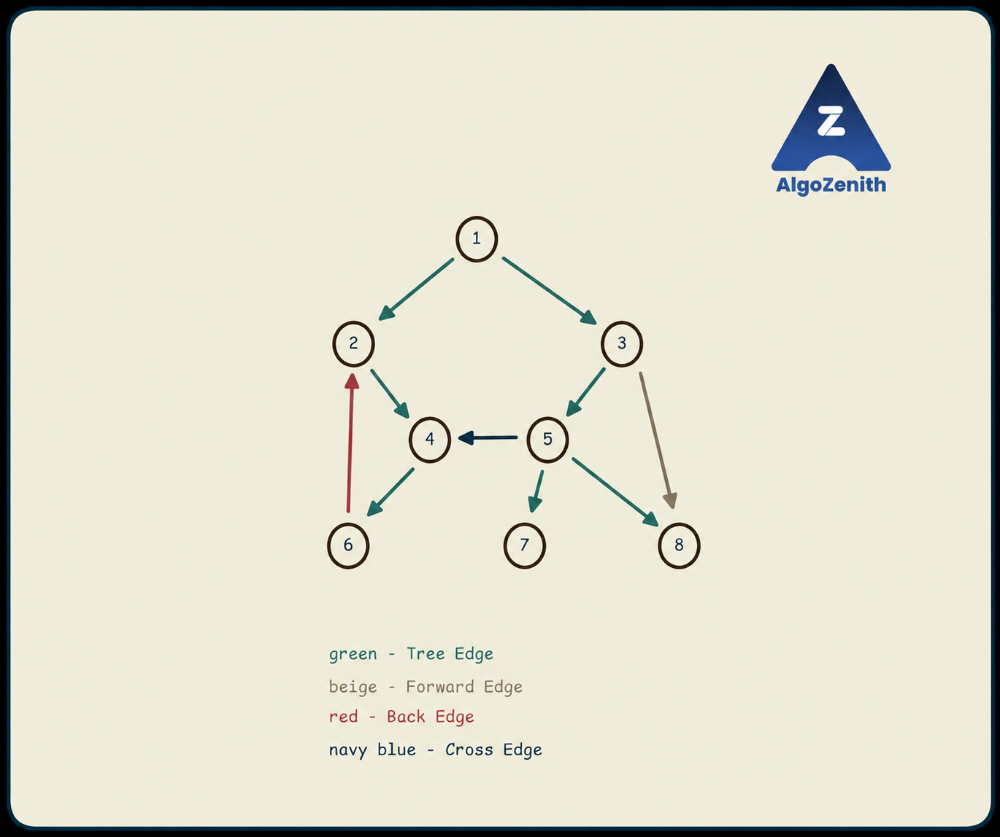

<VIDEO_WIDGET>

<VIDEO_ID></VIDEO_ID>

</VIDEO_WIDGET>

<READING_WIDGET>

# Cycle Detection and Printing in a Directed Graph

In an undirected graph, an edge can be traversed in either direction. In a **directed graph**, every step must follow an arrow.

That changes the DFS cycle test: an edge to a vertex that was visited earlier is **not necessarily evidence of a cycle**. We must check whether that vertex is still **active on the current recursive path**.

## 1. Problem Statement

Given a directed graph with vertices numbered from 1 to \(n\), determine whether it contains a directed cycle. If it does, print **one cycle**, repeating the first vertex at the end to show the closing edge.

For example:

```text
2 -> 4 -> 6 -> 2
```

This is valid only if the graph contains the directed edges `2 -> 4`, `4 -> 6`, and `6 -> 2`.

We want any one cycle—not all cycles and not necessarily the shortest cycle. Apart from the repeated endpoint, the printed cycle should not repeat a vertex.

The algorithm also handles a self-loop `u -> u`, if allowed by the input, by printing `u u`. Two opposite edges `u -> v` and `v -> u` form a valid two-edge directed cycle.

## 2. DFS Forest and Edge Classification

When DFS discovers an unvisited vertex `v` through an edge `u -> v`, it records `par[v] = u`. These discovery edges form a **DFS tree**.

If some vertices remain unvisited after one search, starting DFS from them builds additional trees. Together, they form a **DFS forest**. We follow outgoing edges only, so one start is not guaranteed to reach the whole directed graph.

Relative to a particular DFS forest, directed edges have four classifications:

| Edge type | Meaning of an edge `u -> v` | Example in the illustration |
| --- | --- | --- |
| **Tree edge** | `v` is unvisited when the edge is examined, so this edge discovers it. | `2 -> 4` |
| **Back edge** | The edge points to an active ancestor of `u`, or to `u` itself for a self-loop. | `6 -> 2` |
| **Forward edge** | A non-tree edge from `u` to a descendant of `u` in the DFS tree. | `3 -> 8` |
| **Cross edge** | Neither endpoint is an ancestor of the other in the DFS forest. | `5 -> 4` |

Tree edges are the edges actually chosen to discover vertices. A forward edge also points downward toward a descendant, but it was **not used to discover that descendant**.



### Reading the Illustration

Assume DFS begins at 1, explores the branch through 2 before the branch through 3, and explores `3 -> 5` before `3 -> 8`.

- **Green tree edges:** `1 -> 2`, `2 -> 4`, `4 -> 6`, `1 -> 3`, `3 -> 5`, `5 -> 7`, `5 -> 8`.
- **Red back edge `6 -> 2`:** vertex 2 is an active ancestor of 6. It closes the cycle `2 -> 4 -> 6 -> 2`.
- **Navy cross edge `5 -> 4`:** the branch containing 4 has already finished before DFS enters the branch through 3. Vertices 5 and 4 have no ancestor–descendant relationship.
- **Beige forward edge `3 -> 8`:** vertex 8 was already discovered and finished through `3 -> 5 -> 8`. It is a descendant of 3, but the direct edge `3 -> 8` is not a tree edge.

The picture shows the classifications for a **complete DFS** that continues after observing the back edge. Our cycle-finding program stops at the first back edge, so it will not need to explore the entire illustrated graph.

Edge classifications depend on the DFS start and neighbour order. For example, if 3 explored 8 before 5, the edge `3 -> 8` would become a tree edge instead.

## 3. Which Edge Proves That a Cycle Exists?

A **back edge** `u -> v` closes a directed cycle:

1. Because `v` is an ancestor of `u`, the DFS tree contains a directed path from `v` down to `u`.
2. The back edge `u -> v` returns to the beginning.

For the example:

```text
Tree path: 2 -> 4 -> 6
Back edge:           6 -> 2
Cycle:     2 -> 4 -> 6 -> 2
```

An edge to a finished vertex does **not by itself** prove a cycle. Such an edge can be forward or cross: it does not necessarily provide a directed route back to the current vertex.

Forward and cross edges can occur in graphs that contain cycles elsewhere. We ignore them **for this detection test**; we are not claiming that the entire graph is acyclic when one appears.

### Why a Boolean Visited Array Is Not Enough

Consider:

```text
1 -> 2
1 -> 3
3 -> 2
```

Let DFS explore 2 before 3. Vertex 2 finishes, then DFS enters 3 and examines `3 -> 2`.

Vertex 2 is visited, but it is **not on the current call stack**. This graph has no directed cycle: there is no directed path from 2 back to 3.

We therefore need to distinguish **active** from **finished**, not merely visited from unvisited.

## 4. The Three-Color DFS States

We use the color values from this lesson's original convention:

| Color | Meaning |
| --- | --- |
| `1` | Unvisited: DFS has not entered this vertex. |
| `2` | Active: the vertex's recursive call is still on the call stack. |
| `3` | Finished: its outgoing edges have been processed and its call has returned normally. |

The previous undirected lesson used values 0, 1, and 2 for these same three meanings. Here, initialize every vertex to **1**, not 0.

When processing an edge `node -> v`:

- If `col[v] == 1`, recurse into `v`: this is a tree edge.
- If `col[v] == 2`, a back edge has been found: record its endpoints and stop.
- If `col[v] == 3`, ignore the edge for cycle detection.

Color 3 alone does not distinguish a forward edge from a cross edge. We do not need that distinction to detect or print a cycle.

### Do Not Skip the Parent Edge

This is the key difference from undirected cycle detection.

If DFS uses `u -> v` to enter `v`, and `v` has an outgoing edge `v -> u`, those are **two distinct directed edges**. Together, they form a cycle.

```text
u -> v -> u
```

Do not write `if (v == parent) continue;` in the directed version. The parent parameter is used only to record the DFS tree for reconstruction, not to skip outgoing edges.

Likewise, read each input edge in its given direction:

```cpp
g[u].push_back(v); // Do not also insert u into g[v].
```

## 5. Reconstructing the Cycle in the Correct Direction

Suppose DFS at `node` finds an active vertex `v` through `node -> v`. Save:

```cpp
cycle_start = v;    // Active ancestor, or node itself for a self-loop.
cycle_end = node;
```

Following parents from `cycle_end` reaches `cycle_start`, but this parent walk runs **opposite to the tree-edge directions**.

Therefore:

1. Start at `cycle_end` and append vertices while walking upward through parents, stopping just before `cycle_start`.
2. Append `cycle_start`.
3. Reverse the vector to obtain the directed tree path from `cycle_start` to `cycle_end`.
4. Append `cycle_start` once more to represent the closing back edge.

For `6 -> 2`:

```text
Follow parents:       [6, 4]
Append ancestor 2:    [6, 4, 2]
Reverse:              [2, 4, 6]
Append closing 2:     [2, 4, 6, 2]
```

The direction matters. Printing `6 4 2 6` would generally be invalid: the graph need not contain `6 -> 4`, `4 -> 2`, or `2 -> 6`.

Stop after finding one cycle, propagating success through every active recursive call. This avoids continuing the search or printing the same cycle repeatedly.

## 6. Dry Run on the Illustrated Graph

Use the adjacency order from the sample input below.

| Event | DFS action | Active recursive path |
| --- | --- | --- |
| Start at 1 | Set `col[1] = 2`, `par[1] = -1`. | `[1]` |
| Examine `1 -> 2` | 2 is unvisited: enter it and set `par[2] = 1`. | `[1, 2]` |
| Examine `2 -> 4` | 4 is unvisited: enter it and set `par[4] = 2`. | `[1, 2, 4]` |
| Examine `4 -> 6` | 6 is unvisited: enter it and set `par[6] = 4`. | `[1, 2, 4, 6]` |
| Examine `6 -> 2` | `col[2] == 2`: record a back edge and stop. | `[1, 2, 4, 6]` |

At detection:

```text
cycle_start = 2
cycle_end   = 6
par[6] = 4
par[4] = 2
```

Reconstruction prints:

```text
2 4 6 2
```

Vertex 1 is not included. It led DFS to the cycle, but the cycle itself closes at 2.

## 7. Complete C++17 Implementation

### Input

- First line: `n m`, the number of vertices and directed edges.
- Next `m` lines: `u v`, representing the edge **from `u` to `v`**.
- Assume `n >= 1` and all vertex labels are in the range 1 through `n`.

### Output for This Lesson

- Print `No cycle` if no directed cycle exists.
- Otherwise, print `Cycle found`, followed by one closed sequence whose consecutive pairs are directed edges.

```cpp
#include <algorithm>
#include <iostream>
#include <vector>
using namespace std;

vector<vector<int>> g;
vector<int> col, par;
int cycle_start = -1;
int cycle_end = -1;

bool dfs(int node, int parent) {
    col[node] = 2; // Active on the current recursion stack.
    par[node] = parent;

    for (int v : g[node]) {
        // No parent-edge skip in a directed graph.
        if (col[v] == 1) {
            if (dfs(v, node)) return true;
        } else if (col[v] == 2) {
            cycle_start = v;
            cycle_end = node;
            return true;
        }
        // col[v] == 3: finished; no cycle is proved by this edge.
    }

    col[node] = 3;
    return false;
}

void solve() {
    int n, m;
    cin >> n >> m;
    g.assign(n + 1, {});
    col.assign(n + 1, 1);
    par.assign(n + 1, -1);
    cycle_start = cycle_end = -1;

    for (int i = 0; i < m; ++i) {
        int u, v;
        cin >> u >> v;
        g[u].push_back(v);
    }

    // One starting vertex may not reach every part of a directed graph.
    for (int node = 1; node <= n; ++node) {
        if (col[node] == 1 && dfs(node, -1)) {
            break;
        }
    }

    if (cycle_start == -1) {
        cout << "No cycle\n";
        return;
    }

    vector<int> cycle;
    for (int cur = cycle_end; cur != cycle_start; cur = par[cur]) {
        cycle.push_back(cur);
    }
    cycle.push_back(cycle_start);
    reverse(cycle.begin(), cycle.end());
    cycle.push_back(cycle_start); // Closing edge: cycle_end -> cycle_start.

    cout << "Cycle found\n";
    for (size_t i = 0; i < cycle.size(); ++i) {
        if (i > 0) cout << ' ';
        cout << cycle[i];
    }
    cout << '\n';
}

int main() {
    ios::sync_with_stdio(false);
    cin.tie(nullptr);
    solve();
    return 0;
}
```

If DFS finishes normally without finding a cycle, its color changes from 2 to 3. After early success, some calls unwind without making that change; this is harmless because the entire search stops. A new `solve()` resets all arrays and cycle endpoints.

### Sample 1: The Illustrated Graph

Input:

```text
8 10
1 2
2 4
4 6
6 2
1 3
3 5
5 4
5 7
5 8
3 8
```

Output with this neighbour order:

```text
Cycle found
2 4 6 2
```

### Sample 2: A Visited Neighbour Without a Cycle

Input:

```text
3 3
1 2
1 3
3 2
```

Output:

```text
No cycle
```

DFS finishes vertex 2 before entering 3. The edge `3 -> 2` reaches color 3, not color 2, and does not produce a false cycle.

### Sample 3: The Parent Can Close a Directed Cycle

Input:

```text
2 2
1 2
2 1
```

Output:

```text
Cycle found
1 2 1
```

Skipping the parent at vertex 2 would miss this valid cycle.

The same reconstruction also handles a self-loop: input `1 1` followed by edge `1 1` prints `Cycle found` and `1 1`.

## 8. Why the Algorithm Works

### Every Detected Back Edge Gives a Directed Cycle

Active calls form the current recursive path. Therefore, a color-2 neighbour is an ancestor of the current vertex, or the current vertex itself.

The parent chain identifies a directed tree path from that ancestor down to the current vertex. Reversing the collected parent chain restores the forward direction, and the detected back edge closes the cycle.

### Every Directed Cycle Leads to a Back Edge

Consider the first vertex of a directed cycle entered by DFS. Following outgoing edges makes the remaining cycle vertices reachable during that vertex's exploration, before its call can finish.

If no earlier back edge has already stopped the search, eventually the cycle's predecessor examines its edge back to this still-active vertex. That edge has a color-2 destination, so the algorithm detects a cycle.

The outer loop starts another DFS whenever vertices remain unvisited. Thus, a cycle cannot be missed simply because it is unreachable from vertex 1.

## 9. Complexity

- **Time:** \(O(n+m)\). Each vertex is entered at most once, each outgoing edge is examined at most once, and reconstructing one cycle takes at most \(O(n)\) time.
- **Auxiliary space:** \(O(n)\) for colors, parents, the recursion stack, and the output cycle.
- **Total space including the graph:** \(O(n+m)\).

Recursion depth can reach \(n\), for example along a long directed chain. For very large inputs, account for the environment's stack limit or use an iterative DFS that preserves active and finished states.

## 10. Common Mistakes and Useful Checks

- **Using only a visited flag:** a visited destination may be finished, so it does not necessarily close a cycle.
- **Skipping the parent:** this misses two-edge directed cycles.
- **Adding both directions for each input edge:** this changes the graph and may create cycles that were not present.
- **Initializing colors to 0:** this code uses 1 for unvisited, 2 for active, and 3 for finished.
- **Never marking a completed vertex finished:** later edges to it would be mistaken for back edges.
- **Assuming every edge to color 3 is cross:** it may be forward or cross. Neither classification requires action for this cycle test.
- **Printing the raw parent walk:** parent pointers run upward, opposite to the directed tree path. Reverse before adding the closing endpoint.
- **Continuing after success:** return `true` through the call chain and break the outer loop.
- **Searching only from vertex 1:** it may not reach the cycle.

To validate a printed answer, check that the first and last vertices match, no internal vertex is repeated, and **every consecutive ordered pair is an edge in the input**. An edge in the reverse direction is not sufficient.

## Quick Recap

- Tree, back, forward, and cross edges describe the graph relative to a particular DFS forest.
- A back edge to an active vertex proves a directed cycle.
- Track unvisited, active, and finished states; do not skip the parent edge.
- Reconstruct with parent links, reverse into the arrow direction, and close the cycle.
- Check all unvisited vertices and stop after finding one valid cycle.

</READING_WIDGET>
