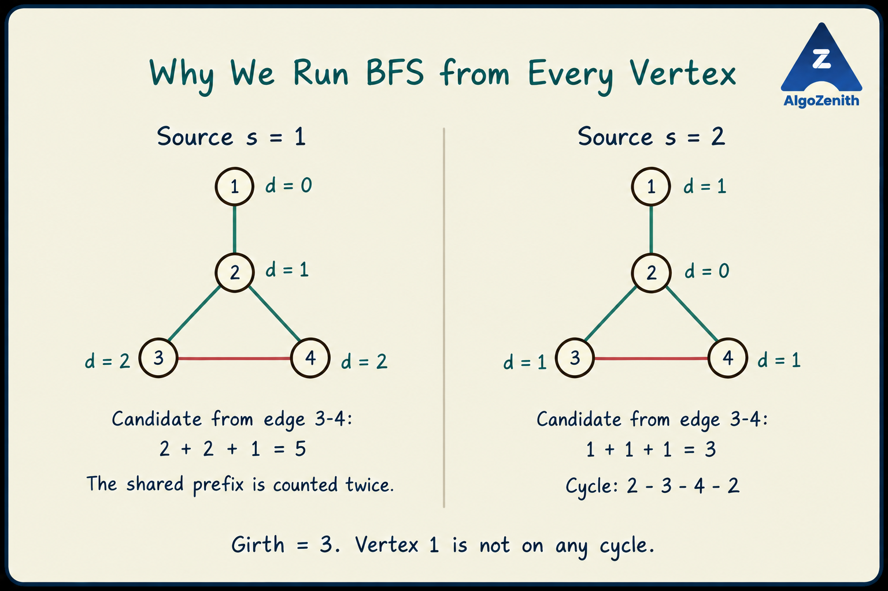

<VIDEO_WIDGET>

<VIDEO_ID></VIDEO_ID>

</VIDEO_WIDGET>

<READING_WIDGET>

# Length of the Shortest Cycle: Girth of an Undirected Graph

The previous lessons used DFS to find **any one cycle**. The first cycle found by DFS need not be the shortest.

Here, we want the **girth** of an undirected graph: the minimum number of edges in any cycle. We will use BFS from every vertex and combine the results.

## 1. Problem Statement

Given an **undirected, unweighted, simple graph** with \(n\) vertices and \(m\) edges, find the length of its shortest cycle.

- Vertices are numbered from 1 to \(n\).
- There are no self-loops or parallel edges.
- The graph may be disconnected.
- If the graph contains no cycle, print **-1**.

The length of a cycle is its number of edges. For example, `2 -> 3 -> 4 -> 2` has length 3. In a simple undirected graph, 3 is the smallest possible cycle length.

Our output is one number: the shortest cycle length **anywhere in the graph**. We are not computing a separate shortest cycle through each vertex.

## 2. What Does One BFS Tell Us?

Choose a source `s`. BFS computes `dis[v]`, the minimum number of edges from `s` to each reachable vertex `v`.

When BFS first discovers a vertex, the discovery edge becomes part of its BFS tree. Now consider an edge `(u,v)` that is **not** a tree edge.

We can combine:

1. The BFS tree path from `s` to `u`.
2. The edge `(u,v)`.
3. The reversed BFS tree path from `v` back to `s`.

The resulting closed walk has length:

$$
\text{candidate} = \text{dis}[u] + \text{dis}[v] + 1
$$

If the two tree paths share only the source, this walk is a simple cycle. If they share a longer prefix, the walk repeats that prefix and the candidate **overestimates** the cycle contained in it.

This distinction is important: a candidate from source `s` is **not necessarily the length of a simple cycle through `s`**.

## 3. Shared Prefixes: Why We Must Try Every Source

Consider these edges:

```text
1-2, 2-3, 2-4, 3-4
```

Vertices 2, 3, and 4 form a triangle. Vertex 1 is attached by a single edge and is not on any cycle.



### BFS from Vertex 1

The distances are:

```text
Vertex:  1  2  3  4
Distance:0  1  2  2
```

For the non-tree edge `(3,4)`:

$$
\text{candidate} = 2+2+1 = 5
$$

The corresponding walk is:

```text
1 -> 2 -> 3 -> 4 -> 2 -> 1
```

It repeats vertex 2 and traverses edge `1-2` in both directions. It is **not** a simple cycle of length 5. Removing the repeated prefix leaves the real cycle `2 -> 3 -> 4 -> 2`, of length 3.

### BFS from Vertex 2

Now vertices 3 and 4 both have distance 1. The same non-tree edge gives:

$$
\text{candidate} = 1+1+1 = 3
$$

This time, the candidate equals the true cycle length.

> One BFS can overestimate a cycle and does not solve “the shortest cycle through this source.” Taking the minimum over BFS runs from **all vertices** gives the global girth.

## 4. Which Edges Should Produce Candidates?

We must exclude tree edges. Merely applying `dis[u] + dis[v] + 1` to every edge would produce false answers even in a tree.

For example, with only the edge `1-2`, BFS from 1 gives distances 0 and 1. Using the formula on that edge would give 2, even though the graph has no cycle: the walk `1 -> 2 -> 1` uses the same edge twice.

The following BFS structure avoids that problem without storing parents:

```cpp
if (dis[x] == INT_MAX) {
    dis[x] = dis[v] + 1;
    q.push(x);
} else if (dis[v] <= dis[x]) {
    girth = min(girth, dis[v] + dis[x] + 1);
}
```

### First Discovery: No Candidate Yet

If `x` is unvisited, the edge `v-x` discovers it and becomes a tree edge. We assign its distance and enqueue it, but do **not** use this edge as a cycle candidate.

The `else if` matters. Two independent `if` statements would allow the newly discovered tree edge to be counted immediately after its distance was assigned.

### Already Discovered: Examine the Levels

For an undirected edge between reachable vertices, BFS distances differ by at most 1. Otherwise, the edge itself would give a shorter route to the farther endpoint.

When `x` is already discovered:

| Condition while processing `v` | Action |
| --- | --- |
| `dis[x] == dis[v]` | Consider the edge: it joins vertices on the same level. |
| `dis[x] == dis[v] + 1` | Consider the edge: `x` was already discovered through another edge. |
| `dis[x] == dis[v] - 1` | Skip this direction. |

Together, the first two cases are `dis[v] <= dis[x]`.

### Why Does This Exclude Tree Edges?

- From parent to child, the edge is handled by the first-discovery branch, so no candidate is computed.
- From child to parent, the parent's distance is smaller, so `dis[v] <= dis[x]` is false.

Every non-tree edge is still considered: examine it from the shallower endpoint, or either endpoint when both are on the same level. For a non-tree edge, the other endpoint must already be discovered; otherwise this edge would have become its tree edge.

Skipping edges toward a lower level is therefore safe. A non-tree edge in that direction was already considered from its shallower endpoint.

This argument assumes a **simple undirected graph**. It is not a drop-in rule for directed graphs or graphs with parallel edges.

## 5. Dry Run on the Triangle with an Attached Vertex

Use the edge order `1-2`, `2-3`, `2-4`, `3-4`.

### Run 1: Source 1

Initially, `dis[1] = 0`, all other distances are `INT_MAX`, and the queue is `[1]`.

| Vertex removed | Work performed | Queue afterward |
| --- | --- | --- |
| 1 | Discover 2 at distance 1. | `[2]` |
| 2 | Skip the edge toward 1. Discover 3 and 4 at distance 2. | `[3, 4]` |
| 3 | Skip the edge toward 2. Edge `3-4` joins two level-2 vertices, giving candidate 5. | `[4]` before the early return |

The best candidate so far is 5. The optimization described below ends this source's BFS here, but **not** the outer loop over sources.

### Run 2: Source 2

Reset the entire distance array. Now the initial queue is `[2]` and `dis[2] = 0`.

| Vertex removed | Work performed | Queue afterward |
| --- | --- | --- |
| 2 | Discover 1, 3, and 4 at distance 1. | `[1, 3, 4]` |
| 1 | Its only neighbour is at a smaller distance; no candidate. | `[3, 4]` |
| 3 | Edge `3-4` joins two level-1 vertices, giving candidate 3. | `[4]` before the early return |

The global answer becomes 3. No cycle in a simple graph can be shorter, so the entire algorithm can stop.

## 6. Why Does the Minimum over All Sources Equal the Girth?

Let the actual girth be \(G\). There are two things to prove.

### A Candidate Cannot Be Smaller Than the Girth

Every accepted edge is a non-tree edge. Adding it to the BFS tree creates a simple cycle: the tree path between its endpoints plus that edge.

If the root-to-endpoint paths share a prefix of length \(p\), this cycle has length:

$$
\text{dis}[u] + \text{dis}[v] + 1 - 2p
$$

It is no longer than the candidate, because \(p\geq 0\). Since every actual cycle has length at least \(G\):

$$
G \leq \text{length of this cycle} \leq \text{candidate}
$$

So the method may temporarily overestimate the answer, but never underestimates it.

### Some Source Produces a Candidate No Larger Than the Girth

Choose `s` on a shortest cycle of length \(G\).

For each vertex on that cycle, BFS distance from `s` is at most the length of the shorter route around the cycle. For any edge `(u,v)` on the cycle, those two shorter-route lengths sum to at most \(G-1\). Thus:

$$
\text{dis}[u] + \text{dis}[v] + 1 \leq G
$$

At least one edge of this cycle is a non-tree edge: a tree cannot contain all the edges of a cycle. That edge produces a candidate no larger than \(G\).

Combining the two bounds, the minimum candidate over all sources is exactly \(G\). The early-return optimization below preserves each source's minimum candidate, so it does not change this conclusion.

If the graph has no cycle, every discovered edge is a tree edge and no candidate is accepted. The answer remains unset, and we print -1.

## 7. The Same-Level Early-Return Optimization

Suppose BFS is processing a vertex at distance \(d\).

- A candidate edge to another vertex at distance \(d\) gives \(2d+1\).
- A candidate edge to distance \(d+1\) gives \(2d+2\).

BFS removes vertices in nondecreasing distance order. Once a same-level edge gives \(2d+1\), every candidate encountered afterward in this BFS is at least \(2d+1\): remaining vertices are at level \(d\) or deeper.

Therefore, after updating the answer, it is safe to return from this BFS:

```cpp
if (dis[v] == dis[x]) {
    return;
}
```

This returns from **one source's search only**. Another source may still produce a smaller answer, as the illustrated example shows.

Do not return immediately after every first candidate. A candidate of \(2d+2\) can be followed by a same-level candidate of \(2d+1\) later in that level. The same-level condition is what makes the supplied optimization safe.

Separately, if the **global answer becomes 3**, we may stop trying sources because 3 is the minimum possible girth in a simple undirected graph.

## 8. Complete C++17 Implementation

### Input

- First line: `n m`, the numbers of vertices and edges.
- Next `m` lines: the endpoints of each undirected edge.
- Assume `n >= 1`, valid vertex labels, no self-loops, and no repeated edges.

### Output

Print the girth, or -1 if no cycle exists.

```cpp
#include <algorithm>
#include <climits>
#include <iostream>
#include <queue>
#include <vector>
using namespace std;

vector<vector<int>> g;
vector<int> dis;
int girth;

void bfs(int source) {
    queue<int> q;
    dis[source] = 0;
    q.push(source);

    while (!q.empty()) {
        int v = q.front();
        q.pop();

        for (int x : g[v]) {
            if (dis[x] == INT_MAX) {
                dis[x] = dis[v] + 1;
                q.push(x);
            } else if (dis[v] <= dis[x]) {
                // Already discovered: this is not a BFS tree edge.
                girth = min(girth, dis[v] + dis[x] + 1);

                // No later candidate in this BFS can be smaller.
                if (dis[v] == dis[x]) return;
            }
        }
    }
}

void solve() {
    int n, m;
    cin >> n >> m;
    g.assign(n + 1, {});

    for (int i = 0; i < m; ++i) {
        int u, v;
        cin >> u >> v;
        g[u].push_back(v);
        g[v].push_back(u);
    }

    girth = INT_MAX;
    for (int source = 1; source <= n; ++source) {
        dis.assign(n + 1, INT_MAX); // Fresh distances for each source.
        bfs(source);
        if (girth == 3) break; // Smallest possible cycle in a simple graph.
    }

    cout << (girth == INT_MAX ? -1 : girth) << '\n';
}

int main() {
    ios::sync_with_stdio(false);
    cin.tie(nullptr);
    solve();
    return 0;
}
```

Every distance used in a candidate is finite: `v` has been removed from the queue, and the `else if` branch requires `x` to have been discovered already. We never add `INT_MAX` to another distance.

### Sample 1: The Illustrated Graph

Input:

```text
4 4
1 2
2 3
2 4
3 4
```

Output:

```text
3
```

The triangle is shorter than the candidate 5 obtained from source 1.

### Sample 2: An Even-Length Cycle

Input:

```text
4 4
1 2
2 3
3 4
4 1
```

Output:

```text
4
```

From source 1, vertices 2 and 4 are at distance 1, and vertex 3 is at distance 2. One of 2 or 4 discovers 3; the other reaches the already-discovered 3 and gives candidate `1 + 2 + 1 = 4`.

This example shows why we must consider edges to an **already-discovered next-level vertex**, not just same-level edges.

### Sample 3: No Cycle

Input:

```text
5 3
1 2
2 3
4 5
```

Output:

```text
-1
```

Both connected components are trees. Trying every source still produces no valid candidate.

## 9. Complexity and When to Use This Approach

One BFS takes \(O(n+m)\) time in the worst case, including resetting the distance array. Trying all \(n\) sources gives:

$$
O\bigl(n(n+m)\bigr)
$$

- **Auxiliary space:** \(O(n)\) for distances and the queue.
- **Total space including adjacency lists:** \(O(n+m)\).

The early exits can improve practical runtime but do not change the worst-case bound. For a sparse graph, the bound is \(O(n^2)\); for a dense graph, it is \(O(n^3)\).

Use the actual input constraints to judge whether repeated BFS is feasible. A method that is linear for one source may be too slow when repeated from every vertex.

## 10. Common Mistakes

- **Treating one source's answer as its shortest containing cycle:** the candidate may include a repeated prefix and the source may not lie on any cycle.
- **Using the formula on tree edges:** even an acyclic graph would appear to have a cycle.
- **Replacing `else if` with an independent `if`:** a just-discovered tree edge would be counted in the same iteration.
- **Checking only equal distances:** this misses even cycles such as a square.
- **Returning after an arbitrary first candidate:** a next-level candidate can be improved by a same-level candidate later in the current BFS layer.
- **Stopping the whole algorithm after the first collision:** the same-level early return ends only that source's BFS, not the search over all sources.
- **Not resetting distances:** every source needs a fresh distance array.
- **Checking only one connected component:** a different component may contain the shortest cycle.
- **Applying the code outside its assumptions:** directed graphs require a different argument. Self-loops and parallel edges, if allowed, introduce possible cycle lengths 1 and 2 and need separate handling.

## Quick Recap

- Girth is the length of the shortest cycle anywhere in the graph.
- Run BFS from each vertex and consider non-tree edges.
- Use `dis[u] + dis[v] + 1` as a candidate, not automatically as a simple cycle through the source.
- The minimum over all sources equals the true girth.
- The same-level early return is safe for one BFS; a global answer of 3 ends the whole search.
- Worst-case time is \(O(n(n+m))\), with \(O(n+m)\) total space.

</READING_WIDGET>
