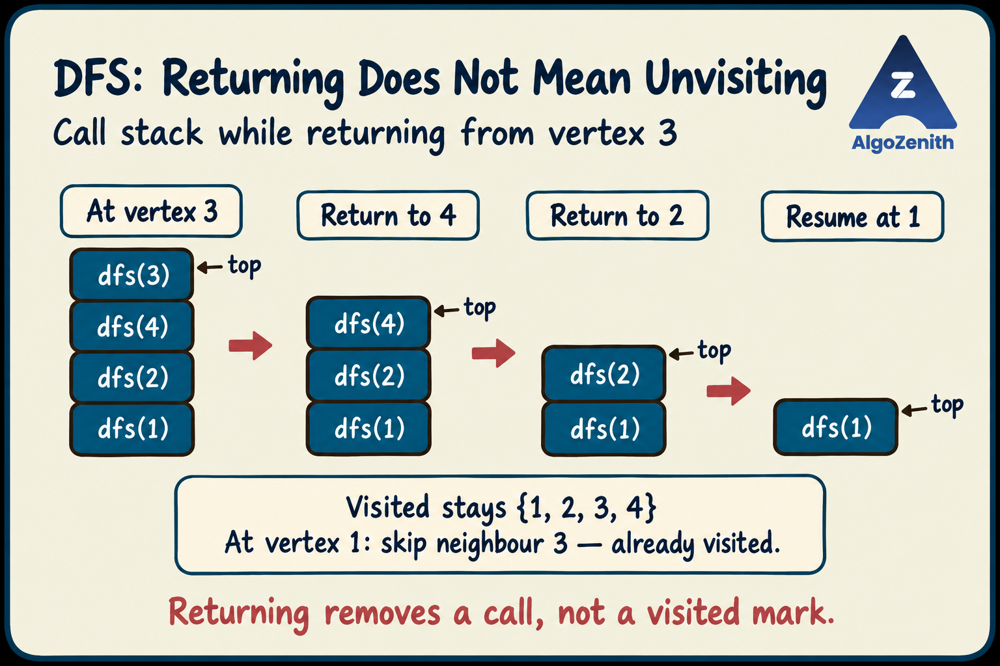
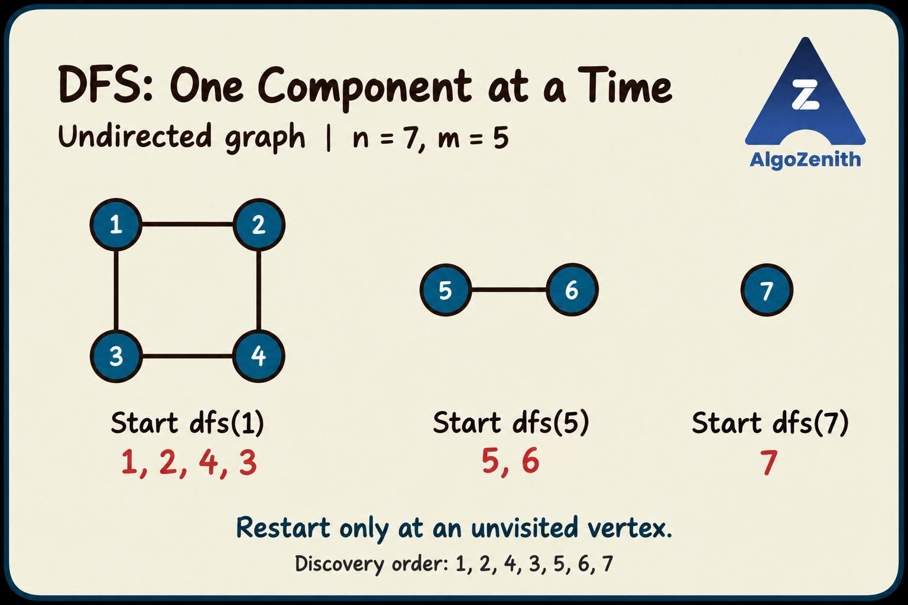

<VIDEO_WIDGET>

<VIDEO_ID></VIDEO_ID>

</VIDEO_WIDGET>

<READING_WIDGET>

# Introduction to DFS

Once a graph is stored, how do we systematically explore the vertices connected to a starting vertex?

**Depth-First Search (DFS)** follows one branch as far as it can through unvisited vertices. When it cannot go deeper, it returns to the previous vertex and tries the next unexplored neighbour.

The idea is:

> **Visit the current vertex, completely explore one unvisited neighbour's branch, and then continue with the remaining neighbours.**

We will implement this using recursion and the adjacency list from the previous lesson.

## 1. What Does a DFS Call Do?

A call `dfs(start)` explores all vertices **reachable from `start`**, assuming we begin with every vertex unvisited.

- In an **undirected graph**, it explores the connected component containing `start`.
- In a **directed graph**, it follows outgoing edges only. A vertex that can reach `start` is not necessarily reachable from `start`.

For example, if the only edge is \(1 \rightarrow 2\), DFS from 1 visits both vertices. DFS from 2 visits only vertex 2.

One starting call does not necessarily visit the entire graph. We will handle that after understanding the recursive function.

## 2. Why Do We Need a Visited Array?

Graphs may contain cycles, and more than one edge sequence may lead to the same vertex.

Without a visited array, following edges such as \(1 \rightarrow 2 \rightarrow 1\) could cause recursion to continue indefinitely. Even a single undirected edge is stored in both endpoint lists, so blindly following neighbours would repeatedly return along it.

We maintain:

- `vis[u] = 0`: vertex `u` has not been visited.
- `vis[u] = 1`: vertex `u` has already been discovered by DFS.

**Mark a vertex before recursively exploring its neighbours.** Any later edge leading to that vertex will then be skipped.

## 3. DFS Through the Recursion Framework

### State and Meaning

The parameter `node` identifies the vertex currently being explored. The graph `g` and visited array `vis` are shared across calls.

The function's job is to visit `node` and recursively explore every still-unvisited neighbour reachable through its branch.

### Work at the Current State

Mark the current vertex as visited. This is also a convenient point to record or print it.

### Recursive Transition

For each neighbour `v` in `g[node]`:

- If `v` is unvisited, call `dfs(v)`.
- Otherwise, skip it and check the next neighbour.

Crucially, `dfs(v)` finishes **before** the loop in `dfs(node)` continues. This is what makes the search depth-first.

### Stopping and Returning

If there are no unvisited neighbours, no further recursive call is made. The function reaches its end and returns automatically.

There is no need for a separate “leaf vertex” test: a vertex with neighbours may still have nothing left to explore because all of them are already visited.

### What Happens During Backtracking?

Returning from a recursive call brings us back to the caller, whose loop resumes from where it paused.

**We do not reset `vis[node]` to 0 when returning.** Here, visited means “discovered anywhere in this traversal,” not “currently on the recursion path.” Undoing the mark would allow repeated visits and would no longer implement this standard DFS traversal.

This differs from backtracking problems where a choice is undone so that another candidate solution can be explored.

## 4. The Recursive Function

```cpp
void dfs(int node) {
    vis[node] = 1;
    order.push_back(node);

    for (int v : g[node]) {
        if (!vis[v]) {
            dfs(v);
        }
    }
}
```

The callers ensure that `dfs` is invoked only on an unvisited vertex. `order` records vertices when they are first discovered; it is useful for seeing the traversal, but is not required merely to mark reachable vertices.

### Where Is the Stack?

Recursion uses the program's **call stack**. Each active call remembers its current vertex and where it has reached in the neighbour loop.

For a chain of calls `dfs(1) → dfs(2) → dfs(4) → dfs(3)`, the call for 3 must return before the call for 4 can resume. This is the LIFO behaviour of a stack.



The figure shows the return sequence from the dry run below. Once vertex 3 finishes, the calls for 4 and 2 also finish. Vertex 1 then resumes its neighbour loop and skips 3 because it is already visited. **Leaving the call stack does not remove a vertex's visited mark.**

DFS can also be implemented with an explicit stack. Here, we use recursive calls so that “explore one neighbour completely, then return” is visible directly in the code.

## 5. Traversing the Entire Graph

Calling `dfs(1)` is enough only if every vertex is reachable from vertex 1.

To visit every vertex, scan all labels and start DFS whenever an unvisited vertex is found:

```cpp
for (int node = 1; node <= n; ++node) {
    if (!vis[node]) {
        dfs(node);
    }
}
```

Keep the **same visited array** throughout this loop. A new starting call explores vertices not reached by earlier calls.

For an undirected graph, each new starting call explores one previously unvisited connected component. An isolated vertex is also visited: it is marked, its empty adjacency list is checked, and the call returns.

For a directed graph, this loop also ensures that every vertex is visited, but the groups explored by successive starting calls should **not** be interpreted as strongly connected components.

## 6. Complete C++ Implementation

This program reads an **undirected, unweighted graph**, with vertices numbered from 1 to \(n\), and prints the order in which all vertices are first visited.

The first line contains `n m`. Each of the next `m` lines contains an undirected edge `u v`.

```cpp
#include <iostream>
#include <vector>
using namespace std;

vector<vector<int>> g;
vector<int> vis;
vector<int> order;

void dfs(int node) {
    vis[node] = 1;
    order.push_back(node);

    for (int v : g[node]) {
        if (!vis[v]) {
            dfs(v);
        }
    }
}

void solve() {
    int n, m;
    cin >> n >> m;

    // Create fresh state for this graph; index 0 is unused.
    g.assign(n + 1, vector<int>());
    vis.assign(n + 1, 0);
    order.clear();

    for (int i = 0; i < m; ++i) {
        int u, v;
        cin >> u >> v;
        g[u].push_back(v);
        g[v].push_back(u);  // Store both directions for an undirected edge.
    }

    for (int node = 1; node <= n; ++node) {
        if (!vis[node]) {
            dfs(node);
        }
    }

    for (int i = 0; i < static_cast<int>(order.size()); ++i) {
        if (i > 0) cout << ' ';
        cout << order[i];
    }
    cout << '\n';
}

int main() {
    ios::sync_with_stdio(false);
    cin.tie(nullptr);

    solve();
    return 0;
}
```

For a **directed graph**, remove only `g[v].push_back(u)` from the input loop. The DFS function remains unchanged because it always follows exactly the neighbours stored in `g[node]`.

Using `g.assign(...)` creates empty lists even if `solve()` is called again for another graph. Resizing an existing outer vector alone does not clear the inner lists that remain.

## 7. Dry Run: Going Deep, Returning, and Restarting

Use this input for the complete program:

```text
7 5
1 2
1 3
2 4
3 4
5 6
```

This is an **undirected** example. Vertices 1, 2, 3, and 4 form one component; vertices 5 and 6 form another; vertex 7 is isolated.



Because neighbours are appended in input order, the adjacency lists are:

```text
1: [2, 3]
2: [1, 4]
3: [1, 4]
4: [2, 3]
5: [6]
6: [5]
7: []
```

Initially, every vertex is unvisited. The outer loop starts with `dfs(1)`.

| Step | What happens? | Discovery order so far |
| --- | --- | --- |
| 1 | Visit 1. Its first unvisited neighbour is 2, so call `dfs(2)`. | `1` |
| 2 | Visit 2. Skip visited neighbour 1 and call `dfs(4)`. | `1, 2` |
| 3 | Visit 4. Skip visited neighbour 2 and call `dfs(3)`. | `1, 2, 4` |
| 4 | Visit 3. Both neighbours, 1 and 4, are already visited, so return to 4. | `1, 2, 4, 3` |
| 5 | Vertex 4 has no neighbours left to check. Return to 2, then return to 1. | `1, 2, 4, 3` |
| 6 | Resume 1's loop. Neighbour 3 is already visited, so skip it and finish `dfs(1)`. | `1, 2, 4, 3` |
| 7 | The outer loop skips 2, 3, and 4, then starts `dfs(5)`. Visit 5 and call `dfs(6)`. | `1, 2, 4, 3, 5` |
| 8 | Visit 6. Skip visited neighbour 5. Return to 5 and finish this branch. | `1, 2, 4, 3, 5, 6` |
| 9 | The outer loop skips 6, then starts `dfs(7)`. Visit 7 and return immediately because its list is empty. | `1, 2, 4, 3, 5, 6, 7` |

The output is:

```text
1 2 4 3 5 6 7
```

### Observations from the Dry Run

- Although 3 is a neighbour of 1, DFS does not visit it immediately after 2. It first completes the recursive branch started through 2.
- Vertex 3 is discovered through 4. When the loop at 1 later reaches neighbour 3, it skips the already-visited vertex.
- Returning to a vertex does not mean discovering or printing it again.
- The jump from 3 to 5 in the printed output is **not an edge traversal**. The first component has finished and the outer loop starts a new DFS.

The printed discovery order is a record of first visits, not necessarily a path in the graph. Returning through earlier vertices and restarting in another component are not printed as new visits.

## 8. Is the DFS Order Unique?

No. It depends on:

- The starting vertex, or the order in which the outer loop considers vertices.
- The order of neighbours within each adjacency list.

For example, if vertex 1's list were `[3, 2]` in the dry run, the first component would be visited in the order `1, 3, 4, 2` instead.

Both orders are valid. The implementation above follows **input order** within adjacency lists and increasing label order when choosing a new starting vertex.

## 9. Why Does DFS Work?

Two observations explain its correctness:

1. **No vertex is discovered twice.** A vertex is marked before its neighbours are explored, and recursive calls are made only for unvisited vertices.
2. **No reachable vertex is missed.** When a vertex is visited, DFS checks all of its outgoing neighbours. Any unvisited one is explored recursively. If a reachable vertex were missed, there would be an edge along a path from the start where a visited vertex led to an unvisited vertex. DFS would have followed that edge, which is a contradiction.

The outer loop extends this traversal to vertices that earlier starting calls could not reach.

Standard DFS with this visited array explores reachable vertices. It does **not** enumerate every possible path between vertices; that is a different task and may require different state and much more work.

## 10. Time and Space Complexity

### Time: \(\Theta(n+m)\) with an Adjacency List

For the traversal of the entire graph:

- The outer loop checks \(n\) vertices.
- Each vertex is discovered once.
- Each adjacency-list entry is inspected once, when its source vertex is explored.

A directed graph has \(m\) adjacency entries. An undirected graph stored in both directions has \(2m\) entries, so:

$$
\Theta(n + 2m) = \Theta(n+m)
$$

The outer loop does **not** multiply the traversal cost by \(n\): already-visited vertices do not start another DFS.

With an adjacency matrix instead, finding the neighbours of each vertex requires scanning a row of length \(n\). Traversing the entire graph would therefore take \(\Theta(n^2)\) time.

### Space

- Adjacency list: \(\Theta(n+m)\).
- Visited array: \(\Theta(n)\).
- Recorded discovery order: \(\Theta(n)\).
- Recursion stack: \(O(n)\) in the worst case, such as a long chain.

The **auxiliary space**, excluding graph storage, is \(O(n)\). Including the adjacency list, total space is \(O(n+m)\).

> **CP / interview caution:** A deep recursion chain can overflow the program's call stack even though the time complexity is acceptable. For large graphs that may contain long chains, consider an explicit-stack DFS. There is no single safe recursion-depth limit for every environment.

## 11. Common Mistakes

- **Marking a vertex after recursion:** a cycle can lead back to it before it is marked. Mark on entry instead.
- **Unmarking on return:** standard reachability DFS must remember every discovered vertex throughout the traversal.
- **Calling DFS only from vertex 1:** this misses vertices outside its reachable set.
- **Adding a reverse edge to a directed graph:** that changes the graph and may change reachability.
- **Expecting a unique traversal order:** neighbour order can change the answer without making it incorrect.
- **Reusing old graph data:** clear adjacency lists and visited state before processing a new graph.

DFS is a foundation for connectivity checks and component exploration. It is also used in algorithms for tasks such as topological sorting and maze exploration; those tasks require their own additional logic and are not implemented by this introductory traversal alone.

## Quick Recap

- DFS explores an unvisited neighbour's branch completely before trying another neighbour.
- Recursion provides the stack needed to remember where to return.
- Mark a vertex when entering its call, and keep it marked after returning.
- One starting call explores its reachable region; an outer loop covers the whole graph.
- With an adjacency list, a full traversal takes \(\Theta(n+m)\) time and \(O(n)\) auxiliary space.

</READING_WIDGET>
