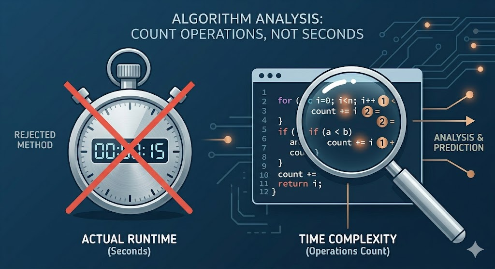
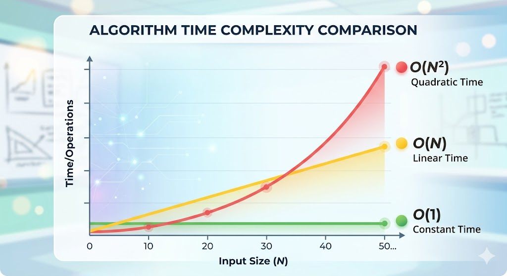

# Introduction to Time Complexity

Hey there! Welcome to the world of Data Structures and Algorithms (DSA). If you've ever written a program and wondered, *"Is this the best way to do it?"* or *"Will this run fast enough?"*, you are already thinking about **Time Complexity**. 

Let's break this down into simple, bite-sized pieces so you can write code like a pro!

## What is Time Complexity?

Imagine you are trying to find the word "Algorithm" in a thick, physical dictionary. 
- **Method 1 (The slow way):** You check every single page from page 1 until you find it. 
- **Method 2 (The smart way):** You open the book in the middle, see if "A" comes before or after, and keep halving the search space until you find it.

If the dictionary suddenly doubles in size, Method 1 takes twice as long, but Method 2 only takes *one extra step*! 

**Time Complexity** is simply a way to describe **how the runtime of your algorithm grows as the size of the input grows.** We use it to figure out if our code will survive when given a massive amount of data.

> 💡 **Interview Insight:** In technical interviews, simply solving the problem isn't enough. The interviewer wants to see if you can analyze *how efficient* your solution is. Time complexity is the universal language engineers use to communicate that efficiency.

---

## Why Time Complexity Matters in DSA

You might think, *"Computers are super fast! Why should I care if my code is a little slow?"*

Let's say you write a program to pair up users on a new social app. 
- If you have 10 users, checking all pairs takes about 100 operations. A computer does this instantly.
- If your app goes viral and you hit 1,000,000 users, a poor algorithm might need **1,000,000 × 1,000,000 = 1 Trillion** operations! 

Even a modern CPU executing $10^8$ operations per second would take nearly **3 hours** to finish that. But with a better algorithm, it could be done in a fraction of a second. 

Time complexity helps us avoid writing code that works fine for small tests but crashes and burns in the real world.

---

## Time Complexity vs. Actual Runtime

A common beginner mistake is thinking Time Complexity means "the exact time my code takes to run in seconds." **It does not!**

The *actual runtime* of a program depends on many unpredictable factors:
- The speed of your specific computer's CPU.
- Whether you are running other heavy apps (like Chrome or Spotify) in the background.
- What programming language you are using (C++ is generally much faster than Python).
- Compiler optimizations.

Because these factors constantly change, measuring "seconds" is an unreliable way to compare algorithms. 

**Time Complexity** solves this by completely ignoring hardware. Instead of measuring time, **we count the number of basic operations** (like additions, assignments, or comparisons) your code performs relative to the input size ($N$).



<!-- > **[IMAGE PLACEHOLDER]**
> **Image Content:** An illustration showing a stopwatch crossed out (representing actual runtime) next to a magnifying glass hovering over a block of code counting operations like `+`, `=`, and `<` (representing time complexity). This visually reinforces that we count operations, not seconds.
> **Location:** Insert here, right after the comparison explanation. -->

---

## Input Size and Its Impact on Performance

Let's look at how the input size ($N$) changes the number of operations in C++.

### 1. Constant Time - Doesn't care about input size
```cpp
void printFirstElement(int arr[], int n) {
    // No matter how big 'n' is, this always takes 1 step!
    cout << arr[0] << "\n"; 
}
```
Even if $N = 1,000,000$, the code only does one thing. This is incredibly fast!

### 2. Linear Time - Grows directly with input size
```cpp
void printAllElements(int arr[], int n) {
    // If n is 10, the loop runs 10 times.
    // If n is 1,000,000, the loop runs 1,000,000 times.
    for(int i = 0; i < n; i++) {
        cout << arr[i] << " ";
    }
}
```
Here, the number of operations grows exactly in proportion to $N$.

### 3. Quadratic Time - Grows much faster than input size
```cpp
void printAllPairs(int arr[], int n) {
    // If n is 10, it runs 10 * 10 = 100 times.
    // If n is 1,000,000, it runs 1,000,000,000,000 times! (Too slow!)
    for(int i = 0; i < n; i++) {
        for(int j = 0; j < n; j++) {
            cout << "(" << arr[i] << ", " << arr[j] << ")\n";
        }
    }
}
```
This is where things get dangerous. As $N$ gets large, nested loops can cause your program to freeze or hit a "Time Limit Exceeded" (TLE) error on coding platforms.



<!-- > **[IMAGE PLACEHOLDER]**
> **Image Content:** A colorful, friendly line graph plotting Input Size ($N$) on the X-axis and Time/Operations on the Y-axis. It should show three distinct lines: a flat green line at the bottom (Constant), a straight diagonal yellow line (Linear), and a steep curving red line (Quadratic), demonstrating how aggressively the red line shoots up as $N$ grows.
> **Location:** Insert here, at the end of the section. -->

---

By understanding how input size affects your code, you're taking your first big step from just *writing code* to *engineering software*. 

# Big O Notation

You've probably heard programmers say things like, *"Oh, that solution is Big O of N."* It sounds like scary math, but it's actually just a shorthand way to talk about time complexity!

## What is Big O?

**Big O Notation** is a standardized, mathematical way to describe the upper bound of an algorithm's runtime. In plain English: **it tells you the absolute *worst* your code will perform as the input size ($N$) gets massive.**

Instead of writing a paragraph saying "the time it takes grows proportionally to the input," we simply write: **$O(N)$**. 
- The "O" stands for "Order of" (referring to the rate of growth).

---

## Best Case, Average Case, and Worst Case

Imagine you are looking for a specific book on a bookshelf with $N$ books. You check them one by one from left to right.

1. **Best Case:** The book is the very first one you check! You found it in 1 step. 
2. **Average Case:** The book is somewhere in the middle. You check about $N/2$ books.
3. **Worst Case:** The book is the very last one on the shelf (or not there at all!). You had to check all $N$ books.

In computer science, we have symbols for these:
- **Best Case:** $\Omega$ (Omega notation) 
- **Average Case:** $\Theta$ (Theta notation)
- **Worst Case:** $O$ (Big O notation)

### Why do we prefer the Worst Case (Big O)?

Imagine you are writing software for the brakes on a self-driving car. You wouldn't want the brakes to respond quickly *on average*. You need a guarantee: *"What is the absolute maximum time this will take in the worst possible scenario?"* 

In software engineering, we plan for the worst. If our worst-case scenario is fast enough, we know our program will never crash or freeze under pressure.

> 💡 **Interview Insight:** When an interviewer asks, *"What is the time complexity of your code?"*, they almost **always** mean the Worst-Case Big O notation, unless they specifically ask for the average or best case.

**Disclaimer for the math geeks:** Strictly speaking, Big O mathematically represents the **upper bound** of a function, not just the "worst-case scenario". You can technically calculate the Big O upper bound of a best-case scenario! However, in the tech industry and interviews, "Big O" has become universally accepted jargon for "worst-case time complexity."


<!-- > **[IMAGE PLACEHOLDER]**
> **Image Content:** A funny comic strip. Panel 1: A programmer saying "My code works perfectly in the best case!" (showing a sunny day). Panel 2: The code is deployed to real users, representing the worst case, and everything is on fire. 
> **Location:** Insert here, to add some humor about planning for the worst case. -->

---

## Rule of Thumb: Drop the Constants!

One of the most important rules of Big O notation is that **we ignore constants and non-dominant terms.** 

Let's look at an example:
```cpp
void printThings(int arr[], int n) {
    // Loop 1 runs N times
    for(int i = 0; i < n; i++) {
        cout << arr[i] << " ";
    }
    
    // Loop 2 also runs N times
    for(int i = 0; i < n; i++) {
        cout << arr[i] << " ";
    }
}
```

If we count the operations, this takes $N + N = 2N$ steps. So, is the time complexity $O(2N)$? 

**No! It is just $O(N)$.** 

Why? Because Big O only cares about the *shape* of the growth curve as $N$ gets closer to infinity. Whether you do 1 operation per item or 100 operations per item, the time still grows *linearly*. Furthermore, a fast computer running a $2N$ algorithm might still beat a slow computer running an $N$ algorithm, so we drop the constant to keep things hardware-independent.

### What about non-dominant terms?
Imagine an algorithm that takes $N^2 + N$ steps.
- If $N = 10$, then $N^2 = 100$ and $N = 10$. Total = 110.
- If $N = 100,000$, then $N^2 = 10,000,000,000$ and $N = 100,000$. 

As $N$ grows, the $N^2$ part becomes so massive that the extra $N$ is basically a rounding error. Therefore, we **drop the smaller terms** and say the complexity is just **$O(N^2)$**.

> **Key Takeaway:** Always strip the complexity down to its most dominant, fastest-growing term. 
> - $O(500N) \rightarrow O(N)$
> - $O(N^2 + 5N + 1000) \rightarrow O(N^2)$

### ⚠️ The Competitive Programming Reality Check (Constant Factors)
While Big O mathematically ignores constants (e.g., treating $O(500N)$ exactly the same as $O(N)$), **Competitive Programming (CP) is much less forgiving.** 

If a problem has $N = 10^5$ and a 1-second time limit, a pure $O(N)$ solution takes $10^5$ operations and passes instantly. But if your $O(N)$ solution has a massive hidden constant—say, it does 500 heavy operations inside the loop—your actual operation count is $500 \times 10^5 = 5 \times 10^7$. Depending on the server speed and the exact operations, this might actually trigger a **Time Limit Exceeded (TLE)**!

> 💡 **Interview vs. CP Insight:** In a software engineering interview, confidently state that $O(500N)$ simplifies to $O(N)$. But during a CP contest, always keep an eye on your **Constant Factor**—the actual number of operations happening inside your loops. If your constant is huge, you might need to optimize the code even if the Big O complexity is theoretically correct.

# Common Time Complexities

Now that we know what Big O is and how to clean it up, let's look at the "Big O Hall of Fame." These are the most common time complexities you will see in coding interviews and competitive programming. 

We will list them from **fastest** to **slowest**.

## 1. $O(1)$ - Constant Time (The Dream)
No matter how massive the input is, the algorithm takes the exact same amount of time.
- **Example:** Accessing an element in an array by its index, or doing basic math operations.
```cpp
int getFirstElement(int arr[]) {
    return arr[0]; // Instant, regardless of array size!
}
```

### 🌟 Special Mention: Amortized Time Complexity
Sometimes, an operation might take $O(N)$ time once in a while, but $O(1)$ time in almost all other cases. When we average out the heavy operation over a sequence of many operations, the cost becomes constant. We call this **Amortized $O(1)$**.

- **Classic Example:** `std::vector::push_back()` in C++. 
When you push elements into a vector, it takes $O(1)$ time. But when the vector runs out of underlying memory, it creates a new array double the size and copies all $N$ elements over ($O(N)$ time). However, because this doubling happens so rarely, the *average* cost of a single push is mathematically proven to be $O(1)$. 

> 💡 **Interview Insight:** Interviewers love asking, *"What is the time complexity of pushing to a dynamic array?"* If you just say $O(1)$, they might penalize you. The golden answer is: *"It is $O(1)$ **amortized**, but $O(N)$ in the worst-case when the array resizes."*

## 2. $O(\log N)$ - Logarithmic Time (Extremely Fast)
If $N$ doubles, the number of operations only increases by 1! This usually happens when you divide the search space in half each step.
- **Example:** Binary Search. 
- **Mind-blowing fact:** If you have $1,000,000$ items, it takes about 20 steps to find your target. If you have $1,000,000,000$ (1 billion) items, it only takes about 30 steps!
```cpp
// Searching in a sorted array by halving the search space
int l = 0, r = n - 1;
while(l <= r) {
    int mid = l + (r - l) / 2;
    if(arr[mid] == target) return mid;
    if(arr[mid] < target) l = mid + 1;
    else r = mid - 1;
}
```

## 3. $O(N)$ - Linear Time (Fair & Steady)
The time taken grows directly with the input size. If $N$ is 100, you do 100 operations.
- **Example:** Looping through an array to find the maximum value.
```cpp
int maxVal = arr[0];
for(int i = 1; i < n; i++) {
    maxVal = max(maxVal, arr[i]);
}
```

## 4. $O(N \log N)$ - Linearithmic Time (The Sorting Standard)
This is slightly slower than $O(N)$ but much faster than $O(N^2)$. It usually happens when you split data in half recursively and then merge or process it.
- **Example:** Efficient sorting algorithms like Merge Sort, Quick Sort, and C++'s built-in `std::sort()`.

## 5. $O(N^2)$ - Quadratic Time (Use with Caution)
The time taken is the square of the input size. If $N = 1,000$, operations = $1,000,000$. This is generally the limit for inputs around $10^4$.
- **Example:** Nested loops, checking all pairs in an array (like Bubble Sort or Selection Sort).
```cpp
for(int i = 0; i < n; i++) {
    for(int j = 0; j < n; j++) {
        // Checking pair (i, j)
    }
}
```

## 6. $O(2^N)$ - Exponential Time (Danger Zone)
The number of operations doubles with each new element added to the input. This is terribly slow and usually only works if $N \le 20$.
- **Example:** Finding all subsets of a set, or a simple recursive Fibonacci function without memory (memoization).

## 7. $O(N!)$ - Factorial Time (Game Over)
The absolute slowest. If $N=10$, it's 3.6 million operations. If $N=12$, it's 479 million operations.
- **Example:** Finding all permutations of a string.


<!-- > **[IMAGE PLACEHOLDER]**
> **Image Content:** A "Big O Cheat Sheet" graph plotting all these complexities on one chart. The X-axis is 'Elements', Y-axis is 'Operations'. $O(1)$ and $O(\log N)$ should be in a green "Excellent" zone at the bottom. $O(N)$ and $O(N \log N)$ in a yellow "Fair" zone. $O(N^2)$, $O(2^N)$, and $O(N!)$ shooting aggressively up into a red "Horrible" zone.
> **Location:** Insert here, at the end of the section as a visual summary. -->

---

# Why We Prefer Higher Order Terms

Earlier, we briefly mentioned dropping "non-dominant" terms. Let's dive a little deeper into this. When we analyze an algorithm, we often get a mathematical equation that represents the total number of operations. For example:

$$T(N) = 3N^2 + 5N + 100$$

Here, we have three different terms:
- **$3N^2$** is the **Higher-Order Term** (it grows the fastest).
- **$5N$** and **$100$** are the **Lower-Order Terms** (they grow slower, or not at all).

In Big O notation, we completely ignore the lower-order terms and the coefficients (the numbers in front of the $N$). So, $T(N)$ simplifies cleanly to **$O(N^2)$**. But why do we do this?

## The Meaning of Lower-Order vs. Higher-Order

Think of it like spending money. 
- A **higher-order term** is like buying a house. It costs millions of rupees.
- A **lower-order term** is like buying a cup of chai on the way to the bank. It costs 20 rupees.

If you are calculating the total cost of buying the house, does the 20 rupees for the chai really matter? Not really! The cost of the house completely overshadows the cost of the tea.

## Why Lower-Order Terms Become Insignificant

The core philosophy of Big O notation is analyzing how an algorithm behaves as the input size ($N$) approaches **infinity**. Let's plug some numbers into our equation $T(N) = N^2 + N$ to see what happens as $N$ gets realistically large:

| Input Size ($N$) | Lower-Order Term ($N$) | Higher-Order Term ($N^2$) | Total Operations ($N^2 + N$) | % Contribution of $N^2$ |
| :--- | :--- | :--- | :--- | :--- |
| **10** | 10 | 100 | 110 | 90.9% |
| **100** | 100 | 10,000 | 10,100 | 99.0% |
| **1,000** | 1,000 | 1,000,000 | 1,001,000 | 99.9% |
| **100,000** | 100,000 | 10,000,000,000 | 10,000,100,000 | 99.999% |

Look closely at the bottom row. When $N = 100,000$, the $N^2$ term is doing 10 Billion operations! The extra 100,000 operations from the lower-order term barely make a dent in the total runtime. It's essentially a rounding error.

> 💡 **Interview Insight:** If you write an algorithm with two distinct steps—for example, first you sort the array $O(N \log N)$, and then you loop through it once $O(N)$—the total time is $O(N \log N + N)$. In an interview, you should immediately simplify this and confidently say, *"The overall time complexity is $O(N \log N)$ because the sorting step dominates the runtime."*

By focusing only on the higher-order terms, we strip away the mathematical clutter and focus entirely on the true bottleneck of our algorithm.

---

# Analyzing Code for Time Complexity

Now for the fun part: looking at actual code and figuring out its time complexity! Think of yourself as a detective. Your job is to count how many times the most deeply nested or most repeated operation runs.

Let's break down the most common patterns you'll see in the wild.

## 1. Single Loops
When you have a single loop running from $0$ to $N$, the time complexity is proportional to $N$.

```cpp
for(int i = 0; i < n; i++) {
    // This runs N times
    cout << "Hello World\n"; 
}
```
**Time Complexity:** $O(N)$

## 2. Nested Loops
When loops are nested inside each other, you **multiply** their complexities.

```cpp
for(int i = 0; i < n; i++) {
    for(int j = 0; j < n; j++) {
        // This runs N * N times
        cout << i << ", " << j << "\n";
    }
}
```
**Time Complexity:** $O(N \times N) = O(N^2)$

*But what if the inner loop doesn't go all the way up to $N$?*
```cpp
for(int i = 0; i < n; i++) {
    for(int j = 0; j < i; j++) {
        // Runs 0 + 1 + 2 + ... + (N-1) times
        cout << "*";
    }
}
```
This is an arithmetic progression summing to about $N^2/2$. We drop the constant (divide by 2), so it is still **$O(N^2)$**.

## 3. Consecutive Loops
When loops are sequential (one after the other), you **add** their complexities and then drop the lower-order terms.

```cpp
// First loop: O(N)
for(int i = 0; i < n; i++) {
    cout << "First loop\n";
}

// Second loop: O(N^2)
for(int i = 0; i < n; i++) {
    for(int j = 0; j < n; j++) {
        cout << "Second loop\n";
    }
}
```
**Total Time:** $O(N) + O(N^2) = O(N^2 + N)$. 
We drop the $N$, leaving us with:
**Time Complexity:** $O(N^2)$

## 4. Loops with Multiplication/Division Growth
Sometimes, the loop variable doesn't increase by 1 (`i++`). Instead, it doubles or halves.

```cpp
for(int i = 1; i < n; i *= 2) {
    // i goes: 1, 2, 4, 8, 16...
    cout << i << "\n";
}
```
Because the gap jumps exponentially, it reaches $N$ much faster than a normal loop. How many times can you double a number until you hit $N$? That's exactly what logarithms measure!
**Time Complexity:** $O(\log N)$

## 5. Recursive Functions
For recursion, we generally look at two things:
1. **Depth of the recursion tree:** How many times does the function call itself?
2. **Work done per call:** What happens inside each call (excluding the recursive calls)?

```cpp
void solve(int n) {
    if(n == 0) return;
    cout << "Thinking...\n"; // O(1) work
    solve(n - 1);           // Calls itself N times
}
```
Here, we make $N$ calls, and each call does $O(1)$ work.
**Time Complexity:** $O(N)$

*What about branching recursion?*
```cpp
int fibonacci(int n) {
    if(n <= 1) return n;
    return fibonacci(n - 1) + fibonacci(n - 2);
}
```
Each call spawns *two* more calls. The number of calls doubles at each level of depth.
**Time Complexity:** $O(2^N)$


<!-- > **[IMAGE PLACEHOLDER]**
> **Image Content:** A visual diagram of a recursion tree for `fibonacci(4)`. It should show the root node splitting into two nodes, which split into two more nodes, visually demonstrating how the tree "explodes" in width, beautifully representing $O(2^N)$ exponential growth.
> **Location:** Insert here, to clarify branching recursion. -->

### Introducing the Master Theorem
When dealing with **Divide and Conquer** algorithms (where a problem is divided into smaller subproblems), counting the recursion depth manually can get complicated. This is where the **Master Theorem** comes in handy!

The Master Theorem provides a direct formula to solve recurrence relations of the form:
$$T(N) = aT\left(\frac{N}{b}\right) + O(N^d)$$

Where:
- **$a$**: The number of subproblems we divide into.
- **$N/b$**: The size of each subproblem.
- **$O(N^d)$**: The time spent doing work outside the recursive calls (like splitting the data or merging results).

While the full mathematical proof is complex, here are the three simplified cases you need to know:
1. **Case 1 (Work done at leaves dominates):** If $a > b^d$, the time complexity is $O(N^{\log_b a})$.
2. **Case 2 (Work is evenly distributed):** If $a = b^d$, the time complexity is $O(N^d \log N)$.
   - *Example:* Merge Sort divides the array into 2 halves ($a=2, b=2$) and merges them in linear time ($d=1$). Since $2 = 2^1$, it falls into Case 2. Complexity: $O(N^1 \log N) = O(N \log N)$.
3. **Case 3 (Work done at root dominates):** If $a < b^d$, the time complexity is $O(N^d)$.

> 💡 **Interview Insight:** You rarely need to solve complex recurrences mathematically in an interview setting. However, knowing how the Master Theorem applies to standard patterns like Merge Sort or Binary Search proves that you deeply understand how "Divide and Conquer" performance works.

## 6. Multiple Input Variables
Sometimes your code relies on two completely different inputs, say an array of size $N$ and an array of size $M$.

```cpp
void printTwoArrays(int arr1[], int n, int arr2[], int m) {
    for(int i = 0; i < n; i++) cout << arr1[i];
    for(int j = 0; j < m; j++) cout << arr2[j];
}
```
**Don't assume everything is $N$!** The time here depends on both $N$ and $M$.
**Time Complexity:** $O(N + M)$

If they were nested, it would be $O(N \times M)$.

## Common Mistakes While Analyzing Code

1. **Assuming all nested loops are $O(N^2)$**
   Look closely at the inner loop's condition. If the inner loop only runs a constant number of times (e.g., `j < 5`), the total complexity is still just $O(N)$.
   
2. **Forgetting to count built-in functions**
   In C++, hidden functions take time! For example, `std::sort()` takes $O(N \log N)$. If you put a `sort()` inside an $O(N)$ loop, your total complexity skyrockets to $O(N^2 \log N)$. Hidden functions count!

3. **Confusing Best Case with Big O**
   If you have a loop that searches for an element and `break`s when it finds it, it *could* stop on the first try. But Big O is the worst case! Assume the element is at the very end. The complexity is $O(N)$, not $O(1)$.

---

# Code Examples for Time Complexity

The best way to get comfortable with Time Complexity is by looking at lots of examples! Let's go through some common code snippets you might encounter and analyze them together.

## 1. Constant Time - $O(1)$
These operations take the same amount of time regardless of how big the input is.

```cpp
// Example A: Swapping two numbers
void swap(int &a, int &b) {
    int temp = a;
    a = b;
    b = temp;
}
// Complexity: O(1)

// Example B: Checking if a number is even
bool isEven(int n) {
    return n % 2 == 0;
}
// Complexity: O(1)
```

## 2. Linear Loops - $O(N)$
Loops that iterate through the input one by one.

```cpp
// Example A: Summing an array
int getSum(vector<int>& arr) {
    int sum = 0;
    for(int i = 0; i < arr.size(); i++) {
        sum += arr[i];
    }
    return sum;
}
// Complexity: O(N)

// Example B: Two pointers moving towards each other
bool isPalindrome(string s) {
    int left = 0, right = s.length() - 1;
    while(left < right) {
        if(s[left] != s[right]) return false;
        left++;
        right--;
    }
    return true;
}
// Complexity: O(N) (Even though it only checks N/2 elements, we drop the constant)
```

## 3. Nested Loops - $O(N^2)$
Loops inside loops where both depend on $N$.

```cpp
// Example A: Printing a 2D Grid
void printGrid(int n) {
    for(int i = 0; i < n; i++) {
        for(int j = 0; j < n; j++) {
            cout << "* ";
        }
        cout << "\n";
    }
}
// Complexity: O(N^2)

// Example B: Selection Sort
void selectionSort(vector<int>& arr) {
    int n = arr.size();
    for(int i = 0; i < n; i++) {
        int min_idx = i;
        for(int j = i + 1; j < n; j++) {
            if(arr[j] < arr[min_idx]) {
                min_idx = j;
            }
        }
        swap(arr[i], arr[min_idx]);
    }
}
// Complexity: O(N^2) (The inner loop runs N, then N-1, then N-2... summing to ~N^2 / 2)
```

## 4. Logarithmic Loops - $O(\log N)$
Loops that cut the problem size in half (or some fraction) at each step.

```cpp
// Example A: Counting digits of a number
int countDigits(int n) {
    int count = 0;
    while(n > 0) {
        n = n / 10;
        count++;
    }
    return count;
}
// Complexity: O(log_10(N)), which simplifies to O(log N)

// Example B: Power function (Fast Exponentiation)
long long power(long long base, long long exp) {
    long long res = 1;
    while(exp > 0) {
        if(exp % 2 == 1) res *= base;
        base *= base;
        exp /= 2;
    }
    return res;
}
// Complexity: O(log exp)
```

## 5. Sorting-Based Examples - $O(N \log N)$
Any algorithm that relies on efficient sorting.

```cpp
// Example: Checking for duplicates
bool hasDuplicates(vector<int>& arr) {
    // Step 1: Sort the array (Takes O(N log N))
    sort(arr.begin(), arr.end());
    
    // Step 2: Linear scan (Takes O(N))
    for(int i = 0; i < arr.size() - 1; i++) {
        if(arr[i] == arr[i+1]) return true;
    }
    return false;
}
// Complexity: O(N log N) + O(N) = O(N log N)
```

## 6. Recursion Examples
The complexity depends on how many recursive calls are made.

```cpp
// Example A: Factorial (Linear Recursion)
int factorial(int n) {
    if(n <= 1) return 1;
    return n * factorial(n - 1);
}
// Complexity: O(N) (N calls, doing O(1) work each)

// Example B: Subsets/Power Set (Exponential Recursion)
void generateSubsets(string s, string current, int index) {
    if(index == s.length()) {
        cout << current << "\n";
        return;
    }
    // Take the character
    generateSubsets(s, current + s[index], index + 1);
    // Don't take the character
    generateSubsets(s, current, index + 1);
}
// Complexity: O(2^N) (Each call branches into 2 more calls)
```

## 7. Mixed Complexity Examples
Combining different pieces together.

```cpp
void mixedExample(vector<int>& arr, int m) {
    int n = arr.size();
    
    // Part 1: O(N)
    for(int i = 0; i < n; i++) cout << arr[i];
    
    // Part 2: O(N * M)
    for(int i = 0; i < n; i++) {
        for(int j = 0; j < m; j++) {
            cout << "Mixing!";
        }
    }
    
    // Part 3: O(N log N)
    sort(arr.begin(), arr.end());
}
// Complexity: O(N) + O(N * M) + O(N log N)
// This doesn't simplify nicely unless we know the relationship between N and M.
// Final Answer: O(N*M + N log N)
```

---

# Time Complexity in Problem Solving

Understanding Time Complexity isn't just about passing interviews—it's your secret weapon for solving algorithmic problems. It acts as a compass, guiding you toward the correct approach before you even write a single line of code.

## How Time Complexity Helps Choose the Right Approach

Imagine you are given a problem on a platform like CodeChef, Codeforces, or LeetCode. You read the description, and an idea pops into your head. Should you start coding immediately? **No!**

Before coding, you should:
1. **Estimate the time complexity** of your idea.
2. **Look at the constraints** of the problem (e.g., $N \le 10^5$).
3. Check if your complexity will pass within the standard time limit (usually 1 or 2 seconds).

If your idea is too slow, you just saved yourself 30 minutes of writing and debugging useless code! You can immediately pivot to thinking about a faster approach.

## Brute Force vs. Optimized Solution

When tackling a hard problem, it's highly recommended to start with the **Brute Force** solution. 
- **Brute Force:** The most obvious, straightforward way to solve a problem, usually involving checking every possible answer. It's often $O(N^2)$ or $O(2^N)$.

Why start here? Because it ensures you actually understand the problem. Once you have the brute force approach, you can analyze its time complexity, find the "bottleneck" (the slowest part), and optimize it.

**Example: Finding a pair of numbers in an array that sum to a target.**
1. **Brute Force ($O(N^2)$):** Check every single pair using nested loops. If $N = 10^5$, this will Time Limit Exceed (TLE).
2. **Optimized ($O(N \log N)$):** Sort the array first, then use the Two-Pointer technique.
3. **Highly Optimized ($O(N)$):** Use a Hash Map to store numbers you've seen and look up the required difference in $O(1)$ time.

By knowing your complexities, you can clearly communicate this progression to an interviewer. 

## Connecting Constraints with Expected Complexity

This is the ultimate competitive programming cheat code! 

Modern CPUs can perform roughly $10^8$ operations per second. By looking at the maximum value of $N$ in the problem description, you can "reverse-engineer" the time complexity the author expects you to use.

Here is a magic table you should memorize:

| Problem Constraint | Expected Time Complexity | Possible Algorithms |
| :--- | :--- | :--- |
| $N \le 10$ to $20$ | $O(N!)$, $O(2^N)$ | Backtracking, Permutations, Bitmasking |
| $N \le 100$ | $O(N^3)$, $O(N^4)$ | 3D/4D Dynamic Programming, Matrix Multiplication |
| $N \le 1,000$ | $O(N^2)$ | Nested Loops, 2D Dynamic Programming |
| $N \le 10^5$ to $10^6$ | $O(N \log N)$, $O(N)$ | Sorting, Binary Search, Two Pointers, Hash Maps |
| $N \le 10^9$ | $O(\sqrt{N})$, $O(\log N)$ | Prime Factorization, Binary Search on Answer |
| $N \le 10^{18}$ | $O(\log N)$, $O(1)$ | Fast Exponentiation, Math formulas |

**How to use this table:**
If a problem says $N \le 10^5$, and you are trying to write an $O(N^2)$ solution... **stop!** $10^5 \times 10^5 = 10^{10}$, which is way more than $10^8$. It will definitely TLE. You need an $O(N)$ or $O(N \log N)$ algorithm.

> 💡 **Interview Insight:** If an interviewer asks you to optimize an $O(N^2)$ solution, your brain should immediately jump to the techniques that yield $O(N \log N)$ (like Sorting/Binary Search) or $O(N)$ (like Hash Maps/Two Pointers).

---

# How to Check if a Solution Will Pass (The $10^8$ Rule)

You've read the problem, figured out the constraints, and designed an algorithm. But how do you know *for sure* if it will pass the Time Limit before you spend time coding it? 

Let's do some quick math!

## Understanding Constraints from the Problem Statement

Every good competitive programming or interview problem will have a **Constraints** section. It looks something like this:
- $1 \le T \le 100$ (Number of test cases)
- $1 \le N \le 10^5$ (Size of the array)
- $1 \le A[i] \le 10^9$ (Values inside the array)

**Rule #1:** When calculating time complexity, you only care about the variables that control the number of operations your code does (like $N$ or $T$). The actual values inside the array ($A[i]$) usually don't affect the time complexity (unless they are explicitly used as loop bounds).

## Estimating Allowed Operations (The $10^8$ Rule)

Here is the golden rule of modern competitive programming:
**A standard C++ program can execute roughly $10^8$ (100 million) basic operations in 1 second.**

*(Note: Python is slower, usually around $10^7$ operations per second, while Java is somewhere in between).*

If the problem has a Time Limit of 1.0 second, your goal is to keep the total number of worst-case operations strictly under $10^8$.

Let's say $N = 10^5$.
- If you write an **$O(N)$** algorithm: It takes $10^5$ operations. $10^5 < 10^8$, so it passes instantly!
- If you write an **$O(N \log N)$** algorithm: $\log_2(10^5) \approx 17$. So, $17 \times 10^5 = 1.7 \times 10^6$ operations. Still way less than $10^8$. It passes easily!
- If you write an **$O(N^2)$** algorithm: $(10^5)^2 = 10^{10}$ operations. $10^{10}$ is **100 times larger** than $10^8$. It will take about 100 seconds to run. **Time Limit Exceeded (TLE)!**

## Common Rough Limits for 1 Second in C++

To save you from doing math during a contest, memorize these rough limits for a 1-second time limit:

- **$O(N)$** will pass if $N \le 10^8$.
- **$O(N \log N)$** will pass if $N \le 10^6$ (or $5 \times 10^5$ to be safe).
- **$O(N^2)$** will pass if $N \le 10^4$ (ideally $3000$ to $5000$).
- **$O(N^3)$** will pass if $N \le 500$.
- **$O(2^N)$** will pass if $N \le 25$.
- **$O(N!)$** will pass if $N \le 11$.

## Considering the Number of Test Cases ($T$)

Many platforms (like CodeChef and Codeforces) group multiple test cases together into a single run. They will give you a variable $T$ representing the number of test cases.

If $T = 100$ and $N = 10^5$, and you write an $O(N)$ algorithm:
- Operations per test case: $10^5$
- Total operations: $T \times N = 100 \times 10^5 = 10^7$
- $10^7 < 10^8$, so it passes!

**Beware of the Trap!**
Sometimes $T$ is large (e.g., $10^5$) and $N$ is large (e.g., $10^5$). If you multiply them, $10^5 \times 10^5 = 10^{10}$, which would TLE even with an $O(N)$ algorithm! 

However, look closely at the problem description. You will often see a magical line: 
> *"The sum of $N$ over all test cases does not exceed $2 \cdot 10^5$."*

This means you don't need to multiply $T \times N$ for the worst case. The total sum of $N$ across the entire file is guaranteed to be small. As long as your complexity is $O(N)$ or $O(N \log N)$ per test case, the total time will just be proportional to the **Sum of $N$**, which will safely pass!

---

# The Ultimate Process of Solving a DSA Problem

Now that you are a master of Time Complexity, how does this fit into the actual process of solving a problem in an interview or a contest? 

Here is a step-by-step blueprint that professionals use to tackle any DSA problem.

## Step 1: Read the problem carefully
Don't rush! Read every single word. Missing a small detail like *"the array is sorted"* or *"elements can be negative"* can completely ruin your approach. 
- Read the sample test cases and make sure you understand *why* the given input produces the given output.

## Step 2: Understand input, output, and constraints
Before you even think about code, look at the constraints.
- What is the maximum value of $N$? 
- Using the $10^8$ Rule and the magic table from earlier, **immediately lock in your target Time Complexity.** If $N = 10^5$, tell yourself, *"I need an $O(N \log N)$ or $O(N)$ solution."*

## Step 3: Think of the logic
Put the keyboard away! Grab a pen and paper (or a whiteboard).
- Start with the **Brute Force** solution. If you can't solve it brute force, you can't optimize it.
- Try to find the bottleneck in your brute force approach. 
- Brainstorm optimizations: Can I sort it? Can I use two pointers? Would a Hash Map speed up the lookups?

## Step 4: Formulate (Code Structure & Determine T.C.)
Once you have an idea, mentally (or quickly on paper) draft the structure of your code.
- *"I will run a `for` loop, and inside it, I will do a Binary Search."*
- Now, **verify the Time Complexity** of your formulated idea. A loop ($N$) + Binary Search ($\log N$) = $O(N \log N)$. 
- Does it match the target complexity you locked in during Step 2? If yes, you have the green light!

## Step 5: Code
Now, and *only* now, do you start typing. 
- Because you already formulated the structure and verified the complexity, coding should just be a mechanical translation of your logic into C++.
- Write clean code, use meaningful variable names, and handle edge cases (like $N = 0$ or negative numbers).

## Step 6: Debug
If your code doesn't work on the first try, don't panic! 
- **Don't just change random things hoping it will pass.**
- Read the error. Is it a Compilation Error? Runtime Error (maybe dividing by zero or accessing out-of-bounds arrays)? Or Wrong Answer?
- Use `cout` statements (or a debugger) to track what your variables are doing at each step and compare it against your pen-and-paper logic.


<!-- > **[IMAGE PLACEHOLDER]**
> **Image Content:** A cool, modern flowchart summarizing this 6-step problem-solving process. The flow goes from 'Read' to 'Constraints' to 'Logic' to 'Formulate (with a check mark for T.C.)' to 'Code' and finally a loop for 'Debug'. 
> **Location:** Insert here, at the end of the document. -->

---

# Time Complexity Patterns to Recognize

As you solve more and more problems, you'll start to notice that certain time complexities almost always pair up with specific algorithms or data structures. Recognizing these patterns is like developing a "sixth sense" for coding!

Here is a quick cheat sheet of patterns you should instantly recognize:

## 1. $O(N)$ - Loop over the array
Whenever you need to look at every element in an array exactly once (or a constant number of times), you are looking at an $O(N)$ pattern.
- **Classic Examples:** Finding the maximum element, calculating the sum of an array, Two-Pointer approach (where both pointers only move in one direction), Sliding Window technique.

## 2. $O(N^2)$ - Nested loops over the array
If you need to compare every element with *every other element*, you will likely write a loop inside a loop, leading to an $O(N^2)$ pattern.
- **Classic Examples:** Bubble Sort, Insertion Sort, generating all possible sub-arrays, checking all pairs to find a specific sum (the brute-force way).

## 3. $O(\log N)$ - Binary Search
If the data is **sorted**, and you are dividing the search space in half at every step, your brain should immediately yell "$O(\log N)$!" 
- **Classic Examples:** Binary Search, searching in a balanced Binary Search Tree (BST), calculating $x^n$ using fast exponentiation.

## 4. $O(N \log N)$ - Sorting
If you ever call a built-in sorting function, or implement a "Divide and Conquer" algorithm that does linear work at each level of division, you have an $O(N \log N)$ pattern.
- **Classic Examples:** `std::sort()` in C++, Merge Sort, Quick Sort. 

## 5. $O(2^N)$ - Pick or Don't Pick (Subsets)
If at every step you have two choices (e.g., "Do I include this element in my subset, or do I exclude it?"), you are generating a recursion tree where every branch splits into two. This is the hallmark of $O(2^N)$ exponential growth.
- **Classic Examples:** Generating all subsets (Power Set), the naive recursive Knapsack problem, classic recursive Fibonacci.

## 6. $O(N!)$ - Permutations
If you need to explore every possible *arrangement* or *order* of a set of items, you are dealing with Factorial time. 
- **Classic Examples:** Generating all permutations of a string, solving the Traveling Salesperson Problem (brute force).

> 💡 **Interview Insight:** In interviews, if you are stuck, try to work backward from these patterns. If the array is sorted, ask yourself: *"Can I use Binary Search here to get an $O(\log N)$ runtime?"* If the constraint is unusually small like $N \le 20$, ask yourself: *"Does the interviewer want a 'Pick or Don't Pick' $O(2^N)$ recursion here?"*

---

# Time Complexity vs. Space Complexity

Throughout this guide, we've been obsessed with **Time Complexity**—how *fast* an algorithm runs. But that is only half of the story in Data Structures and Algorithms. The other half is **Space Complexity**.

## Speed vs. Memory
- **Time Complexity:** How much *time* (or how many operations) your code needs to execute as the input $N$ grows.
- **Space Complexity:** How much *memory* (RAM) your code needs to execute as the input $N$ grows.

When we talk about Space Complexity, there are two distinct terms you should know:
1. **Auxiliary Space:** The *extra* or temporary space used by your algorithm (like creating a new array or using a Hash Map).
2. **Total Space:** The Auxiliary Space + the space taken by the input itself.

> 💡 **Interview Insight:** In interviews, when they ask for "Space Complexity", they almost always mean **Auxiliary Space**. They want to know how much *extra* memory your specific algorithm consumes, ignoring the data that was handed to you.

Just like Time Complexity, Space Complexity is measured using Big O notation!

**Example of $O(1)$ Space (Constant Space):**
```cpp
int sum(vector<int>& arr) {
    int total = 0; // We only created one integer variable
    for(int x : arr) total += x;
    return total;
}
```
No matter how massive the array gets, we only use a tiny, fixed amount of extra memory for the `total` variable.

**Example of $O(N)$ Space (Linear Space):**
```cpp
vector<int> copyArray(vector<int>& arr) {
    vector<int> newArr; // We are creating a brand new array!
    for(int x : arr) newArr.push_back(x);
    return newArr;
}
```
If the input array has 1,000,000 elements, we need memory to store 1,000,000 *new* elements. The space requirement grows directly with $N$.

## The Classic Trade-Off: Why Both Matter
In the real world, memory is finite. If you are writing software for a tiny smartwatch, you might not care if an app takes an extra second to load, but you *definitely* care if it crashes the watch because it ran out of memory!

In competitive programming and interviews, you are often faced with a **Time-Space Trade-off**. 
- You can often make an algorithm **faster** (better time complexity) by using a Hash Map or an extra array to store pre-computed results. But this costs memory (worse space complexity).
- You can **save memory** by doing calculations on the fly without storing anything, but this often requires nested loops (worse time complexity).

> 💡 **Interview Insight:** A great engineer doesn't just blindly write the fastest code. A great engineer asks the interviewer: *"I can solve this in $O(N)$ time but it will take $O(N)$ extra space. Or, I can do it in $O(N \log N)$ time using $O(1)$ space. Which resource is more restricted in our system, memory or CPU?"*

---

**Congratulations!** You've made it through the ultimate guide to Time Complexity. You are now equipped to look at any code and know exactly how fast it will run, and look at any problem constraints and know exactly what algorithm to write. Happy Coding!
