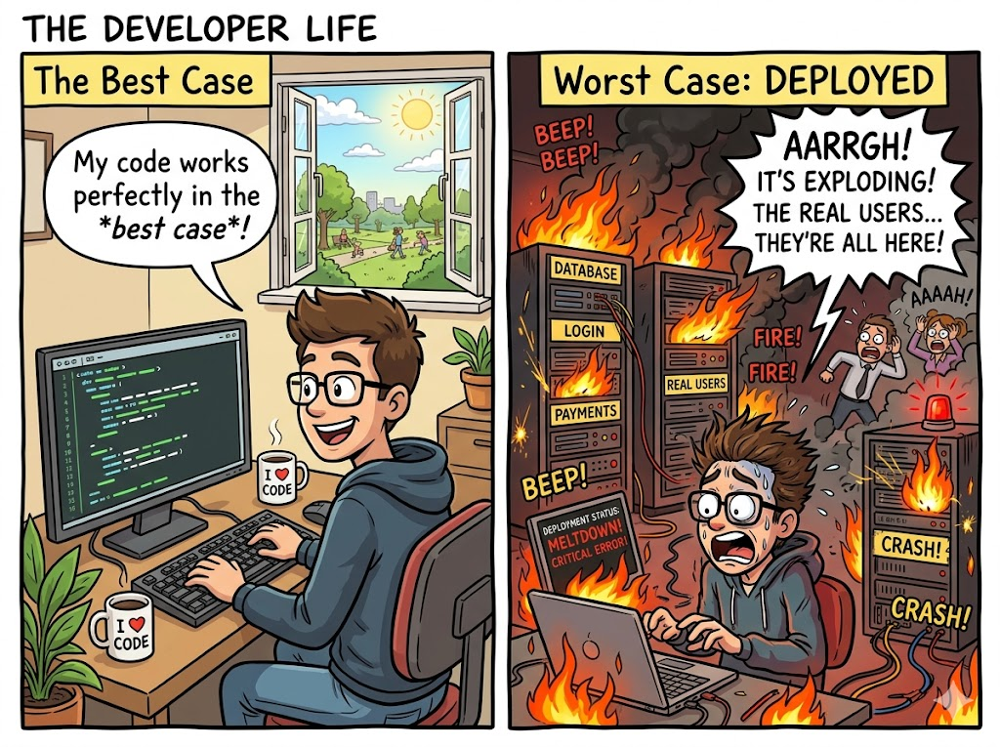

# Big O Notation

You've probably heard programmers say things like, *"Oh, that solution is Big O of N."* It sounds like scary math, but it's actually just a shorthand way to talk about time complexity!

## What is Big O?

**Big O Notation** is a standardized, mathematical way to describe the upper bound of an algorithm's runtime. In plain English: **it tells you the absolute *worst* your code will perform as the input size ($N$) gets massive.**

Instead of writing a paragraph saying "the time it takes grows proportionally to the input," we simply write: **$O(N)$**. 
- The "O" stands for "Order of" (referring to the rate of growth).

---

## Best Case, Average Case, and Worst Case

Imagine you are looking for a specific book on a bookshelf with $N$ books. You check them one by one from left to right.

1. **Best Case:** The book is the very first one you check! You found it in 1 step. 
2. **Average Case:** The book is somewhere in the middle. You check about $N/2$ books.
3. **Worst Case:** The book is the very last one on the shelf (or not there at all!). You had to check all $N$ books.

In computer science, we have symbols for these:
- **Best Case:** $\Omega$ (Omega notation) 
- **Average Case:** $\Theta$ (Theta notation)
- **Worst Case:** $O$ (Big O notation)

### Why do we prefer the Worst Case (Big O)?

Imagine you are writing software for the brakes on a self-driving car. You wouldn't want the brakes to respond quickly *on average*. You need a guarantee: *"What is the absolute maximum time this will take in the worst possible scenario?"* 

In software engineering, we plan for the worst. If our worst-case scenario is fast enough, we know our program will never crash or freeze under pressure.

> 💡 **Interview Insight:** When an interviewer asks, *"What is the time complexity of your code?"*, they almost **always** mean the Worst-Case Big O notation, unless they specifically ask for the average or best case.

**Disclaimer for the math geeks:** Strictly speaking, Big O mathematically represents the **upper bound** of a function, not just the "worst-case scenario". You can technically calculate the Big O upper bound of a best-case scenario! However, in the tech industry and interviews, "Big O" has become universally accepted jargon for "worst-case time complexity."



<!-- > **[IMAGE PLACEHOLDER]**
> **Image Content:** A funny comic strip. Panel 1: A programmer saying "My code works perfectly in the best case!" (showing a sunny day). Panel 2: The code is deployed to real users, representing the worst case, and everything is on fire. 
> **Location:** Insert here, to add some humor about planning for the worst case. -->

---

## Rule of Thumb: Drop the Constants!

One of the most important rules of Big O notation is that **we ignore constants and non-dominant terms.** 

Let's look at an example:
```cpp
void printThings(int arr[], int n) {
    // Loop 1 runs N times
    for(int i = 0; i < n; i++) {
        cout << arr[i] << " ";
    }
    
    // Loop 2 also runs N times
    for(int i = 0; i < n; i++) {
        cout << arr[i] << " ";
    }
}
```

If we count the operations, this takes $N + N = 2N$ steps. So, is the time complexity $O(2N)$? 

**No! It is just $O(N)$.** 

Why? Because Big O only cares about the *shape* of the growth curve as $N$ gets closer to infinity. Whether you do 1 operation per item or 100 operations per item, the time still grows *linearly*. Furthermore, a fast computer running a $2N$ algorithm might still beat a slow computer running an $N$ algorithm, so we drop the constant to keep things hardware-independent.

### What about non-dominant terms?
Imagine an algorithm that takes $N^2 + N$ steps.
- If $N = 10$, then $N^2 = 100$ and $N = 10$. Total = 110.
- If $N = 100,000$, then $N^2 = 10,000,000,000$ and $N = 100,000$. 

As $N$ grows, the $N^2$ part becomes so massive that the extra $N$ is basically a rounding error. Therefore, we **drop the smaller terms** and say the complexity is just **$O(N^2)$**.

> **Key Takeaway:** Always strip the complexity down to its most dominant, fastest-growing term. 
> - $O(500N) \rightarrow O(N)$
> - $O(N^2 + 5N + 1000) \rightarrow O(N^2)$

### ⚠️ The Competitive Programming Reality Check (Constant Factors)
While Big O mathematically ignores constants (e.g., treating $O(500N)$ exactly the same as $O(N)$), **Competitive Programming (CP) is much less forgiving.** 

If a problem has $N = 10^5$ and a 1-second time limit, a pure $O(N)$ solution takes $10^5$ operations and passes instantly. But if your $O(N)$ solution has a massive hidden constant—say, it does 500 heavy operations inside the loop—your actual operation count is $500 \times 10^5 = 5 \times 10^7$. Depending on the server speed and the exact operations, this might actually trigger a **Time Limit Exceeded (TLE)**!

> 💡 **Interview vs. CP Insight:** In a software engineering interview, confidently state that $O(500N)$ simplifies to $O(N)$. But during a CP contest, always keep an eye on your **Constant Factor**—the actual number of operations happening inside your loops. If your constant is huge, you might need to optimize the code even if the Big O complexity is theoretically correct.