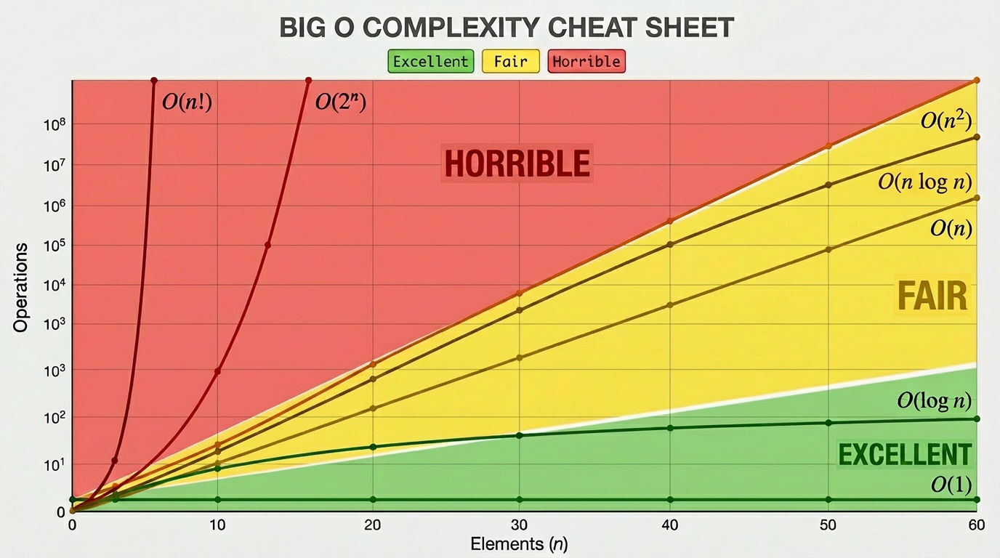
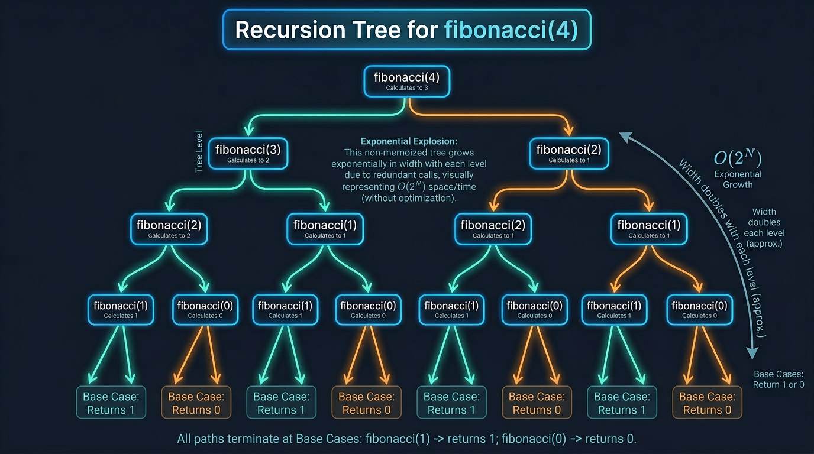

# Time Complexity Code Examples

Time complexity becomes much easier to understand when you connect each Big O pattern with real code. In this lesson, we will look at the most common complexities, learn how to analyze code step by step, and practice with examples you are likely to see in interviews and problem solving.

## Table of Contents

1. [Common Time Complexities](#common-time-complexities)
2. [Analyzing Code for Time Complexity](#analyzing-code-for-time-complexity)
3. [Code Examples for Time Complexity](#code-examples-for-time-complexity)

---

## Common Time Complexities

Now that we know what Big O is and how to clean it up, let's look at the "Big O Hall of Fame." These are the most common time complexities you will see in coding interviews and competitive programming.

We will list them from **fastest** to **slowest**.

### 1. $O(1)$ - Constant Time (The Dream)

No matter how massive the input is, the algorithm takes the exact same amount of time.

- **Example:** Accessing an element in an array by its index, or doing basic math operations.

```cpp
int getFirstElement(int arr[]) {
    return arr[0]; // Instant, regardless of array size!
}
```

### 2. $O(\log N)$ - Logarithmic Time (Extremely Fast)

If $N$ doubles, the number of operations only increases by 1! This usually happens when you divide the search space in half each step.

- **Example:** Binary Search.
- **Mind-blowing fact:** If you have $1,000,000$ items, it takes about 20 steps to find your target. If you have $1,000,000,000$ (1 billion) items, it only takes about 30 steps!

```cpp
// Searching in a sorted array by halving the search space
int l = 0, r = n - 1;
while(l <= r) {
    int mid = l + (r - l) / 2;
    if(arr[mid] == target) return mid;
    if(arr[mid] < target) l = mid + 1;
    else r = mid - 1;
}
```

### 3. $O(N)$ - Linear Time (Fair & Steady)

The time taken grows directly with the input size. If $N$ is 100, you do 100 operations.

- **Example:** Looping through an array to find the maximum value.

```cpp
int maxVal = arr[0];
for(int i = 1; i < n; i++) {
    maxVal = max(maxVal, arr[i]);
}
```

### 4. $O(N \log N)$ - Linearithmic Time (The Sorting Standard)

This is slightly slower than $O(N)$ but much faster than $O(N^2)$. It usually happens when you split data in half recursively and then merge or process it.

- **Example:** Efficient sorting algorithms like Merge Sort, Quick Sort, and C++'s built-in `std::sort()`.

### 5. $O(N^2)$ - Quadratic Time (Use with Caution)

The time taken is the square of the input size. If $N = 1,000$, operations = $1,000,000$. This is generally the limit for inputs around $10^4$.

- **Example:** Nested loops, checking all pairs in an array (like Bubble Sort or Selection Sort).

```cpp
for(int i = 0; i < n; i++) {
    for(int j = 0; j < n; j++) {
        // Checking pair (i, j)
    }
}
```

### 6. $O(2^N)$ - Exponential Time (Danger Zone)

The number of operations doubles with each new element added to the input. This is terribly slow and usually only works if $N \le 20$.

- **Example:** Finding all subsets of a set, or a simple recursive Fibonacci function without memory (memoization).

### 7. $O(N!)$ - Factorial Time (Game Over)

The absolute slowest. If $N=10$, it's 3.6 million operations. If $N=12$, it's 479 million operations.

- **Example:** Finding all permutations of a string.



---

## Analyzing Code for Time Complexity

Now for the fun part: looking at actual code and figuring out its time complexity! Think of yourself as a detective. Your job is to count how many times the most deeply nested or most repeated operation runs.

Let's break down the most common patterns you'll see in the wild.

### 1. Single Loops

When you have a single loop running from $0$ to $N$, the time complexity is proportional to $N$.

```cpp
for(int i = 0; i < n; i++) {
    // This runs N times
    cout << "Hello World\n";
}
```

**Time Complexity:** $O(N)$

### 2. Nested Loops

When loops are nested inside each other, you **multiply** their complexities.

```cpp
for(int i = 0; i < n; i++) {
    for(int j = 0; j < n; j++) {
        // This runs N * N times
        cout << i << ", " << j << "\n";
    }
}
```

**Time Complexity:** $O(N \times N) = O(N^2)$

_But what if the inner loop doesn't go all the way up to $N$?_

```cpp
int seriesLoop(int n) {
    int count = 0;

    for (int i = n; i >= 1; i /= 2) {
        for (int j = 0; j < i; j++) {
            count++;
        }
    }

    return count;
}
```

This is an arithmetic progression summing to about $N^2/2$. We drop the constant (divide by 2), so it is still **$O(N^2)$**.

### 3. Consecutive Loops

When loops are sequential (one after the other), you **add** their complexities and then drop the lower-order terms.

```cpp
// First loop: O(N)
for(int i = 0; i < n; i++) {
    cout << "First loop\n";
}

// Second loop: O(N^2)
for(int i = 0; i < n; i++) {
    for(int j = 0; j < n; j++) {
        cout << "Second loop\n";
    }
}
```

**Total Time:** $O(N) + O(N^2) = O(N^2 + N)$.

We drop the $N$, leaving us with:

**Time Complexity:** $O(N^2)$

### 4. Loops with Multiplication/Division Growth

Sometimes, the loop variable doesn't increase by 1 (`i++`). Instead, it doubles or halves.

```cpp
for(int i = 1; i < n; i *= 2) {
    // i goes: 1, 2, 4, 8, 16...
    cout << i << "\n";
}
```

Because the gap jumps exponentially, it reaches $N$ much faster than a normal loop. How many times can you double a number until you hit $N$? That's exactly what logarithms measure!

**Time Complexity:** $O(\log N)$

### 5. Recursive Functions

For recursion, we generally look at two things:

1. **Depth of the recursion tree:** How many times does the function call itself?
2. **Work done per call:** What happens inside each call (excluding the recursive calls)?

```cpp
void solve(int n) {
    if(n == 0) return;
    cout << "Thinking...\n"; // O(1) work
    solve(n - 1);           // Calls itself N times
}
```

Here, we make $N$ calls, and each call does $O(1)$ work.

**Time Complexity:** $O(N)$

_What about branching recursion?_

```cpp
int fibonacci(int n) {
    if(n <= 1) return n;
    return fibonacci(n - 1) + fibonacci(n - 2);
}
```

Each call spawns _two_ more calls. The number of calls doubles at each level of depth.

**Time Complexity:** $O(2^N)$



### Introducing the Master Theorem

When dealing with **Divide and Conquer** algorithms (where a problem is divided into smaller subproblems), counting the recursion depth manually can get complicated. This is where the **Master Theorem** comes in handy!

The Master Theorem provides a direct formula to solve recurrence relations of the form:

$$T(N) = aT\left(\frac{N}{b}\right) + O(N^d)$$

Where:

- **$a$**: The number of subproblems we divide into.
- **$N/b$**: The size of each subproblem.
- **$O(N^d)$**: The time spent doing work outside the recursive calls (like splitting the data or merging results).

While the full mathematical proof is complex, here are the three simplified cases you need to know:

1. **Case 1 (Work done at leaves dominates):** If $a > b^d$, the time complexity is $O(N^{\log_b a})$.
2. **Case 2 (Work is evenly distributed):** If $a = b^d$, the time complexity is $O(N^d \log N)$.
   - _Example:_ Merge Sort divides the array into 2 halves ($a=2, b=2$) and merges them in linear time ($d=1$). Since $2 = 2^1$, it falls into Case 2. Complexity: $O(N^1 \log N) = O(N \log N)$.
3. **Case 3 (Work done at root dominates):** If $a < b^d$, the time complexity is $O(N^d)$.

> **Interview Insight:** You rarely need to solve complex recurrences mathematically in an interview setting. However, knowing how the Master Theorem applies to standard patterns like Merge Sort or Binary Search proves that you deeply understand how "Divide and Conquer" performance works.

### 6. Multiple Input Variables

Sometimes your code relies on two completely different inputs, say an array of size $N$ and an array of size $M$.

```cpp
void printTwoArrays(int arr1[], int n, int arr2[], int m) {
    for(int i = 0; i < n; i++) cout << arr1[i];
    for(int j = 0; j < m; j++) cout << arr2[j];
}
```

**Don't assume everything is $N$!** The time here depends on both $N$ and $M$.

**Time Complexity:** $O(N + M)$

If they were nested, it would be $O(N \times M)$.

### Common Mistakes While Analyzing Code

1. **Assuming all nested loops are $O(N^2)$**

   Look closely at the inner loop's condition. If the inner loop only runs a constant number of times (e.g., `j < 5`), the total complexity is still just $O(N)$.

2. **Forgetting to count built-in functions**

   In C++, hidden functions take time! For example, `std::sort()` takes $O(N \log N)$. If you put a `sort()` inside an $O(N)$ loop, your total complexity skyrockets to $O(N^2 \log N)$. Hidden functions count!

3. **Confusing Best Case with Big O**

   If you have a loop that searches for an element and `break`s when it finds it, it _could_ stop on the first try. But Big O is the worst case! Assume the element is at the very end. The complexity is $O(N)$, not $O(1)$.

---

## Code Examples for Time Complexity

The best way to get comfortable with Time Complexity is by looking at lots of examples! Let's go through some common code snippets you might encounter and analyze them together.

### 1. Constant Time - $O(1)$

These operations take the same amount of time regardless of how big the input is.

```cpp
// Example: Checking if a number is even
bool isEven(int n) {
    return n % 2 == 0;
}
// Complexity: O(1)
```

### 2. Linear Loops - $O(N)$

Loops that iterate through the input one by one.

```cpp
// Example: Summing an array
int getSum(vector<int>& arr) {
    int sum = 0;
    for(int i = 0; i < arr.size(); i++) {
        sum += arr[i];
    }
    return sum;
}
// Complexity: O(N)
```

### 3. Nested Loops - $O(N^2)$

Loops inside loops where both depend on $N$.

```cpp
// Example: Printing a 2D Grid
void printGrid(int n) {
    for(int i = 0; i < n; i++) {
        for(int j = 0; j < n; j++) {
            cout << "* ";
        }
        cout << "\n";
    }
}
// Complexity: O(N^2)
```

### 4. Logarithmic Loops - $O(\log N)$

Loops that cut the problem size in half (or some fraction) at each step.

```cpp
// Example: Counting digits of a number
int countDigits(int n) {
    int count = 0;
    while(n > 0) {
        n = n / 10;
        count++;
    }
    return count;
}
// Complexity: O(log_10(N)), which simplifies to O(log N)
```

### 5. Sorting-Based Examples - $O(N \log N)$

Any algorithm that relies on efficient sorting.

```cpp
// Example: Checking for duplicates
bool hasDuplicates(vector<int>& arr) {
    // Step 1: Sort the array (Takes O(N log N))
    sort(arr.begin(), arr.end());

    // Step 2: Linear scan (Takes O(N))
    for(int i = 0; i < arr.size() - 1; i++) {
        if(arr[i] == arr[i+1]) return true;
    }
    return false;
}
// Complexity: O(N log N) + O(N) = O(N log N)
```

### 6. Recursion Examples

The complexity depends on how many recursive calls are made.

```cpp
// Example: Factorial (Linear Recursion)
int factorial(int n) {
    if(n <= 1) return 1;
    return n * factorial(n - 1);
}
// Complexity: O(N) (N calls, doing O(1) work each)
```

### 7. Mixed Complexity Examples

Combining different pieces together.

```cpp
void mixedExample(vector<int>& arr, int m) {
    int n = arr.size();

    // Part 1: O(N)
    for(int i = 0; i < n; i++) cout << arr[i];

    // Part 2: O(N * M)
    for(int i = 0; i < n; i++) {
        for(int j = 0; j < m; j++) {
            cout << "Mixing!";
        }
    }

    // Part 3: O(N log N)
    sort(arr.begin(), arr.end());
}
// Complexity: O(N) + O(N * M) + O(N log N)
// This doesn't simplify nicely unless we know the relationship between N and M.
// Final Answer: O(N*M + N log N)
```

## Video Explanation

[](https://drive.google.com/file/d/1pS1WLIg7B8aa4TPhNiu_LeKTFX-DdODc/view?usp=sharing)
