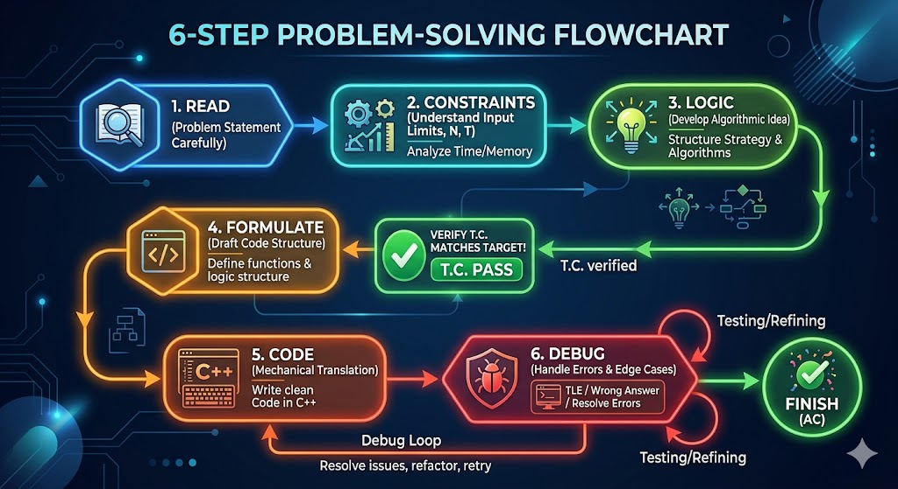

# The Ultimate Process of Solving a DSA Problem

Now that you are a master of Time Complexity, how does this fit into the actual process of solving a problem in an interview or a contest? 

Here is a step-by-step blueprint that professionals use to tackle any DSA problem.

## Step 1: Read the problem carefully
Don't rush! Read every single word. Missing a small detail like *"the array is sorted"* or *"elements can be negative"* can completely ruin your approach. 
- Read the sample test cases and make sure you understand *why* the given input produces the given output.

## Step 2: Understand input, output, and constraints
Before you even think about code, look at the constraints.
- What is the maximum value of $N$? 
- Using the $10^8$ Rule and the magic table from earlier, **immediately lock in your target Time Complexity.** If $N = 10^5$, tell yourself, *"I need an $O(N \log N)$ or $O(N)$ solution."*

## Step 3: Think of the logic
Put the keyboard away! Grab a pen and paper (or a whiteboard).
- Start with the **Brute Force** solution. If you can't solve it brute force, you can't optimize it.
- Try to find the bottleneck in your brute force approach. 
- Brainstorm optimizations: Can I sort it? Can I use two pointers? Would a Hash Map speed up the lookups?

## Step 4: Formulate (Code Structure & Determine T.C.)
Once you have an idea, mentally (or quickly on paper) draft the structure of your code.
- *"I will run a `for` loop, and inside it, I will do a Binary Search."*
- Now, **verify the Time Complexity** of your formulated idea. A loop ($N$) + Binary Search ($\log N$) = $O(N \log N)$. 
- Does it match the target complexity you locked in during Step 2? If yes, you have the green light!

## Step 5: Code
Now, and *only* now, do you start typing. 
- Because you already formulated the structure and verified the complexity, coding should just be a mechanical translation of your logic into C++.
- Write clean code, use meaningful variable names, and handle edge cases (like $N = 0$ or negative numbers).

## Step 6: Debug
If your code doesn't work on the first try, don't panic! 
- **Don't just change random things hoping it will pass.**
- Read the error. Is it a Compilation Error? Runtime Error (maybe dividing by zero or accessing out-of-bounds arrays)? Or Wrong Answer?
- Use `cout` statements (or a debugger) to track what your variables are doing at each step and compare it against your pen-and-paper logic.

<!-- > **[IMAGE PLACEHOLDER]**
> **Image Content:** A cool, modern flowchart summarizing this 6-step problem-solving process. The flow goes from 'Read' to 'Constraints' to 'Logic' to 'Formulate (with a check mark for T.C.)' to 'Code' and finally a loop for 'Debug'. 
> **Location:** Insert here, at the end of the document. -->
